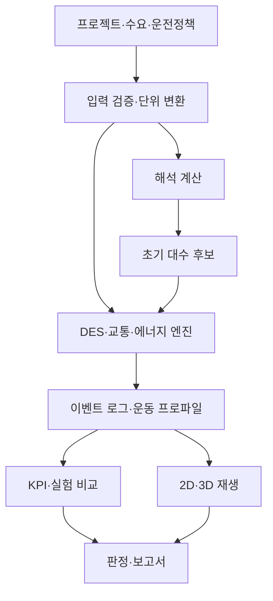

# AGV·AMR 물동량 계산 및 3D 시뮬레이션 개발계획서

| 문서 항목 | 내용 |
| --- | --- |
| 문서 ID | PLAN-AGV-AMR-001 |
| 문서 버전 | v1.0 — 신규 작성 |
| 작성일 / 검토 기준일 | 2026-09-14 |
| 프로젝트 가칭 | AGV·AMR Throughput & 3D Simulator |
| 주요 사용자 | 물류자동화 SE, 제안·설계 담당자, 운영 검토자 |
| 입력 자료 | 첨부 마크다운 8개: 자료 목록·통합 조사서·분야별 조사 노트 |
| 문서 목적 | 계산 모델, 입력·출력, 3D 연동, 개발 순서와 완료 기준을 정의하는 실행 가능한 계획서 |
| 작성 범위 | 첨부 자료의 중복·상충·적용 조건 검토 및 신규 요구사항 설계. 프로그램 구현은 이번 문서의 수행 범위에 포함하지 않음 |
| 버전 원칙 | 첨부 원본과 구분되는 독립 문서. 이후 본 계획서의 변경은 개정 이력으로 관리 |

> **개발 목표:** 현장 레이아웃과 OD 수요를 입력하면 AGV·AMR의 초기 필요 대수, 실제 시뮬레이션 처리량, 지연·병목·충전 손실을 계산하고, 같은 계산 결과를 3D로 재현하여 설계 대안을 비교하는 프로그램을 만든다.
>
> **핵심 설계 결정:** 하나의 계산 엔진이 차량 이동·배차·교통·충전·이재 상태와 KPI를 생성한다. 2D·3D 화면은 그 상태를 표시한다. 3D 재생 속도나 그래픽 품질을 바꾸어도 계산 결과는 같아야 한다.

## 목차

1. 프로젝트 목적과 기본 방향
2. 첨부 자료 검토 결과 및 반영 결정
3. 개발 범위와 버전별 기능
4. 사용 흐름과 화면 구성
5. 입력 데이터 및 엑셀 명세
6. 물동량·대수 계산 모델
7. 동적 시뮬레이션 엔진
8. 3D 시뮬레이션 요구사항
9. KPI·실험·최적 대수 판정
10. 프로그램 구조와 기술 선택
11. 저장·버전·외부 인터페이스
12. 검증 시나리오와 합격 기준
13. 개발 일정과 단계별 산출물
14. 데이터 확보 및 미확정 사항
15. 주요 위험과 대응
16. 최종 완료 체크리스트
17. 참고자료 및 근거 관리
18. 개정 이력

## 1. 프로젝트 목적과 기본 방향

### 1.1 해결하려는 문제

현장 물동량 계산은 평균 이동거리와 최고속도만으로 대수를 산정하거나, 교통·충전·정비를 하나의 효율계수에 합치는 경우가 있다. 이 방식만으로는 짧은 구간의 가감속, 배차에 따른 공차 이동, 교차로 점유, 목적지 버퍼 차단, 동시 충전을 충분히 설명하기 어렵다.

프로그램은 다음 질문에 근거를 갖춘 결과를 제공해야 한다.

| 설계 질문 | 제공할 결과 |
| --- | --- |
| 요구 물동량을 처리하려면 몇 대가 필요한가? | 작업부하 기반 초기 대수와 시뮬레이션으로 검증한 후보 대수 |
| 현재 대수로 시간당 얼마를 운반할 수 있는가? | 입력 수요에 대한 완료 처리량과 별도 포화부하 시험의 지속 처리능력 |
| 차량을 늘렸는데 처리량이 늘지 않는 이유는 무엇인가? | 교통·스테이션·충전·도어 등 원인별 점유·대기시간 |
| AGV와 AMR 중 어떤 구성이 유리한가? | 동일 수요·레이아웃에서 실제 주행·배차 기능별 비교 |
| 통로·충전기·스테이션 위치를 바꾸면 어떤 영향이 있는가? | 대안별 대수, 공차거리, 지연, 처리량, 병목 위치 |
| 고객에게 운전 상황을 어떻게 설명할 것인가? | 화물 흐름, 차량 상태, 대기 원인과 KPI가 연결된 3D 재생 |

### 1.2 기본 적용 환경

- 공장·물류센터 실내의 팔레트, 박스, 토트, 카트 운반을 대상으로 한다.
- 첫 정식 버전은 단일 층의 노드·경로 기반 이송을 완성한다. 층간 엘리베이터와 복잡한 다중 적재는 확장 모듈로 정의한다.
- 한국어 UI를 기본으로 하고, 설비·기술 용어에는 필요한 경우 영문을 병기한다.
- 화면·엑셀의 거리 기본 단위는 **mm**, 팔레트 결과는 **PLT/Hr**로 한다. 내부 계산은 SI 단위로 통일한다.
- 설계 데이터가 없는 항목은 ‘가정값’으로 표시한다. 예제 프로젝트를 실제 프로젝트의 확정 사양처럼 사용하지 않는다.

### 1.3 AGV·AMR 구분 원칙

장비명을 선택하면 초기 설정을 불러오되, 계산은 실제 장비 기능에 따라 달라진다. ‘AGV는 무조건 우회 불가’, ‘AMR은 반드시 분산 관제’ 같은 고정 전제를 두지 않는다. 이 방향은 첨부 S01의 §5.1과 AMR 계획·제어 리뷰의 문제 분류를 참고한 개발 결정이다.

| 구분 | AGV 초기 설정 예 | AMR 초기 설정 예 | 실제 계산을 결정하는 항목 |
| --- | --- | --- | --- |
| 주행 경로 | 지정 경로·분기 | 주행 가능 경로망 | 경로 모드, 방향, 연결성 |
| 경로 변경 | 허용된 분기 내 변경 | 통행 가능 대안 경로 재탐색 | 재계획 허용, 비용함수, 우회 가능 영역 |
| 교통 제어 | 블록·구역 예약 | 공간·시간 예약 | 통로·교차로 자원 및 예약 정책 |
| 기구학 | 차동·조향 등 선정 기종 | 차동·전방향·조향 등 선정 기종 | 회전반경, 제자리 회전, 후진·횡이동 가능 여부 |
| 배차 | 중앙 배차 등 | 중앙 또는 분산 등 | 실제 구현한 배차 정책 |
| 장애물 대응 | 정지·허용 경로 변경 | 정지·경로망 내 우회 | 감지 가정, 재계획 지연, 통과 가능성 |

**v1.0의 AMR 모델은 ‘경로망 기반 동적 우회가 가능한 평면 운동학 모델’이다.** 실제 SLAM, 센서 인식, 연속 자유공간 내비게이션 알고리즘의 성능을 재현한다고 표시하지 않는다.

## 2. 첨부 자료 검토 결과 및 반영 결정

### 2.1 자료별 역할과 중복 정리

S01~S08은 본 문서 안에서 사용하는 첨부 자료 식별자다. 상세 논문 초록과 벤더별 전체 사양표를 다시 나열하기보다, 개발에 필요한 요구사항과 근거 위치를 연결한다.

| ID | 검토한 첨부 파일 | 주요 활용 | 신규 계획서 반영 |
| --- | --- | --- | --- |
| S01 | AGV_AMR_물동량계산_참고자료_20260914.md | 작업 점유시간, 공차, 초기 대수, KPI 정의 | 공통 계산 흐름과 중복 손실 방지의 기본 구조 |
| S02 | AMR_능력계산_자료조사_20260914.md | 운동학, 공차 모형, 대수·배터리 식, 검산 예제 | 핵심 수식과 시험 후보. 부록 C 정정사항을 함께 검토 |
| S03 | 01_국제_안전규격.md | 국제 안전규격, 보호필드, 구역별 제약 | 제약값의 출처·판본·확인 범위를 관리하는 입력 체계 |
| S04 | 02_국내_일본_중국_규정.md | 국가별 적용 검토, 도어·엘리베이터, 국내 연구 | 국가별 근거 메타데이터와 외부 자원 모델. 일괄 법규 판정은 제외 |
| S05 | 03_계획지침_인터페이스_성능시험_도구.md | VDI 계획·시험, VDA 5050, 시뮬레이션 도구 | 입력·결과 비교 규칙, 버전별 데이터 어댑터, 검증 체계 |
| S06 | 04_고전_대수산정_모델.md | 작업부하, 공차 하한·기대치, SBC·대기행렬 | 1차 모델과 연구 확장 모델을 분리하고 적용 조건 명시 |
| S07 | 05_최신_AMR_연구.md | G2P, 협업 피킹, 충전·혼잡·MAPF | 정책 비교·병목 검증. G2P·협업 피킹은 후속 모듈 |
| S08 | 06_벤더사양_실무파라미터.md | 속도·가속·도킹·충전·외형 | 장비 프로파일과 실측 요청 항목. 범용 확정 기본값으로 사용하지 않음 |

S03~S08은 S02의 근거 노트 성격으로 내용이 많이 겹친다. S02의 정정사항을 우선 확인하되, S02에 표시된 ‘검증 완료’도 이번 작성에서 자동 승계하지 않는다. 본 문서에서 독립 재계산한 항목과 첨부에서만 확인한 항목을 구분한다.

### 2.2 발견한 상충·과도한 일반화와 수정 방향

| 검토 ID | 위치 / 발견 사항 | 영향 | 신규 계획서 결정 |
| --- | --- | --- | --- |
| R01 | S06 §5.2의 교통계수를 목표 가동률처럼 해석하는 제안 | 실제 교통 손실과 설계 여유가 섞임 | 교통 시간배수, 기술 가용도, 목표 점유율을 별도 정의 |
| R02 | S02의 `F_t≤1`과 S08 §6의 교통계수 `1.15` | 같은 이름의 값을 반대로 적용할 위험 | 내부는 `k_traffic≥1` 시간배수 사용. `eta_traffic=1/k_traffic`는 적용 시간 범위가 같을 때만 변환 |
| R03 | S02 §7.3·S06 §5.3의 `MM≤BSI≤SBC≤EG` 순서 | 특정 관찰을 보편적인 보장 범위로 오해 | 동일 비용·흐름 제약의 MM 하한만 명시. EG·SBC는 가정이 다른 추정치로 나란히 표시하며 보편 상한·순서를 보장하지 않음 |
| R04 | S02 §8.2의 SBC·Erlang C 결과와 결정론 가용도 조건 차이 | 손실을 적용하지 않은 서비스 수준으로 대수를 확정할 위험 | 근사모형별 가용도·충전·교통 적용 범위를 표시. 최종 추천은 동일 조건 DES로 판정 |
| R05 | S02 §6.1·부록 C의 OPIL 예제: 표기 사이클과 거리 기반 재계산 불일치 | 올림 대수가 3대와 2대로 갈림 | 미해결 참고 사례로 격리. 정식 골든값에는 채택하지 않음 |
| R06 | S05 §1.6.2는 OPIL 일부 수치를 정정했지만 표의 `E_w=1.0` 표기가 S02의 사례값 0.7과 다름 | 정정 전후 수치 혼용 | 원문 재확보 전 특정 OPIL 사례를 기본 프리셋으로 사용하지 않음 |
| R07 | S02·S07의 정책 개선율·혼잡 밀도·로봇/작업자 비율 | 다른 레이아웃에 사례 수치를 그대로 적용할 위험 | 문헌 사례로만 관리. 배차·동선·충전을 시나리오로 직접 비교 |
| R08 | S02 §7.6의 선형 증가 금지·정점 표시, S07의 대수 증가 시 감소 표현 | 실제 결과와 무관한 포화·감소곡선을 강제할 위험 | 무간섭 범위의 선형 증가도 허용. 포화·감소는 관측될 때만 표시하며 탐색 범위 밖의 정점을 단정하지 않음 |
| R09 | S02 §7.7·S07 H3의 endpoint 수 조건 | 특정 MAPD 해법의 충분조건 일부를 모든 AGV·AMR의 필수조건으로 일반화 | 주차 용량과 통과 경로를 직접 검증. endpoint 수만으로 교착 없음 판정 금지 |
| R10 | S03·S04의 0.3 m/s, 0.5 m 등 | 판본·적용구역·기종이 다른 수치를 자동 법정값으로 적용할 위험 | 사업장·장비별 검증값 입력. 확인되지 않은 조항·수치는 자동 속도캡·합격 판정에 사용하지 않음 |
| R11 | S02·S08의 최대 도킹시간·최소 리프트시간·조건부 배터리 시간 혼재 | 최대·최소·평균을 같은 종류의 입력으로 취급 | 값의 통계 의미, 하중, 펌웨어, 측정 조건을 필수 메타데이터로 저장 |
| R12 | S08의 운전/충전 비율 문장과 1:9 등의 순서 | 충전 가용시간을 반대로 해석 | 비율 문자열 대신 `t_run`, `t_charge`를 별도 입력하고 계산 결과로 비율 표시 |
| R13 | S02·S06의 상세 근사식과 원문 미확인 모델 다수 | 범위를 과도하게 넓히고 검증 불가능한 구현을 만들 위험 | 1차는 작업부하·공차 기준선·DES. SBC/MVA/SOQN은 모델별 재현 검증 후 확장 |
| R14 | S02의 기존 STC 소스 경로·공통 파일 재사용 전제 | 이번 첨부에 없는 코드 구조를 실제로 확인한 것처럼 전제할 위험 | 기존 프로그램 연계 계약만 정의. 원본 저장소 확보 후 재사용성 판단 |
| R15 | 첨부 전반의 3D 개념 언급에 비해 연동·재생·검수 계약 부족 | 화면 움직임과 물동량 계산이 달라질 위험 | 엔진 이벤트·운동 프로파일·스냅샷 기반 3D 요구사항 신설 |
| R16 | S02의 특정 오픈소스에 대한 일괄 코드 재사용 금지 문구 | 프로젝트 정책과 실제 라이선스 조건을 혼동 | 코드 도입 시 저장소·버전·라이선스·배포조건 확인. 1차는 자체 엔진과 독립 비교 검증 중심 |
| R17 | S07 H1의 초기 대수식을 Little의 법칙이라고 부르는 설명 | 작업부하 산정과 재공량 관계를 혼동 | 초기 대수식은 작업부하/가용시간 관계로 설명. Little의 법칙은 안정된 동일 집계 경계에서 `L=λW` 확인에 사용 |

**독립 재계산한 OPIL 불일치:** 첨부에 기재된 값으로 `0.4+0.5+(40.30+28.76)/35=2.8731429 min`, `10.222×2.8731429/14.7=1.9979093대`이다. 표기 사이클 `2.912 min`을 쓰면 `2.0249295대`이다. 이는 첨부 수치의 산술 대조이며, 본문·보충자료의 정확한 원값을 새로 검증한 결과는 아니다.

### 2.3 근거 수준의 재정의

| 구분 | 의미 | 프로그램에서의 취급 |
| --- | --- | --- |
| 공식 공개자료 확인 | 발행기관·제조사의 공개 설명 또는 해당 본문 확인 | 확인한 범위와 판본 기록 |
| 첨부 문헌 기반 | 이번에는 첨부의 요약·전개를 검토 | 원문까지 확인한 것처럼 표시하지 않음 |
| 독립 검산 | 본 계획서 작성 시 수치·차원을 재계산 | 조건과 기대값을 시험 명세에 수록 |
| 개발 제안 | UI, 알고리즘, 합격 기준, 일정 등의 신규 설계 | 규격 요구사항과 분리 |
| 미확정 | 근거 부족·상충·실측 미확보 | 가정으로 탐색 가능하되 결과의 미확정 항목으로 표시 |

## 3. 개발 범위와 버전별 기능

### 3.1 첫 정식 버전 v1.0의 필수 범위

| 기능 ID | 필수 기능 | 완료 조건 |
| --- | --- | --- |
| F01 | 프로젝트·시나리오 생성, 복제, 저장·불러오기 | 설정·출처·결과가 버전과 함께 재현됨 |
| F02 | AGV·AMR 장비 프로파일 | 적재/공차 운동, 외형, 하중, 회전, 이재를 설정 |
| F03 | 2D 레이아웃 편집 | 노드·경로·통로폭·방향·제한속도·정지점·장애물·충전기 배치 |
| F04 | OD·시간대 수요·작업이력·엑셀 입력 | 실제 경로 연결성과 단위·참조 ID 검증 |
| F05 | 해석 계산 | 작업부하, 공차 방식별 초기 대수, 시간 분해 |
| F06 | 다대 차량 DES | 배차, 경로, 유한 버퍼, 스테이션, 도어 처리 |
| F07 | 교통 모델 | 교차로·양방향 좁은 통로 예약, 추종, 교착 감지 |
| F08 | AMR 경로 변경 | 통행 불가 이벤트와 허용 경로망 내 우회·재계획 |
| F09 | 배터리·충전 | SOC, 충전기 수·위치·대기, 충전 정책 비교 |
| F10 | 3D 동기화 화면 | 실제 이동·적재·회전·대기·충전 상태와 KPI 일치 |
| F11 | 실험·시나리오 비교 | 대수·충전기·수요·정책 변경, 반복 및 신뢰구간 |
| F12 | 결과 보고서·로그 | Markdown/CSV 결과, 인쇄용 보고서, 경고·근거·재현정보 |
| F13 | 검증 프로젝트 묶음 | 제12장의 핵심 시험과 시나리오 재현 |

F10은 선택 기능이 아니다. 계산만 가능한 개발 중간본은 v1.0 완료로 처리하지 않는다.

### 3.2 운반 유형별 반영

| 운반 유형 | v1.0 지원 방식 | 후속 정밀화 |
| --- | --- | --- |
| 단일 팔레트/박스/토트 P2P | 픽업 1곳→목적지 1곳, 작업당 수량, 차량 최대중량·외형 검증 | 혼합 품목의 적재 배치 |
| 롤러·컨베이어 탑 모듈 | 도킹·인터록·이송시간, 양측 자원 점유 | 컨베이어 전체 흐름과 통합 |
| 잠입·리프트형 | 접근·승강·이탈, 카트/화물 동반 이동 | 다중 랙·G2P 작업 제어 |
| 지게차형 | 전후진 경로·지정 회전 궤적, 명시한 픽업·적치시간과 포크 애니메이션 | 고층 랙 작업, 정밀 조향·마스트 간섭 |
| 견인형 | 단일 카트의 선정된 외곽·회전 궤적 입력 시 지원 | 다중 트레일러 연결부 기구학·off-tracking |
| 다중 토트/밀크런 | 동일 OD 배치 운반의 정적 평균 수량만 지원 | 방문 순서·부분적재·배치대기·회수 순회 |
| 협업 피킹·G2P | 자료·확장 인터페이스만 정의 | 피커 동기화, 주문·포드·SKU 정책, 다중 서버 |

미구현 기구학이나 경로 조건은 ‘지원하지 않는 모델’로 표시한다. 복잡한 견인차를 차체만 움직이는 모델로 조용히 대체하지 않는다.

### 3.3 개발 중간 버전과 확장

| 버전 | 성격 | 범위 |
| --- | --- | --- |
| v0.1 | 계산 검증판 | 입력 스키마, 운동학, 공차, 초기 대수, 골든 테스트 |
| v0.2 | 시각 검증판 | 경로·배차·자원 DES, 초기 2D/3D 동기화 |
| v0.3 | 운영 검증판 | 교통·우회·충전·장애, 재생·실험·보고서 |
| v1.0 | 첫 정식 버전 | F01~F13 검수 완료, 단일 층 AGV·AMR 시나리오 검증 |
| v1.1 이후 | 확장 후보 | 엘리베이터·다층, 혼합 기종 배차, 밀크런, 관제 로그 매핑 |
| v2.0 후보 | 전문 모델 | G2P·협업 피킹·다중 토트·SOQN, 센서/관제 에뮬레이션 연계 |

실차 제어, 자율주행 안전인증, SLAM 성능 평가, 구조·전도·포크 강도 계산은 별도 전문 도구의 영역으로 둔다.

## 4. 사용 흐름과 화면 구성

### 4.1 기본 사용 순서

1. 프로젝트 생성: 대상 설비·운영시간·단위·물동량 목표를 정한다.
2. 장비 선택: 기종별 운동·하중·외형·이재·배터리 조건을 입력한다.
3. 레이아웃 작성: 배경 도면을 맞추고 통로·스테이션·도어·충전기를 배치한다.
4. 수요 입력: OD 표, 시간대 수요 또는 실제 요청 이력을 불러온다.
5. 입력 검증: 연결되지 않은 OD, 지나갈 수 없는 회전, 부족한 필수값을 확인한다.
6. 초기 계산: 공차 방식별 작업부하와 필요 대수 후보를 확인한다.
7. 시뮬레이션: 후보 대수로 운전하고 3D에서 병목·정지 원인을 확인한다.
8. 대안 비교: 차량·충전기·레이아웃·운전정책을 변경해 같은 수요 조건으로 실험한다.
9. 결과 확정: KPI 목표·백로그·SOC 지속성·모델 검증 상태를 함께 검토한다.
10. 보고서 저장: 입력, 계산식, 결과, 경고, 3D 화면, 실행 이력을 묶는다.

### 4.2 화면 목록

| 화면 | 주요 기능 | 사용자 판단에 필요한 정보 |
| --- | --- | --- |
| 프로젝트 홈 | 신규·복제·최근 프로젝트, 버전 비교 | 계산일, 시나리오, 데이터 확정 수준 |
| 기본 조건 | 단위, 교대, 측정시간, 목표·피크 수요 | 평균·피크 입력의 중복 여부 |
| 장비 사양 | 공차·적재 사양, 이재, 충전, 출처 | 최대값·평균값·가정값의 구분 |
| 레이아웃 | 2D 편집, 배경 이미지, 치수·통로 검사 | 실제 이동거리, 단방향, 도킹 방향 |
| 물동량 입력 | OD 매트릭스·리스트, 시간대·이력, 엑셀 | PLT/Hr와 작업/Hr, 운반단위 |
| 운전 정책 | 배차·주차·우회·교차로·충전 | 적용 정책과 설정값 |
| 해석 결과 | 대수 후보, 시간 분해, 민감도 | 하한·근사·검증 전 결과 라벨 |
| 시뮬레이션 | 2D/3D 전환, 재생·정지·이동 | KPI, 차량 상태, 대기 원인 |
| 실험 비교 | 대수 스윕, 충전기 스윕, 대안 표 | 목표 충족, 신뢰구간, 포화·미탐색 범위 |
| 보고서 | 조건·수식·차트·로그·3D 캡처 | 재현 가능한 결과와 미확정 조건 |

3D 화면은 상단에 요구량·완료량·P95 리드타임·백로그·운영 대수를, 하단에 시간축과 재생 제어를 둔다. 차량을 선택하면 현재 작업, 다음 목적지, 적재 상태, 속도, SOC, 대기 원인을 보여 준다. 범례는 색상과 텍스트를 같이 쓴다.

## 5. 입력 데이터 및 엑셀 명세

### 5.1 단위·좌표 계약

| 항목 | 화면 / 엑셀 기본 | 내부 저장·계산 | 변환 규칙 |
| --- | --- | --- | --- |
| 거리·좌표·차체·하중 외형 | mm | m | 입력을 1,000으로 나누어 한 번만 변환 |
| 주행속도 | m/min, 필요 시 m/s 선택 | m/s | m/min을 60으로 나눔 |
| 가속·감속 | m/s² | m/s² | 감속은 양의 크기로 입력 |
| 회전각·각속도 | °, °/s | rad, rad/s | π/180 곱 |
| 시간 | s, 운전기간 h | s | h를 3,600배 |
| 물동량 | PLT/Hr, BOX/Hr, TOTE/Hr, CART/Hr | 화물유형별 수량/h 및 작업/h | 다른 화물단위를 합산하지 않음 |
| 하중 | kg | kg | 차량·작업 최대하중 비교 |
| 에너지 | Wh 또는 kWh | J | Wh×3,600; kWh×3,600,000 |
| 전력 | W | W | J/s와 동일 |
| SOC·비율 | % | 0~1 | %를 100으로 나눔 |

프로젝트 좌표는 오른손 좌표계 `x,y=바닥 평면`, `z=높이`로 한다. 도면 원점·회전·축척을 저장한다. 가져온 파일의 단위를 추정해 자동 확정하지 않는다.

### 5.2 필수 입력 그룹

| 그룹 | 필수 입력 | 선택·확장 입력 |
| --- | --- | --- |
| 프로젝트 | ID, 명칭, 버전, 운전시간, 화물단위, 분석 모드 | 고객·장소, 교대 캘린더, 적용 국가 |
| 차량 유형 | 차체/적재 외곽, 적재량, 적재·공차 v/a/b, 회전 방식 | 후진 속도, 최소 회전반경, 각가감속, 횡가속도 |
| 스테이션 | ID, 좌표, 입출구 방향, 기능, 이재시간, 처리 슬롯, 대기 용량 | 수동 작업자, 처리시간 분포, 독립 후공정 |
| 경로 | 시작·종료 노드, 형상·실제 길이, 방향, 통행폭, 속도, 정지점 | 구역 제한, 경사·천장높이, 회전 궤적 |
| 수요 | OD, 유형, 수량 또는 요청 이력, 작업당 수량 | 우선순위, 납기, 시간대, 배치 정책 |
| 운전 | 운영 대수, 시작 위치, 배차, 주차, 예약·우회 정책 | 정책 가중치, 공정 우선권, 재배치 주기 |
| 충전 | 방식, 위치·개수, 초기 SOC, 충전 시작/종료 기준, 소비·충전 모델 | 충전곡선, 고장, 기회충전 최소시간 |
| 손실 | 항목별 미모델링·계수·이벤트 중 선택 | MTBF/MTTR, 수동 복구시간, 실측 정지 이력 |
| 실험 | 입력 부하/포화 시험 구분, 시간창, 반복·시드, 평가 목표 | 준비운전, 스트레스 배율, 변동 분포 |

### 5.3 이재시간 입력 방식

스테이션마다 다음 두 방식 중 하나를 선택한다.

- **총시간 방식:** 도킹부터 인계·이탈까지 차량이 점유되는 총시간을 입력한다. 포함 동작을 체크한다.
- **세부동작 방식:** 접근, 정위치, 포크/리프트, 이송, 인터록, 이탈의 선후관계를 입력한다.

선후관계가 있는 동작은 합산하고, 동시에 가능한 동작은 각 자원 점유구간을 계산해 임계경로 시간으로 구한다. 총시간과 세부시간을 동시에 더하지 않는다. 경로에 이미 포함된 저속 접근 거리는 이재시간에서 다시 이동시간으로 계산하지 않는다.

### 5.4 엑셀 워크북 명세

아래는 개발할 입출력 템플릿의 명세이며, 이번 산출물에 실제 XLSX 템플릿을 생성한 것은 아니다. 표준 시트명과 헤더를 유지하고, 한글 별칭을 화면에서 매핑할 수 있도록 한다.

| 시트 | 대표 컬럼 | 주요 검증 |
| --- | --- | --- |
| Project | schema_version, project_id, scenario_id, distance_unit, speed_unit, horizon_s | 지원 스키마, 단위 누락 |
| VehicleTypes | type_id, payload_kg, length_mm, width_mm, v_empty_m_min, v_loaded_m_min, a_empty, b_empty, a_loaded, b_loaded, kinematics | v/a/b 양수, 기구학 지원 여부 |
| Vehicles | vehicle_id, type_id, start_node_id, initial_soc_pct, enabled | 유형·시작점 존재, 같은 공간 중복 배치 |
| Nodes | node_id, x_mm, y_mm, z_mm, node_type, stop_required | ID 중복, 좌표 유효성 |
| Paths | path_id, from_node_id, to_node_id, length_mm, width_mm, direction, vmax_m_min, geometry_id | 연결성, 형상·길이 일치, 차량 통과 가능 |
| PathGeometry | geometry_id, sequence, x_mm, y_mm, z_mm, curve_type, radius_mm | 점 순서, 곡선 반경, 퇴화 구간 |
| Stations | station_id, node_id, station_type, service_mode, service_time_s, service_slots, waiting_slots | 서비스 양수, 입출구 접근 가능 |
| OD | origin_id, destination_id, load_type, qty_per_hour, qty_per_job, demand_profile_id | 음수 수요·이동 불가 OD·하중 초과 |
| DemandProfiles | profile_id, start_s, end_s, multiplier, arrival_mode | 시간 중첩, 배율 범위 |
| TaskHistory | task_id, release_s, origin_id, destination_id, load_type, quantity, due_s, priority | 중복 요청, 시각 순서, 누락 목적지 |
| Zones | zone_id, polygon_id, restriction_type, speed_m_min, allowed_types | 도형 유효성, 중첩 제한의 적용 순서 |
| SharedResources | resource_id, type, node_ids, capacity, service_time_s, queue_capacity | 도어·교차로·충전 인터페이스 |
| Chargers | charger_id, node_id, compatible_type_ids, plugs, curve_id, dock_time_s, undock_time_s | 호환성, 도달성, 플러그 수 |
| EnergyProfiles | profile_id, state, power_w, energy_j_per_m, curve_id | 상태별 에너지 중복 입력 |
| ChargeCurves | curve_id, soc_from_pct, soc_to_pct, power_w | SOC 구간 누락·역전, 전력 기준면 |
| Policies | policy_id, dispatch_rule, parking_rule, routing_rule, charge_trigger_pct, charge_target_pct | 허용 정책, 임계치 순서 |
| ParameterSources | object_id, field_name, source_type, source_ref, value_kind, measured_at, conditions | 출처와 실제 입력 필드 연결 |

수요는 동일한 작업군에 대해 OD 평균·시간대 프로파일·실제 이력 중 하나를 주 방식으로 선택한다. 서로 다른 작업군의 혼합 입력은 허용하되 작업군 ID로 중복을 검사한다. 이미 피크 이력을 넣었다면 일반 피크계수를 추가 곱하지 않는다.

엑셀 가져오기는 ‘미리보기→오류·경고 목록→사용자가 적용’ 흐름으로 한다. 잘못된 행을 조용히 0으로 바꾸거나 삭제하지 않는다. 기존 시나리오 반영은 검증 성공 후 하나의 저장 작업으로 완료한다.

## 6. 물동량·대수 계산 모델

이 장의 식은 물리·작업부하 관계 및 첨부 문헌을 참고한 구현 명세다. AGV·AMR 물동량이 특정 안전규격에 의해 이 식으로 인증된다는 의미가 아니다.

### 6.1 계산 단계와 결과 명칭

| 단계 | 모델 | 결과 명칭 / 용도 |
| --- | --- | --- |
| A | 운동학 + 작업부하 + 공차 근사 | ‘해석 초기 대수’ — 후보 탐색 시작점 |
| B | 조건을 명시한 대기행렬·근사모형 | ‘근사 서비스 수준’ — 선택적 연구 확장 |
| C | 배차·교통·자원·SOC DES | ‘시나리오 완료 처리량’ — 입력 수요를 처리한 결과 |
| D | 충분한 지속 부하의 반복 DES | ‘검증 조건 내 지속 처리능력’ — 용량 판단 |
| E | 대수·충전기·배치 실험 | ‘탐색 범위 내 추천 구성’ — 목표와 제약을 만족하는 후보 |

### 6.2 수요와 작업의 구분

OD별 화물 수요 `Q_ij [화물/h]`, 작업당 평균 실제 운반량 `q_ij [화물/작업]`일 때:

```text
lambda_ij = Q_ij / q_ij                 [작업/h]
lambda_total = sum(lambda_ij)
```

`q_ij`는 최대 적재량과 다르다. 팔레트 1매 운반은 1 PLT/작업이다. 한 번에 토트 4개를 운반할 수 있어도 실제 평균이 2개면 평균부하 계산에는 2를 사용한다.

동적 모델에서는 정수 수량의 실제 작업을 생성한다. 다중 적재 시 작업 발생률만 나누고 이동거리까지 다시 적재 수량으로 나누지 않는다. 배치가 차기까지 기다리는 시간·다중 목적지 방문은 별도 배치 모델을 구현했을 때만 지원한다.

### 6.3 정지 출발·정지 도착 운동학

거리 `s [m]`, 속도 상한 `v [m/s]`, 가속도 `a`, 상용 감속도 크기 `b [m/s²]`:

```text
s_critical = v²/(2a) + v²/(2b)

s = 0:
  t = 0

0 < s < s_critical:
  v_peak = sqrt(2*s*a*b/(a+b))
  t = v_peak/a + v_peak/b

s >= s_critical:
  t = v/a + (s-s_critical)/v + v/b
```

속도와 가감속이 알려진 짧은 구간에서는 `s/v`만으로 계산하지 않는다. 단, 실측 주행시간을 직접 쓰는 별도 모드에서는 실측값의 적용 거리·하중·정지 조건을 기록하고 가감속 보정을 다시 더하지 않는다.

### 6.4 연속 구간·회전·곡선

노드를 추가했다는 이유만으로 정지시키지 않는다. 각 경계속도 `u_k`를 앞뒤 구간 속도 상한으로 제한한 후 가속 가능성 전진 패스와 제동 가능성 후진 패스로 연결한다.

```text
u_k <= min(v_k, v_(k+1))
u_k <= sqrt(u_(k-1)² + 2*a_k*s_k)
u_(k-1) <= sqrt(u_k² + 2*b_k*s_k)
```

실제 정지점은 경계속도 0으로 고정한다. 진입·진출 속도 `u0,u1`이 주어진 구간에서는:

```text
vp = sqrt((2*a*b*s + b*u0² + a*u1²)/(a+b))

vp <= v:
  t = (vp-u0)/a + (vp-u1)/b

vp > v:
  t = (v-u0)/a + (v-u1)/b
      + [s-(v²-u0²)/(2*a)-(v²-u1²)/(2*b)]/v
```

경계속도의 물리적 실현 가능성을 먼저 검증한다. 운동 커널은 시간 외에 가속·순항·감속 구간과 `positionAt(t)`, `velocityAt(t)`를 제공한다.

| 회전 모델 | 반영 방법 |
| --- | --- |
| 제자리 회전 | 각도·각속도·각가감속을 동일 프로파일로 계산. 가능한 기종만 허용 |
| 곡선 주행 | 곡선 실제 길이 사용. `v_curve=min(v_limit, sqrt(a_lat_max*R), omega_max*R)` |
| 지게차·조향형 | 최소 회전반경·후진 필요성을 검사하고 지정된 실행 가능 궤적 사용 |
| 회전+주행 중복 | 곡선 구간에 이미 포함된 회전을 별도 제자리 회전시간으로 추가하지 않음 |
| 화물 돌출 | 적재 외곽이 움직이는 전체 궤적과 통로·구조물 간섭 검사 |

급격한 곡률 변경은 정지 회전 또는 연결 곡선으로 모델링한다. 구현하지 않은 jerk 제한은 ‘미반영’으로 기록하고 필요한 경우 해당 조건의 실측 프로파일을 사용한다.

### 6.5 작업시간과 고객 리드타임

```text
t_job_free = t_empty + t_pickup + t_loaded + t_dropoff + t_control

t_vehicle_job = t_job_free
                + t_traffic_wait + t_station_block + t_protection_delay

t_request_lead = t_completed - t_released
```

`t_empty`는 이전 작업 종료점 또는 실제 대기 위치에서 다음 픽업점까지의 공차 이동이다. `t_request_lead`는 배차 전 대기, 차량 도착 대기, 작업 수행을 모두 포함한다. 배차 전 대기는 어떤 차량에도 아직 귀속되지 않으므로 대당 작업부하에 다시 가산하지 않는다.

차량 점유와 스테이션 점유는 서로 다른 자원 장부다. 로봇이 스테이션에서 하역하는 15초는 두 자원을 동시에 점유할 수 있지만, 차량 사이클 합에는 15초를 한 번만 반영한다.

### 6.6 공차 이동 모델

`P_i=sum_j lambda_ij`: 픽업률, `D_i=sum_j lambda_ji`: 하역률, `NF_i=D_i-P_i`: 차량의 순 유입률로 정의한다.

| 방식 | 계산·적용 조건 | 결과 표시 |
| --- | --- | --- |
| 실적·사용자 지정 공차 | 실제 이전 종료점→다음 픽업점 이력 또는 별도 공차 흐름표 | 실적 기반 / 사용자 지정 |
| 출발지 복귀 | 모든 작업 후 출발지 복귀가 실제 정책일 때 역방향 경로 계산 | 복귀 정책 기준 |
| 확률적 기준선 | `e_ij=D_i*P_j/lambda_total`; 이전 하역점과 다음 픽업점의 독립 조합 가정 | EG형 기준선, 운영 보장값 아님 |
| 최소비용 흐름 | 순 유입점→순 유출점을 최소 공차시간으로 연결 | 정상상태 재배치 하한 |
| DES | 실제 배차·주차·우회·충전 후 위치로 다음 공차 생성 | 채택한 정책의 모의 운전 결과 |

공차 부담은 `W_empty=sum(e_ij*t_empty_ij) [s/h]`로 계산한다. 최소비용 흐름의 제약은 다음과 같다.

```text
minimize sum(e_ij * t_empty_ij)
sum_j(e_ij) = NF_i       for NF_i > 0
sum_i(e_ij) = -NF_j      for NF_j < 0
e_ij >= 0
```

한 OD의 정방향 거리와 역방향 거리는 일방통행 때문에 다를 수 있다. 비용은 실행 가능한 경로 시간으로 만든다. 순흐름이 모두 0이면 하한이 0일 수 있으나 실제 배차의 공차가 0이라는 뜻은 아니다. 짧은 유한 시간창에서 초기 위치 효과가 크면 정상상태 하한을 그대로 비교하지 않는다.

원본 OPIL 호환 시 음수 흐름은 가져오기 단계에서 별도 `emptyFlows`로 변환한다. 일반 OD 화면의 음수 수요를 공차로 자동 해석하지 않는다.

### 6.7 초기 대수 산정

```text
W_loaded = sum(lambda_ij * (t_pickup_i+t_loaded_ij+t_dropoff_j+t_control_ij))
W_base = W_loaded + W_empty                                  [s/h]

W_analytic = W_base + W_unmodeled_delay                       [s/h]
N_initial = ceil(W_analytic / (3600*A_rel*A_charge_cond*U_target))
```

| 기호 | 정의 | 제한 |
| --- | --- | --- |
| A_rel | 계획 운전시간 중 기술적으로 사용 가능한 비율 | 정비·고장 등 포함 범위 명시 |
| A_charge_cond | 기술적으로 사용 가능한 시간 중 충전 관련 비가동을 뺀 비율 | A_rel과 겹치는 시간을 다시 제외하지 않는 조건부 비율 |
| U_target | 가용시간에 대한 설계 목표 점유율 | 초기 설계 여유이며 실측 가용도나 물리적 손실이 아님 |
| W_unmodeled_delay | 해석 계산에만 추가한 미모델링 점유시간 | 이미 사이클에 들어간 대기와 중복 금지 |

기술 가용도와 충전율을 독립적인 관측 비율로 각각 측정해 단순 곱하지 않는다. 기준 시간이 겹치면 시간구간의 합집합으로 총 비가동을 산정하거나 위와 같이 조건부 비율로 변환한다.

교통을 근사할 때는 적용 대상 주행시간 `W_travel`에만 `W_traffic_extra=(k_traffic-1)*W_travel`을 적용하는 방식을 기본으로 한다. 실제 전체 사이클에 맞춘 계수라면 범위를 별도 표시한다. `k_traffic`과 `eta_traffic`를 동시에 적용하지 않는다.

계산 중간값을 반올림한 후 대수를 올리지 않는다. 미정수 대수, 올림 대수, 여유율을 같이 표시한다. 실제 수요가 0이면 작업용 필요 대수는 0이며, 대기·예비 설비는 별도 항목이다.

### 6.8 중복 손실 방지 장부

각 손실은 `excluded / coefficient / explicit_event` 중 한 방식만 선택한다.

| 항목 | 해석 모드 | DES 모드 |
| --- | --- | --- |
| 적재·공차 이동 | 운동학 또는 조건이 일치하는 실측시간 | 실제 배차 경로·운동 프로파일 |
| 교통 | 특정 시간 범위의 시간배수 또는 명시적 평균 지연 | 예약·추종·차단 이벤트 |
| 충전 | 조건부 가용시간 또는 별도 비가동 장부 | 이동·도킹·대기·SOC·충전 이벤트 |
| 고장 | 기술 가용도 | 고장·복구 이벤트 또는 고정 정지 이력 |
| 작업자 | 이재 서비스시간·인력 가용시간 | 유한 작업자 자원 |
| 목표 점유율 | 초기 후보 대수 여유 | 결과 판정 기준. 산출 완료량에 다시 곱하지 않음 |
| 설계 수요 여유 | 원시 수요에 1회 적용 | 이미 증대한 요청 이력 사용 |

DES 결과에는 직접 모델링한 손실의 계수를 다시 곱하지 않는다. 해석식의 가용도 값만으로 확률적 고장 패턴을 만들어낼 수 없으므로, 동적 고장 검증에는 MTBF/MTTR 또는 실제 정지 이력이 필요하다.

### 6.9 배터리·충전 모델

v1.0은 다음 중 하나의 소비 모델을 선택한다.

- **상태 전력 모델:** 공차주행·적재주행·이재·대기·정지 상태별 W 값을 사용한다.
- **거리 에너지 모델:** 공차/적재 J/m, 동작별 J, 대기 W를 사용한다. 주행 에너지를 W와 J/m로 동시에 합산하지 않는다.

```text
E_next = E_now - E_consumed + E_charged
SOC = E_now / E_effective_capacity

E_consumed = integral(P_state dt) + sum(E_action)   # 선택 모델의 항목만 적용
E_charged = integral(P_battery_net(SOC, temperature) dt)
```

충전 전력은 배터리 순유입 기준으로 정의한다. 충전기 입력 전력을 쓰면 효율과 로봇 보조전력을 반영해 변환한다. 동일 보조전력을 소비와 순충전 양쪽에서 다시 빼지 않는다.

| 충전 기능 | 요구사항 |
| --- | --- |
| 복귀 조건 | 임계 SOC + 충전기까지의 도달 에너지 + 예비 에너지 검사 |
| 새 작업 수락 | 해당 작업 수행과 이후 충전기 도달에 필요한 에너지가 충분한지 검사 |
| 충전기 선택 | 호환성, 이동시간, 예상 대기, 고장 여부 고려 |
| 충전 정책 | 임계 SOC 충전, 유휴 기회충전, 최소시간/목표 SOC 정책 |
| 충전 종료 | 목표 SOC와 최소시간의 AND/OR 관계를 명시. 기종별 정책으로 선택 |
| 충전곡선 | SOC 구간별 순충전전력 또는 검증된 시간표. 구간 누락 차단 |
| 임계 SOC 도달 | 상태 중간의 임계 도달 시각을 계산해 이벤트 발생 |
| 에너지 부족 | 작업 불가·구조 필요 상태와 원인 표시. 음수 SOC로 운행하지 않음 |
| 기회충전 | 자연 유휴와 겹친 충전을 별도 처리. 생산시간 손실로 일괄 차감하지 않음 |

충전기 평균 대수 하한은 `C_initial=ceil(r_charge*t_occupy/(3600*U_charger_target))`로 볼 수 있다. `r_charge`는 플릿 전체 충전 방문/h, `t_occupy`는 플러그 점유 s/방문이다. 동시 도착과 대기공간은 별도 DES 검증 대상이다. `N*f_charge/U_target` 형식은 `f_charge`가 **실제 플러그 점유 비율**일 때만 동등하게 사용할 수 있다.

### 6.10 외부 자원과 시스템 병목

자원 r을 작업 1건당 평균 `b_r`회 방문하고 서비스시간이 `s_r`, 병렬 처리 수가 `c_r`, 가용도가 `A_r`인 단순 조건에서:

```text
resource_capacity_r = 3600*c_r*A_r/(b_r*s_r)       [작업/h]
```

다종 작업이면 `sum(lambda_k*visits_kr*service_kr)`로 자원별 부하를 먼저 계산한다. 모든 자원 용량은 동일 작업·화물 기준으로 환산한 뒤 비교한다. `min(차량, 스테이션, 도어, ...)`는 병목 상한의 점검이며 실제 완료량은 차단·변동을 포함한 DES로 확인한다.

필수 외부 자원은 작업 스테이션, 입출고 버퍼, 교차로, 좁은 통로, 도어, 충전기이다. 확장 엘리베이터에는 호출·문 개폐·승하차·승강·외부 이용자·층별 대기공간을 포함한다.

### 6.11 대기행렬과 고급 모델의 취급

Erlang C는 포아송 도착·동일 독립 서버·지수 서비스·안정조건 등의 가정을 만족하는 M/M/c 모델이다. AMR의 위치 의존 공차, 교통 간섭, 충전 부재를 그대로 표현하지 못하므로 실제 현장 응답시간의 확정식으로 사용하지 않는다.

연구 확장 시 `a=lambda*E[S]/3600`, `rho=a/N<1`을 검사한다. SBC의 N배속 단일차량 근사를 넣은 Erlang C 결과에는 ‘추가 근사’라고 표시한다. `P_i=0`, `D_i=0`, 비연결 그래프, 비수렴은 명시적으로 처리하고 다른 모형으로 자동 대체하지 않는다.

SBC, MVA, SOQN은 각 원문의 가정·기호·원본 사례를 독립 구현으로 재현한 뒤 추가한다. 고급 수식이 많다는 이유로 검증 전 모형을 v1.0 필수 기능으로 확장하지 않는다.

### 6.12 안전·운전 제약의 반영 범위

ISO 3691-4:2023의 공개 범위는 AGV·AMR을 예로 포함하고, 기계적 수단으로만 유도되는 차량을 제외한다. 이 문서는 무인 산업용 트럭 및 시스템의 안전 요구와 검증을 다룬다. 물동량 산식의 출처로 사용하지 않는다. [ISO 공식 설명](https://www.iso.org/standard/83545.html)

국내 KS B ISO 3691-4의 확인한 상세 페이지는 2021-11-30 발행, ISO 3691-4:2020(IDT)로 표시한다. ISO 2023판과 동일한 판으로 취급하지 않는다. [한국표준협회 상세](https://www.kssn.net/search/stddetail.do?itemNo=K001010135700)

입력은 기종·현장에서 검증한 구역별 속도, 적재 외곽, 정지·재시작 조건, 보호필드 프로파일을 우선한다. 계획용 단순 비교식 `L(v)=v*t_response+s_brake(v)+margin(v)`를 제공할 수 있지만, 제조사별 필드 형상·오차·제동조건을 합쳐 하나의 인증 계산처럼 만들지 않는다.

보호필드 길이만으로 차간 안전거리나 회전 안전성을 확정하지 않는다. 전방·측방 형상, 적재물, 감지점 위치, 지연, 실제 정지 성능을 입력 조건으로 관리한다. 국가 선택 기능은 근거 목록을 표시하며 자동 적법성·인증 합격 판정을 제공하지 않는다.

## 7. 동적 시뮬레이션 엔진

### 7.1 실행 구조

물류 흐름은 이산사건 시뮬레이션(DES)으로 처리하고, 이동은 구간별 연속 운동 프로파일로 표현한다. 교통 검사는 자원 예약과 이동 외곽의 시간별 간섭 검사로 수행한다.



모든 결정은 시뮬레이션 시간으로 처리한다. 브라우저 프레임 시각이나 화면의 차량 위치를 계산 엔진의 상태로 역사용하지 않는다.

### 7.2 요청·화물·차량의 별도 상태

요청 상태와 차량 상태는 별개다. 예를 들어 요청은 차량 배정을 기다리는 동안 차량을 점유하지 않는다.

| 객체 | 주요 상태 |
| --- | --- |
| 요청 | 예정, 발생, 배차대기, 배정, 픽업대기, 운반중, 목적지 인계완료, 취소, 실패 |
| 화물 | 출발 버퍼, 차량 적재, 목적지 버퍼, 후공정, 최종 출고 |
| 차량 | 유휴, 공차주행, 픽업, 적재주행, 하역, 교통대기, 스테이션차단, 보호정지, 충전소이동, 충전대기, 충전도킹, 충전, 고장, 수동복구 |
| 자원 | 사용가능, 예약, 점유, 서비스중, 출구차단, 고장·폐쇄 |

차량의 기본 상태는 서로 배타적이어야 하며, 상태시간의 합은 해당 차량의 측정시간과 같아야 한다. 작업·화물 ID, 회전/리프트 동작, 대기 원인 등은 보조 속성으로 기록한다.

핵심 이벤트는 `REQUEST_RELEASED`, `JOB_ASSIGNED`, `RESOURCE_RESERVED`, `MOTION_STARTED`, `MOTION_COMPLETED`, `PICKUP_COMPLETED`, `DROPOFF_COMPLETED`, `RESOURCE_RELEASED`, `SOC_THRESHOLD_REACHED`, `CHARGE_STARTED`, `CHARGE_COMPLETED`, `FAULT`, `RECOVERED`로 정의한다.

### 7.3 이벤트 순서와 결정성

- 이벤트 키는 `(simulation_time, event_priority, stable_sequence)`로 정렬한다.
- 동일 시각에는 기존 동작 완료·실제 점유 해제, 외부 상태 변화, 요청 도착, 배차·예약, 신규 동작 시작의 순서를 명세한다.
- 미래 예약의 만료와 실제 차량의 공간 이탈은 다르다. 차량이 지연되면 점유를 유지하고 충돌 가능 후속 예약을 취소·재계획한다.
- 경로 변경·고장으로 무효화된 이동 완료 이벤트는 세대 ID 또는 취소 토큰으로 배제한다.
- 난수는 수요·서비스·고장·장애물·배차 동률 해소 등 원인별 스트림으로 분리한다.
- 같은 입력·엔진 버전·시드에서 차량 수 변화가 다른 수요 이력을 만들지 않도록 요청별 난수 키를 고정한다.
- 0초 이벤트 반복, 비수렴 재계획, 무한 큐 증가는 진단 코드와 함께 종료 또는 제한한다. 계산 실패 결과를 추천 후보에 포함하지 않는다.

### 7.4 배차·주차·재배치

| 정책 | v1.0 구현 수준 | 기록 항목 |
| --- | --- | --- |
| FIFO | 발생 순 요청을 실행 가능한 차량에 배정 | 요청순서, 차량 선택 근거 |
| 최소 예상 도착시간 | 공차 경로시간·교통 예약·장비 호환 고려 | 거리만의 최근접과 구분 |
| 우선순위·납기 | 우선순위, due time, 대기시간을 반영 | 오래 기다린 요청의 우선순위 상승 규칙 |
| 유휴 주차 | 현재 위치 허용 또는 지정 주차점 이동 | 통로·교차로 점유 방지 |
| 수요 기반 재배치 | 선택 기능, 예상 픽업 수요와 공차 비용 고려 | 재배치거리·소비·효과를 별도 집계 |

배차는 차량 가용상태, 하중·외형·이재 호환, 경로 접근성, SOC, 스테이션 수용 가능성을 확인한다. 요청 선택 정책과 차량 선택 정책을 별도 설정한다.

### 7.5 경로 탐색과 동적 우회

v1.0은 방향 그래프의 실행 가능 경로를 찾는다. 기본은 Dijkstra 또는 A*이며, 회전비용이 달라지는 경우 노드만이 아니라 진입 방향을 포함한 상태를 사용한다. 경로비용은 예상 주행시간·회전·확정된 자원 대기·허용 페널티로 구성한다.

AMR 모드에서 장애물·폐쇄 통로·지연이 발생하면 허용된 대안 경로를 재탐색한다. 재계획에는 통신·계산 지연을 설정할 수 있다. 미래 예약을 취소하고 현재 위치·속도에서 감속 가능성을 확인한 뒤 새 프로파일을 만든다.

장애물을 인식하는 센서 모델이 없으면 ‘통제기에서 장애물 정보를 아는 시점’을 이벤트로 입력한다. 실제 센서 반응을 구현한 것처럼 설명하지 않는다. 우회로가 없으면 기다리거나 실패 상태를 반환하며 장애물을 관통하지 않는다.

### 7.6 교차로·통로·추종

| 상황 | 기본 모델 | 필수 검증 |
| --- | --- | --- |
| 교차로 | 충돌하는 진입·진출 이동을 하나의 충돌 자원으로 예약 | 차량 뒤쪽과 적재물이 모두 나간 후 해제 |
| 양방향 좁은 통로 | 양 끝 사이 통로의 방향별 배타 예약 | 반대 방향 차량의 마주 진입 금지 |
| 합류·분기 | 합류 자원과 다음 대기공간을 함께 확보 | 노드 이름이 달라도 형상이 겹치면 충돌로 처리 |
| 동일 방향 추종 | 속도별 설정 간격, 전방 차량 제동·정지를 반영 | 차량 길이·적재 돌출 포함, 위치 역전 금지 |
| 추월 | 폭·경로·기구학·예약을 만족하는 구간에만 허용 | 별도 경로 없으면 추월 불가 |
| 정지·재출발 | 정지선 이전 감속, 후속 차량 정지 프로파일 재계산 | 좌표를 즉시 이동시켜 간격을 만드는 처리 금지 |
| 도어 | 도어 확보·개방·통과·폐쇄 이벤트 | 통과 중 폐쇄 금지, 큐가 상류 통로에 미치는 영향 |

교차로 예약은 출구 대기공간 또는 안전한 다음 정지 위치 확보까지 포함한다. 목적지가 찼는데 교차로 안에서 기다리는 상태를 예방한다. 정밀 추종이 아직 검증되지 않은 중간 버전에서는 ‘링크 단일 점유’ 모드로 결과를 표시하고 실제 연속 추종 처리능력으로 해석하지 않는다.

공간 검사에 시간 간격이 필요한 경우 초기 검토값은 0.1 s로 두되, 고속·소형 장애물에서는 더 세분하거나 연속 swept-volume 검사를 사용한다. 단순 위치 샘플 사이를 빠르게 통과하는 충돌 누락을 허용하지 않는다. 시간 간격을 절반으로 줄였을 때 수치 수렴성을 제12장에서 검사한다.

### 7.7 교착과 장시간 대기

- 자원 대기 그래프에 순환이 생기면 교착 후보로 표시한다. 이동·서비스 진전 여부도 확인하여 긴 정상 대기와 구분한다.
- 자원 예약 순서·출구 확보·양보 지점으로 교착을 예방한다.
- 해소는 미래 예약 취소, 우선순위 재조정, 실행 가능한 후진·우회 순으로 시도한다.
- 실제 공간을 점유한 차량을 사라지게 하거나 다른 위치로 옮겨 해결하지 않는다.
- 후진·우회가 불가능하면 수동 복구 이벤트와 손실시간을 기록하거나 해당 실행을 실패 처리한다.
- 어떤 요청도 무한히 밀리지 않도록 aging 정책을 두고, 최대 대기시간과 기아 상태를 기록한다.

교착 후보가 감지되었다가 해소된 경우와 해결되지 않은 경우를 별도 집계한다. ‘예약을 사용하므로 교착이 없다’는 가정은 두지 않는다.

### 7.8 화물·버퍼·인계

화물은 한 시각에 하나의 위치·소유 자원에만 속한다. 픽업 완료 시 출발 버퍼에서 차량으로, 하역 완료 시 차량에서 목적지 버퍼로 이동한다. 인계 중에는 원자적인 완료 이벤트로 소유권을 바꾸어 이중 집계를 막는다.

버퍼는 화물 수용 용량과 차량 대기 용량을 구분한다. 목적지에 적치 공간이 없으면 차량이 적재 상태로 대기하며 상류에 영향을 준다. 후공정 처리시간은 로봇이 떠난 이후 독립 자원에서 진행될 수 있다.

## 8. 3D 시뮬레이션 요구사항

### 8.1 표현 수준

**물류 운영 검토용 3D**를 목표로 한다. 이동·회전·이재·충전 상태의 시각적 근거를 제공하되, 실차 물리·센서·안전 검증까지 수행한 디지털 트윈으로 표시하지 않는다.

| 3D 요구 ID | 기능 | 구현 명세 |
| --- | --- | --- |
| V01 | 시설 배치 | 바닥, 랙, 기둥, 벽, 작업대, 스테이션, 도어, 충전기 |
| V02 | 차량 모델 | AGV/AMR 기본 외형, 방향 표시, 적재/공차 구분 |
| V03 | 화물 표현 | 팔레트·박스·토트·카트의 실제 입력 외형과 수량 |
| V04 | 운동 표현 | 가속·감속·정지·회전, 경로에 따른 위치·자세 |
| V05 | 이재 표현 | 포크/리프트·롤러 이동, 픽업·하역 소유권 전환 |
| V06 | 상태 표시 | 공차·적재·교통대기·충전·고장 색상 및 텍스트 |
| V07 | 경로·자원 표시 | 예정 경로, 예약 영역, 정지선, 교차로, 통행 방향 |
| V08 | 제약 오버레이 | 차량·적재 외곽, 회전 스윕, 입력된 보호필드·저속 구역 |
| V09 | 카메라 | 전체 조감, 평면, 사시, 차량 추적, 저장 시점 |
| V10 | 재생 제어 | 시작·일시정지·정지·재시작, 0.25×~20× 배속, 시간 이동 |
| V11 | 문제 추적 | 대기·교착·차단 이벤트 클릭 시 해당 시각·위치 이동 |
| V12 | 결과 공유 | 현재 시각·시나리오 ID·범례·KPI가 들어간 이미지 캡처 |

화면의 20× 배속은 표시상의 목표 배속이다. 컴퓨터 성능이 부족하면 실제 재생 배속을 표시하며, 사건을 누락해 맞추지 않는다. 대규모 계산은 3D 없이 먼저 수행한 후 저장된 실행을 재생할 수 있어야 한다.

### 8.2 2D와 3D의 공통 모델

2D에서 노드·경로·설비를 편집하면 동일 `layout` 모델을 통해 3D를 갱신한다. 3D 편집은 기본적으로 선택·위치 확인에 집중하고, 치수·속도·방향의 확정 편집은 2D 속성창에서 한다. 추후 3D 이동 편집을 추가해도 같은 검증 함수를 사용한다.

3D 렌더러가 Y-up 좌표계를 사용할 경우 프로젝트의 Z-up 좌표를 `(x,y,z) → (x,z,-y)`로 변환한다. 차량 heading과 모델의 전방 축도 같은 어댑터에서 변환한다. 화면 반전·높이 뒤바뀜을 시험한다.

통로 판정은 입력된 충돌 외곽과 실제 경로 형상을 사용한다. 장식용 랙 메시의 폴리곤 수, 그림자, 투명도에 따라 물류 처리량이 달라지면 안 된다.

### 8.3 계산 엔진과의 데이터 계약

| 데이터 | 내용 | 활용 |
| --- | --- | --- |
| SceneDefinition | layoutHash, 설비·차량·화물 외형, 노드·경로·구역 | 장면 초기화 |
| MotionSegment | entityId, tStart, tEnd, 경로 형상, 진입·진출 속도, phases, 자세 | 프레임별 정확한 위치·속도 |
| StateEvent | eventId, simTime, entityId, state, causeCode, taskId, resourceId | 상태·원인·적재·충전 표현 |
| Checkpoint | simTime, 모든 객체 상태, 자원 점유, 작업목록, SOC, 난수 상태 | 시간 이동 및 실행 재개 |
| MetricsSnapshot | simTime, 완료량, 백로그, 상태시간, 자원 점유 | 같은 시각의 KPI 표시 |

직선운동은 일정 속도 선형보간으로 대체하지 않고 가감속 phase의 위치식을 사용한다. 곡선은 엔진의 경로 파라미터를 따른다. 제자리 회전은 해당 회전 프로파일을 따른다.

충돌 외곽 중첩이 발생하면 모델 오류로 로그를 남기고 해당 실행을 유효한 추천 근거에서 제외한다. 차량을 숨기거나 시각적으로만 간격을 벌리지 않는다.

### 8.4 스냅샷·시간 이동

초기 제안은 시뮬레이션 시간 30초 간격 체크포인트와 모든 상태 이벤트·운동 구간을 저장하는 방식이다. 저장량 측정 후 간격을 조정한다. 긴 실행은 청크로 나눠 메모리에 모두 올리지 않는다.

이전 시각으로 이동할 때 가장 가까운 체크포인트를 복원하고 이벤트를 목표 시각까지 재생한다. 조회만 하는 재생은 원래 실행 로그·KPI를 변경하지 않는다. 설정을 바꾼 재실행은 새 `run_id`를 부여한다.

### 8.5 3D 자산과 도구

브라우저 3D는 Three.js를 1차 후보로 한다. 공식 GLTFLoader는 glTF 2.0 자산을 불러오는 기능을 제공하며, 반복 물체에는 InstancedMesh를 검토할 수 있다. 이는 3D 표시 기술 선택의 근거이며 시뮬레이션 계산 기능을 제공한다는 뜻은 아니다. [GLTFLoader 공식 문서](https://threejs.org/docs/pages/GLTFLoader.html), [InstancedMesh 공식 문서](https://threejs.org/docs/pages/InstancedMesh.html)

초기는 간단한 절차형 차량·설비 모델로 검증하고, 필요하면 Blender에서 제작한 자산을 GLB로 변환해 교체한다. Blender는 모델 제작·보완 도구로 사용하고, 물동량 계산 엔진은 독립적으로 유지한다.

| 자산 항목 | 기준 |
| --- | --- |
| 치수·축 | 실제 m 단위, 원점과 전방 축, 접지면 정의 |
| 동작 피벗 | 포크·리프트·롤러·카트 체결부의 이름과 기준점 |
| 화물 결합 | load_anchor와 인계 시점 정의 |
| 충돌 모델 | 시각 메시와 별도인 차량·화물 외곽, 회전 스윕 |
| 성능 | 반복 설비 인스턴싱, 단계별 상세도, 가벼운 그림자 |
| 교체 검증 | 기본 모델→상세 GLB 교체 전후 KPI·경로·점유 동일 |
| 배포 | 파일 크기·출처·사용 조건 기록, 외부 CDN 없이 번들 포함 |

v1.0은 기본 모델만으로 모든 V01~V12를 검증할 수 있어야 한다. 사실적인 재질이나 홍보용 영상 품질이 핵심 기능 완료를 지연시키지 않도록 한다.

### 8.6 성능 목표

아래 값은 벤더 성능이나 달성 사실이 아니라 **프로젝트 검수 목표 제안**이다. 기준 PC의 CPU·GPU·RAM, 운영체제·브라우저 버전과 모델 복잡도를 시험 기록에 고정한다.

| 규모 | 초기 목표 | 측정 조건 |
| --- | --- | --- |
| 표준 시나리오 | 차량 50대, 노드 500개, 경로 1,000개, 스테이션 20개 | 기본 모델, 1920×1080, 그림자 보통 |
| 3D 재생 | 표준 시나리오에서 프레임 시간 P95≤33.3 ms 목표 | 재생 시작 직후 준비구간을 제외한 5분 측정 |
| 계산 전용 | 표준 시나리오 8h·10,000작업 1회≤120초 목표 | 3D 비활성, 반복실험 시간과 분리 |
| 확장 시험 | 100대 이상 및 고밀도 교통 | 성능곡선·메모리·실패 규모 보고, 지원 상한은 측정 후 확정 |
| 응답성 | 계산 중 일시정지·취소 요청≤1초 반영 목표 | 엔진 배치 처리의 양보 간격 포함 |

목표를 못 맞추면 그래픽 상세도·로그 수준·경로 캐시 등을 조정한다. 정확성 검사를 끄거나 이벤트를 건너뛰어 성능 목표를 맞추지 않는다.

## 9. KPI·실험·최적 대수 판정

### 9.1 지표 정의

| KPI | 정의 | 주의사항 |
| --- | --- | --- |
| 완료 처리량 | 측정창 내 목적지 인계가 완료된 수량/측정시간[h] | 동일 화물 ID를 최종 인계 시 1회 집계 |
| 작업 처리량 | 완료 작업 수/측정시간[h] | PLT/Hr 등 화물 수량과 구분 |
| 수요 충족률 | 평가 대상 요청 중 평가 시점까지 완료한 요청 또는 수량 비율 | 작업 기준·수량 기준을 명시 |
| 리드타임 | 요청 발생→목적지 인계완료 | 평균·P50·P95·최대, 배차 전 대기 포함 |
| 납기 준수율 | 평가 대상 중 due time 이내 완료 수/전체 평가 대상 수 | 이미 기한 지난 미완료 요청은 실패로 포함 |
| 백로그 | 발생했지만 완료·취소·실패종료되지 않은 활성 요청 수 | 실행 중·배차대기·종료 시 잔량과 최장 경과시간. 실패종료 수 별도 표시 |
| 차량 상태비율 | 상태별 시간/측정창의 차량시간 | 배타 상태의 합 100% |
| 생산적 점유율 | 적재주행·픽업·하역 등 명시한 상태합/기준 차량시간 | 공차·대기 포함 여부를 고정 |
| 공차율 | 공차거리/총 작업 이동거리 | 충전·주차·재배치 이동은 별도도 표시 |
| 자원 이용률 | 점유한 서버시간/(병렬서버 수×측정시간) | 시간가중 평균, 대기열 길이와 병기 |
| 충전 KPI | 충전량, 플러그 점유, 대기시간, SOC 분포·최소값 | 초기 SOC 및 시작/종료 총에너지 비교 |
| 교통 KPI | 교차로·좁은 통로·추종·폐쇄별 대기 | 원인 코드로 중복 없이 분해 |
| 모델 실패 | 충돌, 미해결 교착, 미도달 요청, SOC 고갈, 입력 오류 | 실패 실행을 정상 평균에 섞지 않음 |

### 9.2 측정창·미완료 요청

두 가지 시험을 명확하게 구분한다.

- **교대·유한작업 시험:** 실제 교대 시작 상태, 초기 차량 위치·SOC·버퍼 재고를 사용한다. 시작 손실도 결과의 일부다. 준비운전을 관행적으로 빼지 않는다.
- **정상상태 시험:** 준비운전 후 시간창 `[t_w,t_end)`의 완료량·상태시간을 측정한다. 준비운전 길이는 큐·처리량·SOC 주기 안정 여부를 보고 정한다.

처리량은 완료 시각 기준으로 집계한다. 리드타임·납기 평가는 ‘측정창에 발생한 요청 집단’처럼 별도 코호트를 정의한다. 코호트를 끝까지 따라갈 때 필요한 drain 구간은 처리량 분모에 더하지 않는다.

관측 종료 때 미완료 요청이 남으면 완료건 P95만 제시해 지연이 양호하다고 판정하지 않는다. 미완료 수·경과시간·기한 초과를 같이 표시하고, 핵심 지연 판정은 ‘판정 보류’ 또는 실패로 처리한다. 완료 요청 0건이면 P95는 0이 아니라 ‘계산 불가’이다.

실패종료 요청은 활성 백로그에서는 제외하되 완료로 집계하지 않는다. 수요 충족·납기 평가에서는 실패로 남기고, 취소 요청의 평가 분모 포함 여부도 사전에 정한다. 실패 요청을 종료시켜 백로그가 감소했다는 이유로 수요를 충족했다고 판단하지 않는다.

### 9.3 수요 충족 시험과 처리능력 시험

낮은 수요에서 30 PLT/Hr가 완료되었다고 시스템 능력이 30 PLT/Hr라고 표시하지 않는다.

| 시험 | 부하 조건 | 주요 판정 |
| --- | --- | --- |
| 정상 수요 | 평균·시간대·이력 수요 | 완료·납기·대기·백로그 |
| 피크 수요 | 실제 피크 또는 명시한 설계 배율 | 피크 중 큐 증가와 이후 회복시간 |
| 지속 능력 | OD 비중을 유지하며 충분한 외부 대기 수요 제공 | 내부 병목 처리량, SOC 지속성 |
| 수요 한계 탐색 | 요구량 배율을 단계적으로 변화 | 지연·백로그 기준을 만족하는 범위 |
| 장애 스트레스 | 차량/충전기/도어/통로 장애 | 서비스 저하와 복구, 예비 구성의 효과 |

포화시험에서도 OD 구성·입력 방식에 따라 자원 경쟁이 바뀔 수 있다. 단일 숫자만 표시하지 않고 해당 작업 혼합과 시험 조건을 결과 이름에 포함한다.

### 9.4 반복·신뢰구간

확률적 시나리오의 초기 계획은 독립 시드 10회 반복이다. 반복별 평균 처리량의 95% 신뢰구간은 `mean ± t(0.975,r-1)*sample_sd/sqrt(r)`로 계산한다. 독립 반복을 관측 단위로 하며 개별 작업을 모두 독립 표본으로 간주하지 않는다.

처리량 신뢰구간 반폭이 평균의 5% 이하인 것을 초기 정밀도 목표로 두고, 미달 시 20회·30회까지 늘릴 수 있다. 30회에도 부족하면 불확실성을 표시하고 모델 변동성·측정기간을 재검토한다. 이 수치들은 프로젝트 제안 기준이다.

P95 리드타임은 요청 분포의 분위수이며 위의 평균 신뢰구간과 다르다. 반복별 P95·미완료 비율을 보고하고, 최종 P95 판정이 필요한 경우 반복을 고려한 부트스트랩 등 별도의 추정 절차를 정의한다. 표본이 부족하면 ‘잠정’으로 표시한다.

대안 비교는 동일한 외부 수요·고장·장애물 이력을 사용한다. 정책이 바뀌어 난수 호출 순서가 달라져도 입력 이력이 바뀌지 않도록 한다. 탐색에 쓴 시드와 별도의 검증 시드로 최종 후보를 재시험한다.

### 9.5 추천 대수와 충전기 탐색

초기 대수는 탐색 시작점일 뿐이다. 해석 하한부터 사용자가 지정한 최대 대수까지 정수 후보를 평가한다. 대수 증가 시 혼잡으로 비단조 결과가 나올 수 있으므로 ‘대수가 많을수록 반드시 개선’이라는 이분 탐색 전제를 두지 않는다.

1. 경로·외부 자원·에너지 입력이 유효한 후보만 생성한다.
2. 대수·충전기 수를 스윕하고, 각 후보의 목표 수요·납기·백로그·SOC·실패 결과를 비교한다.
3. 지속 능력의 신뢰하한이 설계 수요를 넘는지, 피크 이후 적체가 해소되는지 확인한다.
4. 목표를 만족한 후보 중 최소 운영 대수, 다음으로 충전기 수 등을 명시한 우선순위로 선택한다.
5. 탐색 범위를 벗어난 전역 최적을 주장하지 않는다. 만족 후보가 없으면 ‘범위 내 충족 구성 없음’을 반환한다.
6. 운전용 대수와 예비 대수를 별도로 제시한다. 예비는 N-1 장애 시나리오 등 명시한 가용성 목표로 검토한다.

비용 최적화는 차량·충전기·운영비 입력이 확보되었을 때 후속 기능으로 추가한다. 가격 자료 없이 CAPEX 최소 구성을 자동 추천하지 않는다.

### 9.6 지속성 판정

완충 상태로 짧게 운전한 처리량을 24시간 지속 성능으로 외삽하지 않는다. 정상상태 시험은 충전 주기가 나타날 만큼의 기간을 확보하고, 말기 SOC가 계속 하락하는지 확인한다. 최소한 반복되는 충전 패턴·주기별 에너지 수지를 관찰하되, ‘몇 회 충전했으므로 안정’이라고 자동 확정하지 않는다.

백로그는 시간구간별 기울기와 시작/종료 잔량을 같이 본다. 안정된 수요 시험에서 큐가 계속 증가하면 처리량 숫자가 목표에 가까워도 충족으로 판단하지 않는다. 허용 백로그·회복시간·SOC 드리프트는 프로젝트 목표값으로 저장한다.

## 10. 프로그램 구조와 기술 선택

### 10.1 제안 기술 구성

| 계층 | 제안 구성 | 선택 목적 |
| --- | --- | --- |
| 화면 | TypeScript 기반 웹 UI, Vite 빌드 | 데이터 계약과 계산 코드의 타입 관리 |
| 계산 | 독립 TypeScript Motion/Fleet 모듈 | 화면 없이 시험·일괄 실행 가능 |
| 동적 엔진 | Web Worker의 DES·경로·예약·에너지 | 긴 계산 중 UI 응답 유지 |
| 2D | Canvas/SVG 기반 레이아웃 편집 | 치수·노드·경로 정밀 입력 |
| 3D | Three.js | 브라우저 장면, glTF 자산, 차량 상태 재생 |
| 프로젝트 저장 | JSON 및 브라우저 로컬 DB | 시나리오·실행 메타데이터 저장과 파일 백업 |
| 엑셀·CSV | 선정 라이브러리 + 명시적 스키마 검증 | 입력 미리보기·오류 위치·보고서 표 |
| 검증 | JS/TS 시험 + 독립 Python 산술·간단 DES 비교 | 같은 구현의 오류를 그대로 비교하지 않도록 함 |
| 버전 관리 | Git 저장소, release tag, 변경이력 | 엔진·모델·스키마 변경 추적 |

프레임워크·엑셀 라이브러리의 구체 버전은 착수 시 호환성·라이선스·오프라인 동작을 확인한 뒤 lockfile로 고정한다. 본 문서는 최신 버전을 보장하거나 도입 라이선스를 확정하는 문서가 아니다.

### 10.2 모듈 분리

| 모듈 | 책임 | 입력→출력 |
| --- | --- | --- |
| schema / units / validation | 데이터 타입·단위·기본 검사 | 원본 프로젝트→정규화 프로젝트·오류 |
| motion | 직선·회전·곡선 프로파일 | 경로·차량조건→시간·phases·위치함수 |
| routing | 경로·진입방향·제약·비용 | 출발·목적지·상태→실행 가능 경로 |
| workload / empty / fleet | 공차 기준선·초기 대수 | OD·시간·가용도→근사 결과 |
| dispatch | 요청·차량 선택 | 가용 차량·요청→작업 할당 |
| traffic / reservations | 자원·시간 예약·추종·교착 | 이동 의도→허용·대기·재계획 |
| station / buffer | 서비스·화물·차단 | 인계 요청→점유·완료·화물 위치 |
| energy / charging | 소비·SOC·충전기 | 차량상태→SOC·충전 이벤트 |
| simulation / rng | 이벤트큐·실행·결정성 | 시나리오·시드→실행 로그 |
| metrics / experiments | KPI·반복·대수 스윕 | 로그·목표→통계·추천 후보 |
| scene2d / scene3d / replay | 표시·보간·시간 이동 | 장면·로그→시각화 |
| io / report | Excel·JSON·CSV·보고서 | 데이터·결과→파일 |

### 10.3 핵심 호출 계약

| 함수 계약 | 최소 반환 내용 |
| --- | --- |
| `validateProject(project)` | errors, warnings, normalizedProject |
| `calculateInitialFleet(project)` | timeBreakdown, emptyModels, workload, fleetCandidates, assumptions |
| `createSimulation(project, runOptions)` | 독립 실행 인스턴스, engineVersion, configHash |
| `runUntil(simTime)` | events, motionSegments, metricsDelta, runStatus |
| `getCheckpoint()` | 객체·자원·이벤트큐·난수 상태 |
| `restoreCheckpoint(checkpoint)` | 복원 결과·버전 호환 확인 |
| `collectMetrics(window, cohort)` | 집계 정의를 포함한 KPI |
| `runExperiment(matrix, seeds)` | 후보별 반복 결과·신뢰구간·실패 원인 |
| `buildReport(project, runs)` | 입력·수식·근거·비교·한계·재현정보 |

공통 데이터에는 `equipmentType='agv_amr'`, `capabilities`, `ports`, `schemaVersion`, `engineVersion`을 둔다. 향후 STC·RGV·셔틀·컨베이어 프로그램과 연결할 경우 동일한 화물 ID와 인계 완료 이벤트를 사용하도록 한다.

이번 검토에서는 기존 5종 계산 프로그램의 실제 소스·API·버전을 확인하지 않았다. 재사용은 원본 확보 후 결정한다. 통합 시 공통 운동학·통계·직렬화 기능은 공통 패키지 한 곳에서 관리하고 설비별 복사본을 개별 수정하는 구조를 피한다.

### 10.4 배포 방향

1차는 사내 Windows PC의 Chrome/Edge에서 동작하는 웹 프로그램을 제안한다. 외부 서버 전송 없이 입력·계산·3D 재생이 가능한 번들을 우선한다. Web Worker·모듈·3D 자산을 사용하는 정식 배포는 로컬 실행기/서버 또는 사내 웹서버 방식으로 검증한다.

단일 HTML은 배포 편의 확장으로 검토한다. `file://`에서 Worker·모듈·자산을 읽는 제약을 검증하지 않은 상태에서 더블클릭만으로 완전 오프라인 실행을 보장하지 않는다. 단일 파일이 필수로 확정되면 worker·라이브러리·모델 임베딩 구조와 용량을 별도 검수한다.

공개 호스팅·실차 관제 연결은 본 계획서 작성의 실행 범위에 포함하지 않는다. 개발 완료 시점에 사내 운영 환경에 맞춰 배포 대상을 결정한다.

## 11. 저장·버전·외부 인터페이스

### 11.1 프로젝트와 실행의 분리

| 저장 객체 | 반드시 포함할 항목 |
| --- | --- |
| Project | projectId, schemaVersion, 작성·수정일, 단위, 장비·레이아웃·수요·출처 |
| Scenario | scenarioId, parentScenarioId, 변경 파라미터, 운전 정책·목표 |
| Run | runId, project/scenario ID, engineVersion, modelVersion, configHash, 시드, 실행조건 |
| Results | 측정창·코호트, KPI, 신뢰구간, 미완료·실패·경고, 원시 집계 |
| Replay | 장면 버전, 초기 상태, 운동·이벤트 로그, 체크포인트 |

설정을 바꾸면 기존 실행 결과에는 ‘현재 설정과 다름’을 표시한다. 이전 결과를 새 입력의 계산값처럼 보여 주지 않는다. 프로젝트 파일은 JSON 내보내기·불러오기로 보관하며, 자동 저장만으로 영구 보존을 보장하지 않는다.

### 11.2 외부 관제·VDA 5050

VDA 5050은 관제와 이동로봇의 작업·상태 교환 인터페이스다. 공식 발행 안내와 저장소에서 3.0.0을 확인할 수 있다. 이 규격의 채택만으로 경로 최적화·물동량·안전 성능이 보장되는 것은 아니다. [VDA 공식 안내](https://www.vda.de/en/news/publications/publication/vda-5050), [공식 릴리스](https://github.com/VDA5050/VDA5050/releases)

v1.0은 내부 데이터 모델과 범용 작업·상태 CSV를 우선한다. VDA 5050 2.x/3.x 로그 임포트는 후속 어댑터로 개발한다. 버전별 원문·스키마를 고정하고 실제 벤더 메시지 샘플로 검증한다.

잘못된 키나 공백을 일괄 trim해 의미를 바꾸지 않는다. 공식 버전별 호환 규칙에 있는 필드만 명시적으로 변환하고 변환 내역·원본을 보존한다. 이름이 다른 키가 충돌하면 오류로 처리한다.

배터리 용량·소비·순충전전력은 해당 프로토콜 필드만으로 충분한지 개별 확인한다. 누락값을 ‘있을 것’으로 가정하지 않고 기종 사양과 운영 로그에서 보완한다. 초기 단계는 로그 재현용이며 실차에 명령을 전송하지 않는다.

### 11.3 보고서 출력

보고서는 다음 순서로 구성한다.

1. 요구 물동량·후보 대수·검증 조건과 충족 여부.
2. 입력·단위·출처·미확정 항목.
3. 주행·이재·공차·지연 시간 분해와 해석 대수.
4. DES 시나리오, 배차·교통·충전 정책과 측정창.
5. 완료량·리드타임·백로그·SOC·병목 결과.
6. 차량·충전기·레이아웃 대안 비교 및 신뢰구간.
7. 시각·시나리오가 표시된 3D 캡처와 주요 사건.
8. 추천 이유, 적용 한계, 추가 확보가 필요한 데이터.
9. 엔진·모델·설정 해시·시드·버전 및 재현 절차.

정식 결과에는 ‘가정 기반 / 현장 보정 / 현장 검증’ 상태를 표시한다. 미검증 입력으로 생성한 3D가 사실적으로 보인다는 이유로 결과 수준을 올리지 않는다.

## 12. 검증 시나리오와 합격 기준

### 12.1 검증 원칙

검증은 **수식의 정확성 → 상태·자원 불변조건 → 운영 시나리오 → 현장 일치성 → 3D 동기화·성능** 순서로 진행한다. 아래는 향후 프로그램의 시험 명세다. 본 계획서 작성 중에는 제12.2의 숫자를 독립 재계산했으며, 아직 프로그램의 시험을 수행한 것은 아니다.

해석 결과와 DES가 항상 같아야 한다고 요구하지 않는다. 동일한 무간섭 결정론 조건에서는 일치해야 하며, 교통·충전·변동이 추가된 DES의 차이는 원인별 시간 장부로 설명해야 한다.

### 12.2 독립 검산값

#### 예제 A — 운동학

정지→정지 주행, `v=1.5 m/s`, `a=0.5 m/s²`, `b=0.7 m/s²`:

| 검산 항목 | 기대값 |
| --- | --- |
| 임계거리 | 3.857142857 m |
| 60 m 주행시간 | 42.571428571 s |
| 2 m 주행시간 | 3.703280399 s |
| 대칭 가감속 a=b=0.5, 60 m | 43.000000000 s |
| 대칭 가감속 a=b=0.5, 2 m | 4.000000000 s |
| 90° 제자리 회전, omega=0.8 rad/s, alpha=beta=1.0 rad/s² | 2.763495408 s |

직선 수식 시험 허용오차는 배정밀도 계산 기준 절대 `1e-6 s` 또는 상대 `1e-8` 중 큰 값으로 제안한다. 표시값 반올림과 내부 계산 오차를 구분한다.

#### 예제 B — 초기 대수 산정

**설명용 가정:** 단일 팔레트 작업 72 PLT/Hr, 적재 60 m와 공차 복귀 60 m. 시험용 궤적은 방향 전환 추가시간이 없는 모델로 정의한다. 실제 기종이 정지 회전·후진 제한을 요구하면 별도 시간과 사양을 추가해야 한다.

| 입력 | 값 |
| --- | --- |
| 적재 v/a/b | 1.2 m/s, 0.3 m/s², 0.5 m/s² |
| 공차 v/a/b | 1.5 m/s, 0.5 m/s², 0.7 m/s² |
| 픽업 / 하역 / 추가 제어 | 15 s / 15 s / 4 s, 서로 중복 없음 |
| A_rel | 0.95, 예제 가정 |
| A_charge_cond | 0.90, 기술 가용시간 중 충전 관련 비가동 반영 |
| U_target | 0.85, 초기 대수 설계 목표 |
| 교통 | 무간섭 해석 기준, 추가 계수 없음 |

```text
t_loaded = 53.200000000 s
t_empty = 42.571428571 s
t_job = 53.2 + 42.571428571 + 15 + 15 + 4
      = 129.771428571 s/작업

W = 72 * 129.771428571
  = 9,343.542857143 s/h

이상적 평균 작업부하 = W/3600 = 2.595428571대 상당
초기 설계 대수 = ceil(W/(3600*0.95*0.90*0.85))
              = ceil(3.571281144) = 4대
```

4대의 무간섭 해석 공급 상한은 `3600×4×0.95×0.90/129.771428571=94.8745 PLT/Hr`이다. 이는 공유 통로·스테이션을 포함한 DES 결과가 아니다. 4대가 같은 복귀 통로를 사용하면 교통 모델로 다시 검증한다.

하역 뒤 독립 후공정이 **1 PLT당 60 s, 1개 처리 슬롯**이라면 그 자원의 장기 상한은 60 PLT/Hr이다. 버퍼가 유한한 통합 시스템은 해당 병목 때문에 72 PLT/Hr를 지속 충족할 수 없다. 차량 대수만으로 최종 판정하지 않는지 확인하는 시험으로 사용한다.

#### 예제 C — 공차 기준선

S02 §8.2의 4개 스테이션 사례를 공차 모듈 시험용으로 재계산했다. 이 사례의 `거리/속도` 조건은 공차·흐름 산술 검산용이며, 최종 주행 엔진에서 가감속을 무시하라는 뜻이 아니다.

| 출발→목적지 거리 [m] | S1 | S2 | S3 | S4 |
| --- | --- | --- | --- | --- |
| S1 | 0 | 60 | 100 | 40 |
| S2 | 60 | 0 | 40 | 100 |
| S3 | 100 | 40 | 0 | 60 |
| S4 | 40 | 100 | 60 | 0 |

| 적재 수요 [작업/h] | S1 | S2 | S3 | S4 |
| --- | --- | --- | --- | --- |
| S1 | 0 | 14 | 6 | 0 |
| S2 | 4 | 0 | 10 | 6 |
| S3 | 0 | 2 | 0 | 16 |
| S4 | 10 | 0 | 4 | 0 |

| 검산 항목 | 기대값 |
| --- | --- |
| P: 픽업률 | [20, 20, 18, 14] |
| D: 하역률 | [14, 16, 20, 22] |
| NF=D-P | [-6, -4, 2, 8], 합 0 |
| 총 수요 | 72 작업/h |
| 적재거리 부하 | 4,360 m/h |
| EG형 공차거리 부하 | 3,626.666666667 m/h |
| 단순 직교 거리의 최소 재배치 비용 | 520 m/h: S4→S1 6건, S4→S2 2건, S3→S2 2건 |
| 주행속도 1.2 m/s, 적·하역 각 15 s의 EG형 총 작업부하 | 8,815.555555556 s/h |

#### 예제 D — 에너지 단위

유효 용량 1,000 Wh, 시작 에너지 1,000 Wh인 시험 배터리가 500 W로 720 s 운전하면 소비량은 100 Wh, 잔량은 900 Wh이다. 이후 **배터리 순유입** 600 W로 600 s 충전하면 100 Wh가 충전되어 1,000 Wh가 된다. 같은 보조전력을 이중 차감하지 않는지 확인한다.

### 12.3 기능·엔진 검수표

| 시험 ID | 대상 / 조건 | 합격 기준 |
| --- | --- | --- |
| T01 | 단위: 60,000 mm, 72 m/min | 각각 60 m, 1.2 m/s로 한 번만 변환 |
| T02 | 운동학 예제 A, 임계거리 양쪽 | 기대값·연속성 허용오차 이내 |
| T03 | 같은 속도 구간 임의 분할 | 전체 시간·끝 위치·속도 불변 |
| T04 | 제한속도 감소·실제 정지점 | 제동 가능, 속도 상한 준수, 음수 phase 없음 |
| T05 | 곡선·제자리 회전·지게차 궤적 | 지원 기구학 일치, 회전 중복 시간 없음 |
| T06 | 공차 예제 C, 흐름 균형 | 행렬 합·공차량 일치, 하한과 기대치 구분 |
| T07 | 초기 대수 예제 B | 미정수 3.571281144, 올림 4대 |
| T08 | 총 이재시간 vs 같은 세부 순차 동작 | 동일 사이클, 접근·리프트 중복 없음 |
| T09 | 무간섭 차량 1대 결정론 주기 | 해석 주기와 DES 인계 시각 일치. 초기 위치·첫 공차를 동일하게 설정 |
| T10 | 화물·요청 보존 | 발생=완료+취소+실패종료+활성 미완료, 화물의 위치·소유권 중복 0 |
| T11 | 상태·자원 장부 | 차량 상태시간 합=측정시간, 자원 점유≤capacity |
| T12 | 교차로 경합·서로 다른 ID의 교차 경로 | 이동 외곽 겹침 0, 우선권·출구 확보·대기 기록 |
| T13 | 양방향 좁은 통로·동일 링크 교환 | 정면 충돌·차량 자리 교환 없음, 후미 이탈 후 해제 |
| T14 | 추종 중 선행차 급정지 | 설정 간격·정지 프로파일 준수, 차량 위치 역전·순간이동 없음 |
| T15 | 유한 목적지 버퍼와 후공정 60 s | 큐·차단 전파, 장기 상한 60 PLT/Hr 반영 |
| T16 | 같은 수요의 AGV/AMR 대안 경로 | 허용된 경로만 사용, 우회 시간·지연 포함, 경로 없으면 대기/실패 |
| T17 | 교착·기아 시나리오 | 감지·해소 또는 미해결 실패 기록, 임의 차량 삭제 없음 |
| T18 | 충전기 부족·동시 SOC 임계 | 충전 점유 초과 0, 대기·이동·소비 반영 |
| T19 | 예제 D와 작업/충전 도달 에너지 | 에너지 수지 일치, 음수 SOC·도달 불가 작업 수락 없음 |
| T20 | 충전·고장·교통 계수와 이벤트 동시 선택 | 중복 설정 검증 오류, DES 완료량 사후 재감산 없음 |
| T21 | 피크 이력과 피크계수 | 같은 작업군 중복 증폭 방지 |
| T22 | 미완료 요청·완료 0건·불안정 큐 | 미완료 정보 표시, 0초 P95·거짓 충족 판정 없음 |
| T23 | 시드·설정·버전 동일 재실행 | 이벤트 순서·완료량 동일, 수치 허용오차 이내 |
| T24 | 3D off/on, 배속·프레임 제한 변경 | 계산 로그·KPI 동일 |
| T25 | 체크포인트 전후 seek·재개 | 차량·화물·자원·SOC·KPI가 원래 시각과 일치 |
| T26 | 잘못된 Excel: ID·단위·경로·숫자 | 행·열·필드 오류 표시, 기존 데이터 부분 훼손 없음 |
| T27 | 저장 후 재개방·스키마 변경 | 설정·출처·해시 유지, 미지원 버전은 명시 오류 |
| T28 | 대수 증가·저수요·병목 시나리오 | 선형/포화/감소를 관측대로 표시, 강제 곡선 없음 |
| T29 | 형상 검사 간격 0.1→0.05 s 등 | 충돌 유무 동일, 처리량 변화 1% 이하 목표. 미달 시 간격·검사 방식 재검토 |
| T30 | 고장 중 실제 점유와 예약 만료 | 점유 유지·후속 예약 재계획, 고장차 관통 없음 |
| T31 | 평면·3D 좌표·모델 교체 | 위치·heading·적재 높이 일치, 자산 변경 전후 물류 결과 동일 |
| T32 | 장기 SOC·충전 주기 | 시작 에너지 소모로만 달성한 일시 처리량을 지속 능력으로 오인하지 않음 |
| T33 | 후방 장애물·화물 돌출·회전 스윕 | 차체 중심이 통과해도 외곽 간섭 시 경로 부적합 또는 정지 |
| T34 | 이벤트 취소·동시 발생·0초 루프 | 무효 이벤트 중복 완료 없음, 결정적 순서·진단 종료 |

충돌·화물 보존·자원 점유·에너지 수지·배속 독립성은 정확성 필수 게이트다. 처리량이 목표와 비슷하더라도 이 항목이 실패하면 합격하지 않는다.

### 12.4 3D 시각 검수

| 검수 대상 | 확인 내용 |
| --- | --- |
| 스케일 | 실제 1,000 mm 기준물이 1 m로 표현되고 차량·화물 크기와 일치 |
| 좌표 | 바닥 x/y 방향, 높이 z, heading, 층 ID 표시 일치 |
| 운동 | 가속·감속·정지 위치·회전 속도가 로그와 일치 |
| 화물 | 픽업·하역 완료 이벤트와 부착·분리 시점 일치 |
| 대기 | 차량이 정지한 자원과 원인 코드가 화면에서 일치 |
| 충전 | 이동·도킹·대기·충전 상태와 SOC 그래프 일치 |
| 재생 | 일시정지 중 위치·SOC 불변, 이전 시각 이동 후 복원 |
| 표시 | 범례·단위·선택 차량 정보, 전체·추적·평면 시점 확인 |
| 성능 | 제8.6의 고정 기준 장면에서 프레임·계산·메모리 측정 |

회전하는 화물 모서리가 랙을 통과하는 장면, 모델끼리 겹친 뒤 그대로 운행하는 장면, 정지 중 SOC가 충전 없이 올라가는 장면은 미관 문제가 아니라 모델 또는 동기화 오류로 분류한다.

### 12.5 현장 로그와의 검증

최소 확보 로그는 요청 발생, 차량 배정, 픽업 시작·완료, 하역 시작·완료, 경로 또는 위치, 차량 상태, 충전 시작·완료, SOC이다. 관제·WMS·PLC 시계의 차이, 중복 이벤트, 누락값을 전처리 기록으로 남긴다.

보정용 데이터와 검증용 데이터를 분리한다. 한 구간의 평균 처리량에 맞추려고 속도·혼잡·충전 계수를 동시에 조절하지 않는다. 주행, 이재, 교통대기, 충전대기를 가능한 한 별도 실측으로 맞춘다.

초기 현장 비교 목표는 동일 운영조건에서 평균 사이클 오차 5% 이내, 완료량 오차 10% 이내로 제안한다. 이 수치는 표준 합격선이 아니며, 데이터 품질과 고객 인수기준을 확인해 확정한다. 평균값 외에 병목 위치·큐 변화·P95·SOC 패턴이 맞는지도 확인한다.

## 13. 개발 일정과 단계별 산출물

### 13.1 일정 가정

전담 개발자 1명, SE의 정기적인 모델·사양 검토, 기본 3D 모델 제작 지원을 전제로 **약 16~20주**를 초기 계획 범위로 둔다. 정밀 차량 조향, 다중 견인차, 실차 관제 연동, 상용 시뮬레이터 동등 수준을 요구하면 추가 산정한다. AI 코딩 도구 사용 여부보다 요구사항·실측 데이터·시험 게이트의 완료가 일정 기준이다.

| 단계 | 예상 기간 | 주요 작업 | 검토 가능한 산출물 / 종료 게이트 |
| --- | --- | --- | --- |
| P0 요구사항·데이터 | 1~2주 | 첫 대상 기종·현장·KPI 확정, 스키마·단위·범위 | requirements.md, schema, Excel 템플릿 초안, 예제 입력 |
| P1 계산 코어 | 3~4주 | 운동학·공차·초기 대수·독립 검산 | v0.1 계산판, 예제 A~D, T01~T08 |
| P2 운영 엔진·초기 3D | 5~7주 | DES·배차·스테이션·버퍼, 경로 표시·차량 이동 | v0.2, 무간섭·스테이션 병목, T09~T11·T24 기초 |
| P3 교통·에너지 | 8~11주 | 교차로·통로·추종·우회·교착·충전 | v0.3, T12~T20·T30·T32~T34 |
| P4 3D·재생·데이터 | 12~14주 | 이재·화물·SOC·seek·Excel·저장 | V01~V12, T24~T27·T31 |
| P5 실험·현장 대조 | 15~17주 | 대수·충전기 비교, 통계·미완료 처리, 로그 보정 | T21~T23·T28~T29, 비교 보고서 |
| P6 정식 배포 검수 | 18~20주 내 | 회귀 시험·성능·사용 매뉴얼·배포 | v1.0 패키지, 전체 필수 게이트, release notes |

단순한 첫 현장에서는 일부 기간을 줄일 수 있으나, 3D·충전·교통 검증을 생략해 정식 완료를 앞당기지 않는다. P0와 P3 종료 때 범위와 일정을 다시 산정한다.

### 13.2 개발 단계별 문서·파일 산출물

| 산출물 | 역할 |
| --- | --- |
| planning.md | 승인된 목적·범위·우선순위·변경 이력 |
| calculation_spec.md | 수식·기호·단위·가정·예외·근거 |
| simulation_spec.md | 상태·이벤트·자원·교통·에너지 계약 |
| ui_3d_spec.md | 화면·장면·좌표·재생·자산 기준 |
| schemas 및 Excel 템플릿 | 외부 입력·저장의 검증 가능한 계약 |
| fixtures / expected_results | 예제 데이터와 독립 기대값 |
| validation_report.md | 시험 결과·실패 원인·현장 대조 |
| user_manual.md | 초보자용 입력→실험→3D→보고서 사용법 |
| 배포 번들 / release notes | 실행 가능한 프로그램과 지원 범위·변경사항 |

위 파일들은 후속 개발의 산출물 명세다. 이번 신규 계획서 외에 이미 생성되었거나 구현되었다고 해석하지 않는다.

### 13.3 우선순위 원칙

1. 수량·시간·단위·상태 보존을 먼저 확정한다.
2. 차량 1대부터 다대·교통·충전으로 확장한다.
3. 3D는 P2부터 같은 엔진에 연결해 오류를 조기에 발견한다.
4. 통계·미완료·SOC 지속성 검증을 마친 뒤 추천 기능을 활성화한다.
5. 최초 현장 검증 이후 다층·혼합 기종·G2P 등의 적용 범위를 넓힌다.

## 14. 데이터 확보 및 미확정 사항

계획서는 아래 값이 없어도 개발을 시작할 수 있도록 예제 입력과 필드를 정의했다. 실제 프로젝트의 대수 결론을 내릴 때에는 확정 여부를 표시한다.

| 우선순위 | 확보 항목 | 확인할 내용 | 미확보 시 처리 |
| --- | --- | --- | --- |
| 필수 | 레이아웃·운전 경로 | CAD/치수, 방향, 통로폭, 기둥·문·작업자 구역 | 치수 명시 예제만 사용, 실제 현장 추천 보류 |
| 필수 | 시간대별 OD 수요 | 작업 단위, 피크, 요청 시각, 납기 | 평균·피크 가정 시나리오와 민감도 |
| 필수 | 차량 실제 운전 사양 | 하중별 v/a/b, 회전·후진·정지 조건 | 제조사 확인값 또는 명시 가정 |
| 필수 | 이재·도킹 시간 | 포함 동작, 최대/평균/P95, 반복 분포 | 총시간 방식과 범위 실험 |
| 필수 | 배터리·충전 | 용량·소비·충전곡선·호환성·정책 | 예제는 가능, 지속 능력 결과는 잠정 |
| 필수 | 교통 정책 | 블록·교차로 우선권·추종·우회·주차 | 구현 정책을 설계 가정으로 표시 |
| 필수 | 서비스 목표 | PLT/Hr, P95, 납기율, 백로그, 회복시간 | 개별 KPI 출력, 최종 자동 충족판정 미활성 |
| 중요 | 고장·정비·복구 | 실제 로그 또는 MTBF/MTTR, 복구 위치 | 명시한 무고장/장애 시나리오 병기 |
| 중요 | 운전·안전 제약 | 적용 판본, 위험성평가, 기종 보호필드 | 법정 기본값 추정 없이 출처 미확정 표시 |
| 중요 | 기존 프로그램 소스 | 프로젝트 구조·모듈·데이터·라이선스 | 새 공통 계약으로 개발 후 어댑터 검토 |
| 확장 | GLB/CAD 3D 모델 | 축척·전방축·피벗·사용 권한 | 기본 도형 모델 사용 |
| 확장 | 실차 관제 로그 | VDA 5050 버전·벤더 확장·시계 동기 | 범용 CSV 계약 먼저 구현 |

첫 구현용 기종은 ‘단일 팔레트 P2P, 단일 층, 공차·적재 속도 구분, 교차로 1개 이상, 충전기 포함’ 구성을 제안한다. 수요·차량 수·통로가 단순한 사례에서 검증한 뒤 복잡한 현장으로 확장한다.

## 15. 주요 위험과 대응

| 위험 | 발생 징후 | 대응 |
| --- | --- | --- |
| 최고속도 기반 과대평가 | 짧은 거리에서 실측보다 주행이 빠름 | 경계속도·가감속·회전·도킹 분리 |
| 공차 누락 | 다중 OD인데 적재 작업만 계산 | 배차 이력·공차 장부·주차 이동 검증 |
| 손실 이중 계산 | DES 충전·교통 후 효율계수 재적용 | 항목별 적용 모드·시간 기준 검증 |
| 초기 완충 효과 | 짧은 시험만 목표 달성, 말기 SOC 하락 | 장기 충전 주기·에너지 수지 검증 |
| 큐·미완료 제외 편향 | 완료건 지연은 낮지만 미완료 증가 | 코호트·미완료 경과시간·백로그 판정 |
| 차량 중심점만의 충돌검사 | 회전 화물·견인물이 구조물을 통과 | 적재 외곽·swept path와 자원 점유 검증 |
| 교착 은폐 | 대기차량을 재배치하여 계속 진행 | 실행 가능한 해소·수동복구·실패 로그 |
| 과도한 범위 | G2P·피킹·실차 제어까지 동시에 구현 | v1.0 기능 게이트와 후속 모듈 분리 |
| 근사식 과신 | 단일 수식 결과로 최종 납기 성능 확정 | 모델별 가정·DES·현장 데이터 비교 |
| 그래픽과 계산 불일치 | 배속·탭 전환으로 결과 변화 | 시뮬레이션 시간·Worker·로그 단일화 |
| 브라우저 자원 부족 | 장기 3D 로그가 메모리를 소진 | 이벤트 청크·체크포인트·렌더링 독립 |
| 데이터 버전 혼용 | 이전 조건 결과를 새 입력 옆에 표시 | 해시·모델 버전·실행 ID·stale 표시 |
| 근거 과대 해석 | 출처 ‘확인’ 표지만 보고 수치 적용 | 확인 범위·판본·기종·측정 조건 관리 |

## 16. 최종 완료 체크리스트

- [ ] F01~F13이 구현되고 지원 운반 유형과 미지원 조건이 명확하다.
- [ ] AGV·AMR 이름과 실제 주행·배차 능력이 분리되어 있다.
- [ ] mm·m/min·PLT/Hr 입력과 내부 SI 변환이 검증되었다.
- [ ] 엑셀·OD·시간대·작업이력의 중복·오류를 찾을 수 있다.
- [ ] 운동학·공차·이재·대수 산술의 독립 검산값을 통과했다.
- [ ] 교차로·좁은 통로·추종·차단·우회·교착 사례를 재현했다.
- [ ] SOC·충전기 대기·작업 후 충전 도달 가능성을 검증했다.
- [ ] 충전·고장·교통 손실을 한 번만 반영한다.
- [ ] V01~V12의 3D 기능이 계산 엔진과 일치한다.
- [ ] 3D off/on·프레임·배속·시간 이동으로 KPI가 달라지지 않는다.
- [ ] 화물·요청·상태시간·자원·에너지 보존이 충족된다.
- [ ] 수요 충족과 지속 처리능력을 별도 시험한다.
- [ ] 미완료·백로그·P95·신뢰구간·말기 SOC를 결과에 포함한다.
- [ ] 대수·충전기 탐색 결과에 평가 범위와 실패 후보를 표시한다.
- [ ] 정밀도·현장 검증·성능 목표의 달성 수준을 기록한다.
- [ ] 입력·출처·설정·시드·모델 버전·로그로 결과를 재현할 수 있다.
- [ ] 사용자 매뉴얼·예제 프로젝트·보고서·배포 번들이 준비되어 있다.

## 17. 참고자료 및 근거 관리

### 17.1 첨부 근거 연결표

| 본 계획서 | 주된 첨부 근거 |
| --- | --- |
| §1~§3 목적·범위·검토 | S01 전반, S02 §10·부록 C, S07 H |
| §5 입력·단위·파라미터 | S01 §5.1, S02 §3·§10.2, S08 §6 |
| §6.3~§6.4 운동학 | S02 §3.1~§3.3·부록 B; 본 문서 독립 검산 |
| §6.5~§6.8 공차·대수 | S01 §5.2~§5.5, S02 §7, S06 §4~§5 |
| §6.9 충전·에너지 | S02 §6.3·§7.7, S07 D·H, S08 §4 |
| §6.10~§7 자원·교통 | S01 §5.5, S04 §5, S07 E·H |
| §6.12 운전 제약 | S03 §11~§12, S04 §5, 아래 공식 확인자료 |
| §8 3D | 신규 개발 요구사항; S01 P6 및 S05 §5의 모델링 관점을 참고 |
| §9 KPI·실험 | S01 §5.6, S02 §9, S05 성능시험·계획지침 |
| §10~§13 구조·시험·일정 | 신규 설계 결정. S02 §10은 참고하되 기존 소스 존재·호환성 미확인 |

첨부 파일명과 세부 위치는 §2.1의 S01~S08 정의를 따른다. 파일 내 ‘확인’ 표시는 해당 조사 작성자의 확인 범위를 뜻하며 이번 문서의 원문 재검증과 동일하지 않다.

### 17.2 이번 작성에서 공식 페이지로 확인한 자료

| 번호 | 자료 | 확인 범위 / 사용 위치 |
| --- | --- | --- |
| E01 | [ISO 3691-4:2023](https://www.iso.org/standard/83545.html) | 발행판·개정 진행 표시·공개 적용범위. 유료 세부 조항 수치 확정에는 사용하지 않음 |
| E02 | [KS B ISO 3691-4](https://www.kssn.net/search/stddetail.do?itemNo=K001010135700) | 발행일·ISO 2020 IDT·공개 적용범위 |
| E03 | [VDI 2710 Part 3](https://www.vdi.de/en/home/vdi-standards/details/vdi-2710-blatt-3-applications-of-simulation-for-automated-guided-vehicle-systems-agvs) | 2014-05 발행, 시뮬레이션 입력·결과 정의를 돕는 지침이라는 공개 설명 |
| E04 | [VDA 5050 발행 안내](https://www.vda.de/en/news/publications/publication/vda-5050), [공식 릴리스](https://github.com/VDA5050/VDA5050/releases) | 3.0.0·작업/상태 인터페이스·자유주행 관련 확장 설명. 버전별 모든 필드의 재검증은 수행하지 않음 |
| E05 | [Three.js GLTFLoader](https://threejs.org/docs/pages/GLTFLoader.html) | glTF 2.0 로더 기능 |
| E06 | [Three.js InstancedMesh](https://threejs.org/docs/pages/InstancedMesh.html) | 반복 메시 표시 기능, 3D 최적화 후보 |
| E07 | [RAWSim-O 공식 저장소](https://github.com/merschformann/RAWSim-O) | RMFS 시뮬레이션 비교 후보의 저장소 확인. 본 프로그램에 코드 도입하지 않음 |

VDI 2710 Part 3는 AGVS 계획에 사용할 시뮬레이션의 입력·결과를 다루지만, 특정 도구나 모델의 상세 구현 지침을 제공하는 것은 아니다. 본 문서의 수식·엔진·합격 기준은 별도로 정의한 개발 결정이다. [VDI 공식 공개 설명](https://www.vdi.de/en/home/vdi-standards/details/vdi-2710-blatt-3-applications-of-simulation-for-automated-guided-vehicle-systems-agvs)

### 17.3 후속 원문 검토 우선 문헌

아래는 첨부 S01·S02·S06·S07을 통해 검토한 문헌이다. 이번 작성에서 모든 논문의 전체 본문을 새로 읽거나 원 수식을 재현한 것으로 표시하지 않는다.

| 문헌 | 후속 활용 | 접근 링크 |
| --- | --- | --- |
| Le-Anh & de Koster, 2006, AGV 설계·제어 리뷰 | 공차·배차·주차·교통 모형의 범위 | [DOI](https://doi.org/10.1016/j.ejor.2005.01.036) |
| Fragapane 외, 2021, AMR 계획·제어 리뷰 | AMR 능력·운영정책 분류 | [DOI](https://doi.org/10.1016/j.ejor.2021.01.019) |
| Choobineh 외, 2012, 폐쇄 대기행렬 기반 대수 | 고급 해석 모형 후보 | [DOI](https://doi.org/10.1080/00207543.2011.562560) |
| Fu 외, 2021, DES·반응표면 기반 대수 | 대수·파라미터 실험 설계 | [DOI](https://doi.org/10.1177/0954405421995602) |
| Zou 외, 2018, RMFS 충전·교환 전략 | 충전 자원과 로봇 대수의 관계 | [DOI](https://doi.org/10.1016/j.ejor.2017.12.008) |
| Yue, 2021, 복합 방식 로봇 시뮬레이션 사례 | 물류 이벤트와 이동·상호작용 연결 | [학회 PDF](https://www.informs-sim.org/wsc21papers/049.pdf) |
| Körösi & Duchoň, 2026, OPIL 대수 해석법 | 입력·보정계수와 예제 불일치 재확인 | [DOI](https://doi.org/10.1038/s41598-026-46148-y) |

OPIL 원문 페이지는 이번 접근에서 내용을 확보하지 못했다. 따라서 §2.2의 불일치는 첨부 수치의 독립 산술 검산까지만 확정하고, 원문·보충자료의 오기 여부는 미확정으로 둔다. 국가별 법령·유료 규격·벤더 전체 사양의 현행성도 이번 계획서에서 일괄 재검증하지 않았다.

### 17.4 코드·모델 도입 기록

외부 코드나 논문 모형을 도입할 때는 출처, 정확한 버전·commit, 라이선스, 사용 범위, 원문 확인 수준, 수정 내용, 재현 시험을 기록한다. 논문의 개선율을 계수로 가져오는 것과 알고리즘을 구현하는 것은 구분한다.

근거 문서나 장비 사양이 갱신되면 그 값을 사용한 시나리오를 찾아 재검토할 수 있어야 한다. 기존 프로젝트의 입력값은 자동 변경하지 않고 변경 후보와 영향만 제시한다.

## 18. 개정 이력

| 버전 | 날짜 | 변경 내용 |
| --- | --- | --- |
| v1.0 | 2026-09-14 | 첨부 8개 자료를 검토하여 독립 계획서 신규 작성. 공차·손실계수·미확정 검산값을 정리하고, 입력·계산·DES·3D·통계·시험·일정·근거 관리 명세 추가 |

다음 개정은 대상 기종·첫 현장·서비스 목표·배포 환경의 확정 또는 모델/시험 계약의 변경 시 진행한다. 문구·수치 정정은 v1.0.1, 기능 요구 확장은 v1.1, 호환성을 바꾸는 구조 변경은 v2.0과 같이 구분하고 변경 사유와 영향을 남긴다.
