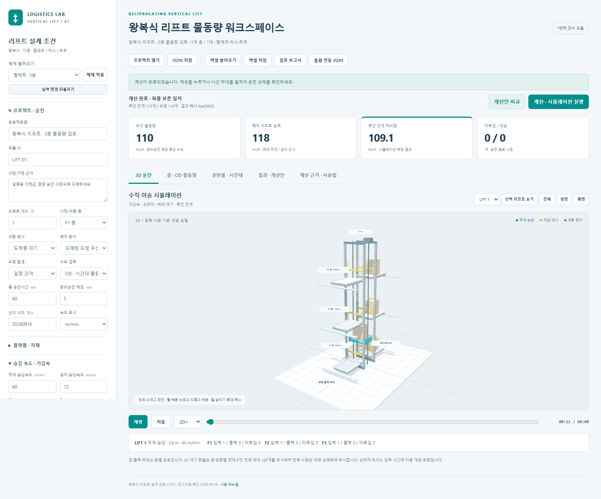

# 왕복식 리프트 물동량 계산 · 3D 시뮬레이션 사용 매뉴얼

버전 1.0.0 · 작성 2026-09-16

## 1. 실행과 빠른 시작

같은 폴더의 **리프트_실행.html**을 Edge 또는 Chrome에서 엽니다. 별도 설치나 인터넷 연결 없이 계산과 3D를 사용할 수 있습니다. 온라인 참고자료 링크를 열 때만 인터넷이 필요합니다.

1. 왼쪽에서 팔레트, 박스, 토트, 리프트 2대, 출구 정체 중 예제를 선택하고 **예제 적용**을 누릅니다.
2. **층 · OD 물동량**에서 실제 층 높이, 상하차 시간, 버퍼와 층간 요구 물동량을 입력합니다.
3. 플랫폼 유효 치수, 화물 허용하중, 승강 속도·가감속을 승인 사양에 맞춥니다.
4. **계산 · 시뮬레이션 실행**을 누릅니다.
5. **재생** 또는 시간 막대로 운전 상태를 확인합니다. **결과 · 개선안**에서 미투입·재공·차단·리드타임을 확인합니다.
6. **엑셀 저장**, **JSON 저장**, **검토 보고서**로 조건과 결과를 보관합니다.

기본값은 설명용 가정입니다. 특정 제조사의 장비를 그대로 재현하거나 성능을 보증하는 값이 아닙니다.



## 2. 지원하는 장비와 운전

- 왕복식 수직 리프트, 독립 승강로 1~8대, 2~20층.
- 모든 리프트는 동일 사양이며 등록한 모든 층을 운행합니다.
- 팔레트·박스·토트. HU는 개별 운반물 1개를 뜻하며 유형 사이의 환산은 하지 않습니다.
- 한 운행에서는 같은 OD, 같은 화물 유형만 함께 적재합니다.
- 각 층에는 입력 이재부 1개와 출력 이재부 1개가 있습니다. 각 자원과 버퍼를 여러 리프트가 공유합니다. 입력·출력은 서로 다른 자원입니다.
- 층 입력은 선입선출이며, 후단 출력 공간이 없으면 적재한 리프트가 도착층에서 기다립니다.

운전 순서: **배차 → 공차 접근 → 정위치 → 도어 열림 → 상차 → 닫힘·인터록 → 적재 승강 → 정위치 → 출력 공간·이재부 확보 → 도어 열림 → 하차 → 닫힘·인터록**.

매회 기준층 귀환을 선택하면 이후 공차 귀환과 정위치를 끝내고 다음 요청을 배차합니다. 도착층 대기는 하차층에서 다음 요청을 기다립니다.

## 3. 기본조건 입력

| 항목 | 의미 |
| --- | --- |
| 프로젝트명 / 모듈 ID | 설계안 이름과 향후 전체 창고에서 구분할 장비 ID |
| 사양·가정 근거 | 승인 도면, 제조사 사양, 실측 날짜 또는 설계 가정을 기록 |
| 리프트 대수 | 독립 승강로 수. 한 승강로 안의 복수 캐리어 수가 아님 |
| 시작/귀환 층 | 운전 초기 위치와 매회 귀환 기준층 |
| 배차 방식 | 높은 OD 우선순위를 먼저 검토하고, 오래된 요청 또는 가까운 출발층 기준으로 선택 |
| 요청 발생 | 일정 간격 또는 Poisson 무작위 도착. 같은 시드는 같은 요청을 재현 |
| 총 운전시간 / 준비운전 | 둘 다 분(min). 준비운전은 총 운전시간 안에 포함되며 그 시간의 통계만 제외 |
| 플랫폼 유효 길이·폭·높이 | 화물을 실을 수 있는 유효 공간. 화물 회전·단 쌓기는 하지 않음 |
| 화물 허용하중 | 캐리어·컨베이어 자중을 제외하고 운반물에 허용하는 kg. 제조사 총 승강하중과 구분 |
| 최대 동시 적재 | 같은 OD 화물을 한 번에 싣는 상한. 공간·중량·버퍼 제약으로 더 작아질 수 있음 |
| 부분 적재 최대 대기 | 입력 버퍼에 들어온 첫 화물을 기준으로 만재를 기다리는 시간. 0이면 현재 있는 수량으로 바로 운행 |
| 적재 / 공차 승강속도 | 화면의 m/min 또는 m/s 표시 선택 적용. 내부 계산은 m/s |
| 상승 / 하강 속도 비율 | 해당 방향 최대속도에 곱하는 비율. 가감속 값은 별도 |
| 정위치 | 실제 승강 이동 후 1회 적용. 같은 높이의 공차 접근에는 적용하지 않음 |
| 도어 열림·닫힘 / 인터록 | 상차 정차와 하차 정차 각각에 적용 |
| 해석용 가용도 | 해석 능력·참고 필요 대수에만 적용. 시뮬레이션 정지는 정지표로 별도 지정 |
| 목표 설계 부하율 | 참고 필요 대수 계산에 사용. 실제 장비 속도를 낮추는 값이 아님 |

입력을 바꾸면 기존 운전 결과와 개선안 비교가 초기화됩니다. **입력 변경 되돌리기**로 직전 입력 상태를 복원할 수 있습니다.

## 4. 층 스테이션과 OD

층 높이는 기준면에서의 절대 높이(m)입니다. 예: 0.6 m, 4.6 m, 8.6 m이면 각 층간 이동은 4 m입니다.

상차·하차는 **화물 1개당 순수 이재시간**입니다. 2개를 실으면 이재시간도 2배이며 도어·인터록은 정차마다 한 번입니다. 도어·인터록을 포함한 총 실측시간을 입력할 경우 별도 지연을 중복 적용하지 않도록 분리해야 합니다.

입력 버퍼의 자리는 상차가 끝날 때 비웁니다. 배차되어 리프트가 접근 중인 화물도 입력 버퍼를 점유합니다. 출력 버퍼는 하차 시작 전 예약하며, 후단 반출 중인 화물도 자리를 차지합니다. 후단 반출 0 s/개는 무대기 인계입니다.

층을 추가하면 기존 OD 값은 유지하고 새 층과의 출발·도착 조합을 0 개/h로 만듭니다. **전체 층간 OD 생성**도 같은 방식입니다. 한 쌍에 여러 화물 유형이 필요하면 **OD 추가**로 행을 나눕니다.

층 삭제 시 그 층을 참조하는 OD도 삭제하고 삭제 수를 알려줍니다. 실측 작업이력이 해당 OD를 참조하면 이력을 먼저 정리해야 삭제할 수 있습니다.

## 5. 화물·시간대·계획정지·이력

### 적재 제한

화물 길이 방향을 플랫폼 길이 방향에 맞춥니다. 배치 가능 개수는 길이 방향 개수 × 폭 방향 개수입니다. 실제 상한은 이 개수, 중량으로 허용되는 개수, 최대 동시 적재, 출발 입력 버퍼, 도착 출력 버퍼 중 최솟값입니다. 유효 높이도 검사합니다.

서로 다른 화물이나 OD는 섞어 싣지 않습니다. 같은 층 입력 대기열 중 앞에서 연속된 동일 OD만 묶습니다. 따라서 해석에서 가정한 최대 적재와 실제 운전의 평균 적재가 다를 수 있습니다.

### 시간대별 비율

운전 시작부터 분(min) 기준입니다. 100%는 1배, 150%는 1.5배, 0%는 그 구간의 신규 요청 없음입니다. 표가 비어 있으면 전 시간 100%입니다. 표를 입력하면 0부터 총 운전 종료까지 빠짐없이, 시간순으로, 중복 없이 연결해야 합니다.

**1시간 간격 자동 생성**은 기존 시간대 비율을 구간 길이로 가중하여 유지하고 새로운 시간은 100%로 만듭니다. 시간대 경계만 쪼개고 같은 비율을 유지하면 도착 수열이 달라지지 않습니다.

### 계획 정지

리프트 번호와 시작·종료 min을 입력합니다. 겹치는 정지 구간은 합칩니다. 해당 리프트의 이동·도어·이재 동작은 현재 위상에서 멈춘 뒤 재개합니다. 점유한 이재부와 화물도 유지합니다. 정지 때문에 출구 버퍼의 후단 반출까지 멈추지는 않습니다.

이는 정지 시간을 검토하기 위한 근사이며, 비상정지 감속·브레이크 제어 모델은 아닙니다.

### 실측 작업이력

CSV 헤더는 `id,release_s,flowId`입니다. 한 행은 화물 1개입니다.

```csv
id,release_s,flowId
J001,0,OD1
J002,15.5,OD2
```

작업이력 모드에서는 OD의 화물·층·우선순위를 사용하지만 OD 요구량과 시간대 비율로 추가 요청을 만들지는 않습니다. CSV 불러오기는 자동으로 작업이력 모드로 바꿉니다. 엑셀 작업이력 시트로도 입력할 수 있습니다.

## 6. 3D 화면 조작

| 조작 | 동작 |
| --- | --- |
| 마우스 왼쪽 버튼 드래그 | 시점 회전 |
| **마우스 휠 버튼을 누르고 드래그** | **화면 평행 이동** |
| 휠 굴리기 | 확대·축소 |
| 전체 / 정면 / 평면 | 시점 맞춤 |
| 리프트 선택 → 선택 리프트 보기 | 해당 리프트 위치로 시점 이동 |
| 재생 / 일시정지 / 처음 | 운전 이력 재생 제어 |
| 시간 막대 | 임의 운전 시각으로 이동 |
| 1×~120× | 재생 속도만 변경. 계산 물동량은 바뀌지 않음 |

승강 위치는 계산에 사용한 같은 가감속 곡선을 사용합니다. 상하차·도어는 시간에 따른 개념 표현입니다. 층·방향별 대기 화물은 최대 8개, 전체 표시 화물은 최대 220개입니다. 결과 수량은 표시 개수 제한과 무관하며 전체 화물을 집계합니다.

카드와 결과 탭은 **전체 계산 종료 결과**, 3D 아래 상태표는 **현재 재생 시각**입니다.

## 7. 계산식과 결과 읽기

이동거리 H, 최대속도 v, 가속도 a, 감속도 d일 때:

```text
도달속도 vp = min(v, sqrt(2H / (1/a + 1/d)))
가속거리 = vp² / (2a)
감속거리 = vp² / (2d)
정속시간 = max(0, H - 가속거리 - 감속거리) / vp
이동시간 = vp/a + 정속시간 + vp/d
```

짧은 거리는 삼각형 속도곡선, 긴 거리는 사다리꼴 속도곡선입니다. 정위치·도어·상하차·제어시간은 별도입니다.

**해석 리프트 능력**은 현재 OD 비율을 유지한 최대 적재 기준입니다. 도착층 대기의 공차는 이전 OD와 다음 OD를 독립적으로 섞은 평균으로 근사합니다. 매회 기준층 귀환은 기준층 → 출발층, 도착층 → 기준층을 모두 더합니다. 공용 이재부와 후단 반출의 부하를 추가 비교한 값이 해석 라인 상한입니다.

**시뮬레이션 처리량**은 실제 사건 순서에 따라 배차·부분 적재·대기·정지·차단을 계산한 관측값입니다. 수요가 낮으면 처리량도 낮으므로 이를 최대 능력으로 해석하면 안 됩니다. 해석용 가용도를 다시 곱하지 않습니다.

| 결과 | 의미 |
| --- | --- |
| 리프트 하차 처리량 | 준비운전 이후 플랫폼에서 출력 버퍼로 하차 완료한 개수/h |
| 후단 인계 처리량 | 준비운전 이후 출력 버퍼에서 후단으로 반출 완료한 개수/h |
| 미투입 | 요청은 발생했지만 입력 버퍼에 들어가지 못한 화물 |
| 입력 / 탑승 / 출력 | 입력 버퍼, 리프트, 출력 버퍼의 종료 시점 화물 |
| 재공 | 입력 + 탑승 + 출력 |
| 평균 대기시간 | 요청 발생부터 배차까지. 공차 접근·상차부 대기는 이후 운전시간에 포함 |
| 평균 / P95 리드타임 | 요청 발생부터 최종 후단 인계까지. P95는 완료 화물의 95백분위 |
| 작업 / 차단 / 정지 / 유휴 | 리프트 시간 분류. 공차 비율은 작업 비율의 일부 |

준비운전 동안 상태는 유지하고 통계 시간만 제외합니다. 준비운전 전에 발생해 이후 완료한 작업도 완료 통계에 들어갑니다. 미완료 화물은 리드타임 통계에서 빠지므로 미투입·재공과 함께 읽어야 합니다.

화물 보존 검증: **총 요청 = 총 최종 인계 완료 + 미투입 + 입력 + 탑승 + 출력**.

## 8. 개선안 비교

같은 요청·시드로 7개 안을 계산합니다: 기준, 리프트 1대 추가, 속도 20% 증가, 상하차 20% 단축, 출력 버퍼 2배, 후단 반출 20% 단축, 매회 기준층 귀환.

입력 한도를 넘는 안은 제외합니다. 처리량이 높고 P95가 낮은 안을 표시하지만, 단일 시드의 제한된 후보 비교입니다. 전역 최적해나 현장 성능 보증은 아닙니다. 대수 증설은 승강로 공간·구조·비용을 별도로 검토해야 합니다.

**이 조건 적용**은 선택안의 입력을 적용하고 결과를 초기화합니다. 다시 시뮬레이션을 실행하여 확인합니다.

## 9. 파일 저장과 통합 창고 연동

### 입력 파일

JSON은 SI 단위의 전체 입력을 저장하며 형식·버전·단위·입력 해시를 검사합니다. 엑셀은 아래 8개 시트에 전체 조건을 저장합니다.

| 시트 | 내용 |
| --- | --- |
| 안내 | 형식·단위·편집 방법 |
| 기본조건 | 플랫폼, 속도, 가감속, 도어, 배차, 시간, 시드 등 |
| 층스테이션 | 높이, 이재, 버퍼, 반출, 연계 장비 |
| 운반물 | 유형·치수·중량 |
| OD물동량 | 출발·도착·화물·요구량·우선순위 |
| 시간대비율 | 시작·종료·비율 |
| 계획정지 | 리프트별 정지 구간 |
| 작업이력 | 시각별 화물 요청 |

엑셀 속도는 **m/min**, 기본 운전시간·준비운전·시간대·정지는 **min**, 작업이력은 **s**입니다. 화면 속도 표시 선택과 무관합니다. % 셀에는 120% 또는 1.2를 입력합니다. 키·시트명·헤더·단위를 유지하고 수식은 값 붙여넣기로 바꾸세요. .xlsx만 지원하며 파일은 10 MB 이하입니다.

모든 시트를 검사한 뒤 한 번에 적용합니다. 오류가 있으면 기존 입력·결과를 유지합니다. 성공하면 이전 운전 결과는 초기화됩니다. 저장 파일은 브라우저 다운로드 폴더에 만들어집니다.

### 결과와 연동

- 검토 보고서: 전체 입력, 결과, 정의, 출처를 담은 HTML. 브라우저 인쇄에서 PDF 저장 가능.
- 결과 CSV: OD·화물·장비별 처리량과 대기 지표.
- 화물별 운전이력 CSV: 요청, 수락, 배차, 상하차, 후단 인계 시각.
- 통합 연동 JSON: `vertical_lift` 형식, 모듈별 층 입출력 포트, 버퍼, SI 설정, 화물 ID와 후단 인계 이벤트.

통합 포트 ID 예: `LIFT-01:F2:out`. 기존 컨베이어·스태커크레인·직선/LOOP RGV·셔틀·AGV/AMR를 연계 대상으로 지정할 수 있습니다. 현재는 설정·포트·완료 이력 교환 규격이며, **기존 프로그램과 공유 시계로 동시 운전하는 어댑터는 연결되지 않았습니다**. 후단은 입력한 반출시간으로 모사합니다.

## 10. 모델 범위와 확인 자료

복층 캐리어, 동일 승강로의 다중 차량, 혼합 목적지 중간 정차, 연속식 수직 컨베이어, 저크 제어, 전력·회생에너지, 구조 강도·안전 인증 설계는 포함하지 않습니다. 화물 자중·치수 검사는 입력 사양을 이용한 적재 가능성 검사입니다.

참고자료 확인일: 2026-09-16. 제조사의 조건부 최대 처리량 대신 거리·가감속·실제 이재시간으로 계산합니다.

- [NERAK 왕복식 수직 리프트](https://www.nerak-systems.com/vertical-lifts/vertical-reciprocating-conveyors): 다층 운반, 캐리어 위 컨베이어, 운반물과 높이에 따라 달라지는 능력.
- [Qimarox Prorunner mk1](https://www.qimarox.com/product/prorunner-mk1/): 소형 운반물 왕복식, 짧은 스트로크의 속도 제한 참고. 한 페이지의 처리량 표기가 여러 개여서 고정 기본 능력으로 채택하지 않음.
- [Qimarox Prorunner mk9](https://www.qimarox.com/product/prorunner-mk9/): 화물 하중과 캐리어 포함 하중의 구분, 다층 입출고 구성.
- [Qimarox Prorunner mk10](https://www.qimarox.com/product/prorunner-mk10/): 고층·중량 팔레트의 참고 구성.

세부 출처 검토와 기본값 구분은 **리프트_물동량계산_참고자료_20260916.md**를 참조하세요. 구현 소스·시험 기록은 `07_vertical_lift` 폴더에 있습니다.
