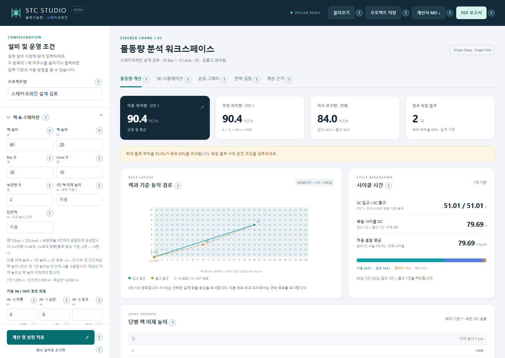
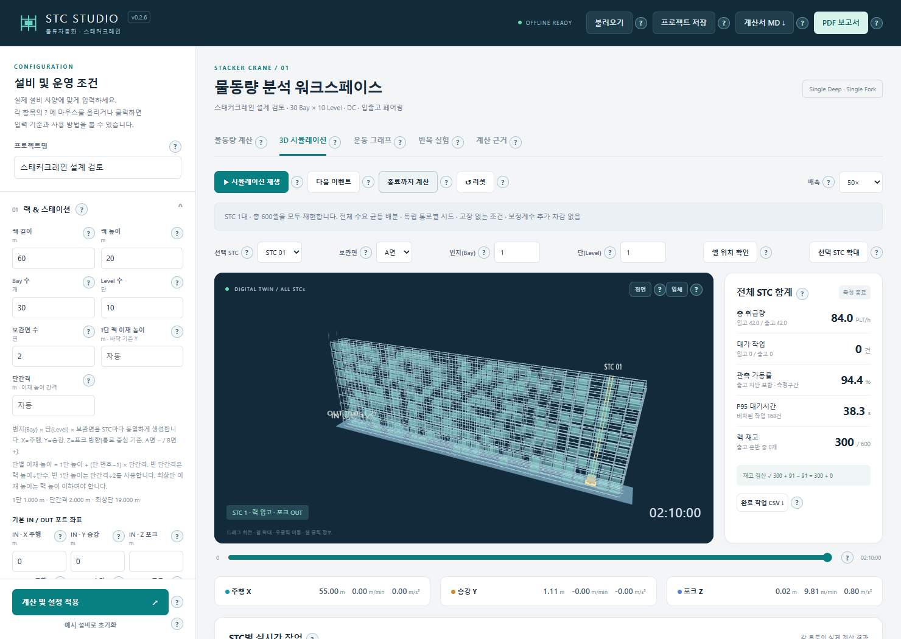
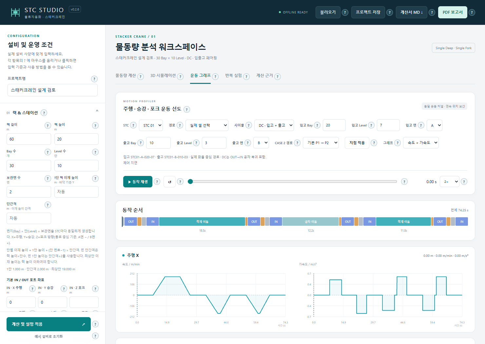
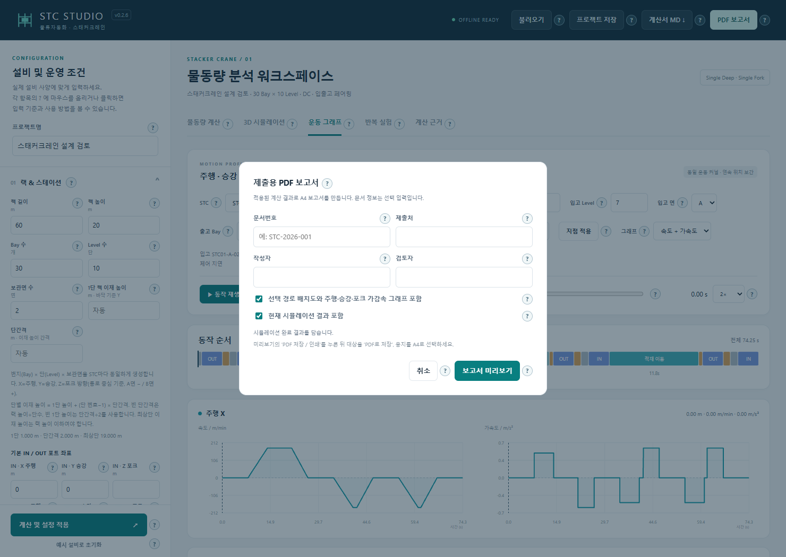

# STC Studio 사용 매뉴얼

스태커크레인 물동량 계산 · 재고 기반 시뮬레이션 · 운동 그래프

**대상 프로그램:** `스태커크레인_실행.html` / STC Studio v0.3.4  
**매뉴얼:** v1.3 · 2026-09-17  
**대상 독자:** 물류자동화 설계·SE·제안·검토 담당자

이 매뉴얼은 현재 실행 파일의 화면과 동작을 기준으로 작성했습니다. 랙과 설비 사양을 입력하여 처리능력과 필요 독립 통로를 검토하고, 대기·재고·출고 버퍼의 영향을 시뮬레이션으로 확인한 뒤 계산서를 저장하는 순서로 설명합니다. 예제의 수치는 프로그램 조작을 익히기 위한 가정값입니다.

## v0.3.1 추가 기능: 싱글딥·더블딥 선택

1. 왼쪽 **랙 & 스테이션 → 화물 보관 깊이**에서 **싱글딥** 또는 **더블딥**을 선택합니다.
2. **주행·승강·포크 → 포크 편도 스트로크 · 앞열**과 **뒷열 포크 편도 스트로크**를 확인합니다. 각각 통로 중심부터 화물 중심까지의 **총 편도거리(m)**입니다. 뒷열은 앞열보다 커야 하며 빈칸은 앞열의 2배를 설계 가정으로 적용합니다.
3. **계산 및 설정 적용**을 누릅니다. 저장 셀 수 = 번지 × 단 × 보관면 × 깊이(싱글 1 / 더블 2) × STC 수입니다. 기본 랙은 싱글딥 600셀, 더블딥 1,200셀/STC입니다. 저장 용량이 2배여도 시간당 처리량이 2배가 되는 것은 아닙니다.
4. **3D 시뮬레이션 → 깊이**, **운동 그래프 → 입고 깊이 / 출고 깊이**에서 D1(앞열), D2(뒷열)를 선택합니다. 더블딥 주소에는 `-D1` 또는 `-D2`가 붙습니다. 프로젝트 JSON, 완료 작업 CSV, 계산서 MD, PDF 보고서에도 반영됩니다.

보관 깊이는 보관면 수 및 SC/DC 운전 모드와 별개입니다. 기존 프로젝트는 싱글딥으로 불러오며, 싱글딥에서는 뒷열 입력을 사용하지 않습니다.

**계산 가정:** 분석은 앞열·뒷열을 50:50으로 선택한 포크 이재시간 평균입니다. FEM CASE와의 결합은 설계 확장으로 표시합니다. DC의 입고·출고는 서로 다른 번지·단·면을 사용합니다. 시뮬레이션은 뒷열 우선 입고, 앞열이 비어 있을 때만 뒷열 접근, 접근 가능한 재고 내 FIFO를 적용합니다. SKU 지정 출고 및 앞열 화물 재배치 작업은 포함하지 않습니다.

## v0.3.0 추가 기능: SC/DC 비율과 복합 CASE 배치

### 싱글·듀얼 비율 지정

1. **요구 물동량 & 운전 → 운전 모드 → SC / DC · 지정 비율**을 선택합니다.
2. 싱글 또는 듀얼 작업 비율을 %로 입력합니다. 다른 비율은 자동 조정되어 합계가 100%가 됩니다.
3. **비율 기준**을 운전 사이클 횟수 또는 처리 화물 개수로 선택합니다.
4. **계산 및 설정 적용**을 누른 뒤 분석 비율과 3D 시뮬레이션의 실제 완료 비율을 비교합니다.

사이클 기준 50:50은 SC 1회(화물 1개) + DC 1회(입고 1개·출고 1개)입니다. 이때 DC로 처리하는 화물은 약 66.7%입니다. 화물 기준 50:50은 사이클 기준 DC 약 33.3%입니다. 화물 비율 f는 사이클 비율 p=f/(2−f)로 환산합니다.

입고 80·출고 20이면 분석 DC 사이클 비율 상한은 25%입니다. 실제 운전은 누적 배차 횟수로 비율을 조절합니다. 같은 조합의 양쪽 작업과 빈 셀·재고가 없으면 가능한 SC를 처리하므로 실제 비율은 달라질 수 있습니다. 실제 비율은 **준비운전 이후 완료된 SC/DC 사이클** 기준입니다. 지정 비율 모드의 SC는 해당 포트로 복귀합니다.

### STC마다 다른 CASE 사용

1. **독립 통로 / 크레인** 대수를 입력합니다.
2. **랙 & 스테이션 → STC별 포트 표 → CASE**에서 각 호기에 CASE 1~6을 지정합니다.
3. 개별 XYZ를 입력하면 CASE 참조 좌표보다 우선합니다. **기본**은 기존 기본 CASE와 기본 포트 좌표를 따릅니다.
4. 적용 후 계산표와 3D에서 각 STC의 배치를 확인합니다.

CASE 3·5·6의 기본 높이는 H/2, CASE 4의 기본 X는 L/2입니다. 공용 CASE 1·3·4의 빈 Z는 기본 IN Z를 공통 사용합니다. 실제 좌표는 XYZ에 입력합니다.

### 한 STC에 여러 CASE 배치

1. **복합 입·출고 포트 구성**을 열고 STC 번호를 선택합니다.
2. **조합 추가** 또는 빈 STC의 **CASE 1~6 예제 추가**를 누릅니다.
3. 조합 ID, CASE, 배분 %, IN/OUT XYZ를 입력합니다. **STC별 최대 6개 조합, 배분율 합계 100%**입니다.
4. **편집 닫기 → 계산 및 설정 적용**을 누릅니다.

ID는 영문·숫자·밑줄·하이픈 1~24자이며 STC 안에서 중복할 수 없습니다. 추가·삭제 시 해당 STC의 배분율을 자동 환산합니다. 빈 XYZ는 CASE 참조 배치이며 **좌표 초기화**로 되돌릴 수 있습니다.

조합 행이 있는 STC는 조합 표의 포트만 사용합니다. 행이 없는 STC는 기본·개별 포트 표를 사용합니다. STC 대수를 줄여 범위를 벗어난 조합은 자동 삭제하지 않으므로 번호를 수정하거나 행을 삭제해야 적용됩니다.

배분율은 각 STC의 입고·출고 요구량에 동일하게 적용합니다. 조합 A 60%, B 40%라면 입고도 60:40, 출고도 60:40입니다. **DC는 같은 조합 안에서만** 페어링합니다. 모든 조합은 하나의 크레인과 재고를 공유합니다.

동일 XYZ의 IN끼리, OUT끼리는 버퍼를 공유합니다. 다른 좌표의 포트에는 각각 입력한 버퍼 용량과 반출 간격을 적용합니다. 같은 좌표의 IN과 OUT은 별도 버퍼입니다.

### 결과 확인과 저장

- 분석은 조합별 SC/DC 시간과 STC별 혼합 평균, 포트 전환 공차시간을 표시합니다. 처리능력을 단순 평균하지 않고 시간을 가중 평균합니다.
- 전환 공차시간은 조합·SC 입출고 방향을 독립 선택한다는 가정의 추정값입니다. 실제 배차 순서·재고·버퍼 영향은 DES에서 확인하세요. 복합 CASE 구성은 FEM 참조 배치를 조합한 설계 확장입니다.
- 3D는 모든 실제 포트와 버퍼를 표시합니다. 휠 버튼을 누르고 드래그하면 화면을 이동합니다.
- **운동 그래프 → STC → 포트 조합**으로 각 CASE의 실제 경로를 선택합니다.
- 지정 비율 모드의 반복 실험은 기존 3개 모드에 현재 지정 비율을 추가합니다.
- JSON에는 비율·기준·STC별 CASE·모든 조합을 저장합니다. 이전 v0.1/v0.2 파일은 기존 운전 모드를 유지합니다.
- 완료 작업 CSV에 조합 ID·CASE, 계산서 MD/PDF에 설정·조합·실제 비율을 포함합니다.

**연습 예제:** 프로그램의 불러오기에서 `01_stacker_crane/examples/08_SC60_DC40_CASE복합.json` 또는 `09_STC별_CASE2_5_6.json`을 선택합니다. 예제 사양은 조작 연습용 가정입니다.

기존 매뉴얼의 기본 조작 화면 캡처는 v0.2.6 당시 화면입니다. 신규 비율·복합 배치는 이 절을 기준으로 사용하세요.


## 1. 실행과 빠른 시작

### 1.1 프로그램 열기

1. `스태커크레인_실행.html`을 마우스 오른쪽 버튼으로 클릭합니다.
2. **연결 프로그램 → Microsoft Edge 또는 Google Chrome**을 선택합니다.
3. 상단에 **STC STUDIO v0.3.4**, 본문에 **물동량 분석 워크스페이스**가 보이는지 확인합니다.

설치·로그인·서버·인터넷 연결 없이 실행됩니다. 프로그램 HTML 한 파일만 복사해도 사용할 수 있습니다. 3D를 지원하지 않는 환경에서는 2D로 표시됩니다. 작은 창에서는 설정 영역이나 표 내부를 별도로 스크롤해야 합니다.

### 1.2 처음 사용하는 순서

1. 왼쪽 **프로젝트명**을 입력합니다.
2. **랙 & 스테이션**에서 랙 치수와 포트 위치를 입력합니다.
3. **주행 · 승강 · 포크**에서 속도 단위를 먼저 확인하고 설비 사양을 입력합니다.
4. **요구 물동량 & 운전**에서 전체 입고·출고 요구량, 피크 계수, 통로 수, 운전 모드를 설정합니다.
5. **운전효율 및 보정**에서 세 계수와 근거를 지정합니다. 조작 연습은 **이상 조건 1.0**으로 시작할 수 있습니다.
6. 왼쪽 아래 **계산 및 설정 적용**을 누릅니다.
7. **물동량 계산**에서 처리량·필요 통로·경고를 확인합니다.
8. **3D 시뮬레이션 → 종료까지 계산**으로 대기·재고·외부 출하량을 확인합니다.
9. **프로젝트 저장**으로 입력을 보관하고, **계산서 MD ↓** 또는 **PDF 보고서**로 결과를 저장합니다.

> **설정 변경 후 반드시 적용:** 입력을 바꾸면 이전 결과가 흐려집니다. 다시 **계산 및 설정 적용**을 눌러야 결과를 사용할 수 있습니다. 이때 기존 시뮬레이션과 반복 실험 결과가 초기화되므로 필요한 결과는 먼저 내보내세요.

## 2. 화면 구성과 도움말



| 화면 위치 | 기능 | 사용할 때 |
| --- | --- | --- |
| 상단 메뉴 | 불러오기, 프로젝트 저장, 계산서 MD ↓, PDF 보고서 | 입력 재사용과 결과 보관 |
| 왼쪽 설정 | 랙·포트, 대표점, 운동 사양, 수요, 보정계수, 시뮬레이션 조건 | 계산 조건 입력 |
| 왼쪽 아래 | 계산 및 설정 적용, 예시 설비로 초기화 | 입력 반영 또는 기본 예시 복원 |
| 물동량 계산 | 처리량, 사이클 시간, 높이·포트·CASE 표, 필요 통로 | 정적인 설계 능력 검토 |
| 3D 시뮬레이션 | 전체 STC 동작, 재고, 대기, 버퍼, 완료 작업 | 시간에 따른 운영 결과 확인 |
| 운동 그래프 | 한 사이클의 주행·승강·포크 운동 | 특정 셀 경로와 이재 순서 확인 |
| 반복 실험 | 세 운전 모드의 반복 비교 | 시드에 따른 변동과 운영 차이 검토 |
| 계산 근거 | 운동식, 사이클, 집계 기준, 적용 범위 | 계산의 전제 확인 |

**? 도움말 사용:** 항목 옆 **?**에 마우스를 올리면 설명이 열립니다. 클릭·터치하면 고정되며, 다시 클릭하거나 ×, 바깥 클릭, Esc로 닫습니다. 키보드는 Tab으로 이동하고 Enter/Space로 고정합니다. 도움말을 여는 동작은 해당 버튼을 실행하거나 설정을 적용하지 않습니다.

## 3. 랙과 입출고 포트 설정

### 3.1 랙 치수와 저장 위치

| 입력 항목 | 화면 단위 | 기본 예시 | 입력 기준 |
| --- | --- | --- | --- |
| 랙 길이 | m | 60 | 랙 왼쪽 끝부터 오른쪽 끝까지 X 방향 길이 |
| 랙 높이 | m | 20 | 랙 높이 H. 최상단 이재 높이 이상 |
| Bay 수 | 개 | 30 | 한 보관면의 가로 번지 수, 1~200 |
| Level 수 | 단 | 10 | 아래부터 센 단수, 1~30 |
| 보관면 수 | 면 | 2 | 1: A면 / 2: A·B면 |
| 1단 랙 이재 높이 | m | 빈칸·자동 | 바닥 기준으로 1단에 놓인 화물 중심 Y |
| 단간격 | m | 빈칸·자동 | 인접한 단의 이재 중심 사이 높이 |

한 셀에 화물 1개를 보관합니다. 모든 STC는 같은 랙 규격과 단별 높이를 사용합니다.

```text
전체 셀 수 = Bay 수 × Level 수 × 보관면 수 × 깊이(싱글 1 / 더블 2) × STC 수
번지 중심 X = (번지 번호 − 0.5) × 랙 길이 ÷ Bay 수
k단 중심 Y = 1단 랙 이재 높이 + (k − 1) × 단간격
```

단간격을 비우면 **랙 높이 ÷ Level 수**, 1단 높이를 비우면 **단간격 ÷ 2**를 사용합니다. 기본 예시는 600셀/STC이며, 1단 1 m·단간격 2 m·10단 19 m입니다.

예를 들어 1단 높이 0.5 m, 단간격 2 m, 4단이면 각 단의 Y는 0.5 / 2.5 / 4.5 / 6.5 m입니다. 설정 적용 후 **단별 랙 이재 높이** 표에서 확인하세요. 최상단 높이가 랙 높이를 넘으면 적용이 차단됩니다.

### 3.2 IN·OUT XYZ 좌표

**IN**은 입고 포트, **OUT**은 출고 포트입니다. 좌표는 각 STC 통로의 로컬 좌표로 입력합니다.

| 축 | 뜻과 기준 | 입력 예 |
| --- | --- | --- |
| X · 주행 | 랙 왼쪽 끝 0, 오른쪽 끝 랙 길이 | X=−3 m: 왼쪽 외부 3 m |
| Y · 승강 | 기준면에서 놓인 화물 중심까지의 높이 | 포트 중심 높이 1.6 m → 1.6 |
| Z · 포크 | 통로 중심에서 포크 방향 거리. A면 음수, B면 양수 | Z=−1 m: A면 방향 편도 1 m |

X는 −500~500 m, Y는 −100~100 m 범위에서 랙 외부 좌표를 입력할 수 있습니다. **포트까지 거리를 포함하려고 랙 길이를 늘리지 마세요.** 길이 33.9 m 랙의 오른쪽 외부 4.1 m 포트는 X=38 m로 입력합니다. IN과 OUT의 `|Z|`는 포크 편도 스트로크 이하여야 합니다.

**빈칸의 의미를 구분하세요.**

- 기본 IN Z와 OUT Z의 빈칸은 각각 **−포크 스트로크**를 사용합니다. OUT Z 빈칸이 IN Z를 그대로 복사하는 것은 아닙니다.
- 기본 OUT X·Y를 비우면 해당 STC의 IN X·Y를 따릅니다.
- STC별 표의 빈칸은 해당 좌표의 기본값을 따릅니다. 기본값도 빈칸인 항목은 위 자동 규칙을 적용합니다.
- 숫자 **0**은 좌표 0을 직접 지정합니다. 빈칸과 다릅니다.

### 3.3 여러 STC의 개별 포트

1. **요구 물동량 & 운전 → 독립 통로 / 크레인**에 대수를 입력합니다.
2. **랙 & 스테이션 → STC별 포트 표 갱신**으로 행 수를 확인합니다. 대수 변경 시에도 표가 갱신됩니다.
3. 각 STC 행에 기본값과 다른 좌표만 입력합니다. 오른쪽 OUT 열은 가로 스크롤로 확인합니다.
4. **계산 및 설정 적용**을 누르고 **CASE 적용 및 STC별 계산**에서 실제 IN·OUT XYZ와 사이클 시간을 확인합니다.

**개별값 지우기**는 개별 표를 비워 기본 포트로 되돌립니다. **CASE 포트 배치 적용**은 기본·개별 X/Y를 CASE 참조 배치로 바꾸므로 실제 포트 입력 후 사용할 때 주의하세요.

셀 주소 `STC03-B-012-06`은 **3호기 · B면 · 12번지 · 6단**입니다. 보관면이 1이면 A면만 사용합니다.

## 4. 주행·승강·포크 사양 입력

### 4.1 단위를 먼저 확인하기

기본 속도 단위는 **m/min**, 가속도·감속도는 **m/s²**입니다. 랙·포트·포크 스트로크는 **m**, 캐리지 이재 승하강량은 **mm**입니다. 가용도·효율·충전률은 80%를 **0.8**로 입력합니다. 신규 SC/DC 비율과 포트 배분율은 **80**으로 입력합니다.

| 운동축 | 최대속도 기본값 | 가속도 기본값 | 감속도 기본값 |
| --- | --- | --- | --- |
| 주행 X | 180 m/min = 3 m/s | 0.5 m/s² | 0.6 m/s² |
| 승강 Y | 60 m/min = 1 m/s | 0.5 m/s² | 0.5 m/s² |
| 포크 Z | 36 m/min = 0.6 m/s | 0.8 m/s² | 0.8 m/s² |

단위 선택기를 바꾸면 입력된 세 속도를 환산합니다. 사양이 180 m/min이면 **m/min을 선택한 뒤 180**을 입력하세요. m/s 상태에서 180을 넣고 단위만 바꾸면 10,800 m/min으로 환산되므로 원하는 값을 다시 입력해야 합니다. 속도 입력칸 아래 허용 범위와 환산값을 확인하세요.

### 4.2 이재와 지연

| 입력 항목 | 단위 | 기본 예시 | 적용 방식 |
| --- | --- | --- | --- |
| 포크 편도 스트로크 | m | 1.2 | 랙 이재 시 편도 거리. 포트는 Z의 절댓값 사용 |
| 캐리지 이재 승하강량 | mm | 110 | 상차 UP / 하차 DOWN 운동 거리 |
| 이재 후 안착 대기 | s/이재 | 1 | 승하강 완료 후 포크 IN 전 정지 |
| 정위치 시간 | s/이동 | 0.5 | 실제 XY 이동이 있는 구간마다 1회 |
| 제어 지연 | s/사이클 | 0.5 | SC·DC 사이클당 1회 |
| 적재 속도·가감속 비율 | 0~1 비율 | 1 | 적재 시 속도·가속도·감속도에 함께 곱함. 허용 0.1~1 |

```text
상차: 포크 OUT → 캐리지 UP → 안착 대기 → 포크 IN
하차: 포크 OUT → 캐리지 DOWN → 안착 대기 → 포크 IN
```

승하강 중 포크는 완전히 신장한 상태로 정지합니다. 랙·포트의 Y는 놓인 화물 중심이고, 상차 후 적재 이동은 이재 승하강량만큼 높은 위치에서 이루어집니다. 캐리지 이재 시간은 승강축 속도·가감속으로 계산하며 별도 이재 저속 입력은 없습니다.

기본 110 mm 승하강은 약 0.9381초/이재이며 SC에 2회, DC에 4회 포함됩니다. 기존 사양의 이재시간에 승하강 운동이 포함되어 있다면 **이재 후 안착 대기**에는 추가 안착 시간만 넣어 중복을 피하세요.

주행과 승강은 동시에 출발하며 이동시간은 두 축 중 긴 시간으로 정합니다. 짧은 거리는 최대속도에 도달하지 않는 삼각형 속도선도, 충분히 긴 거리는 정속 구간이 있는 사다리꼴 선도가 됩니다.

## 5. 요구 물동량·운전 모드·보정계수

### 5.1 수요와 대수

| 입력 항목 | 기본 예시 | 의미 |
| --- | --- | --- |
| 평균 입고 요구량 | 35 PLT/h | 전체 STC가 처리할 평균 입고 수요 |
| 평균 출고 요구량 | 35 PLT/h | 전체 STC가 처리할 평균 출고 수요 |
| 피크 계수 | 1.2 | 평균 수요를 피크 수요로 환산 |
| 독립 통로 / 크레인 | 1대 | 독립 통로당 STC 1대, 전체 1~100대 |
| 목표 설계 부하율 | 0.8 | 보정능력 대비 목표 부하율 80% |
| 화물 단위 | PLT | PLT·BOX·TOTE 중 선택 |

```text
전체 피크 요구량 = (평균 입고 + 평균 출고) × 피크 계수
통로당 투입 수요 = 전체 피크 요구량 ÷ STC 수
```

이미 피크 수요를 입력했다면 피크 계수는 1로 설정합니다. **수요는 전체 기준**이므로 대수를 늘릴 때 입력 수요까지 함께 나눌 필요가 없습니다. 화물 단위 선택은 수량 표시를 바꾸며 팔레트와 박스 사이의 환산이나 물리 사양 변경을 자동으로 수행하지 않습니다.

### 5.2 운전 모드

| 모드 | 시뮬레이션 동작 | 결과를 볼 때 |
| --- | --- | --- |
| SC · I/O 복귀 | 한 건 처리 후 해당 IN/OUT 포트로 복귀 | 입고 또는 출고 1건/사이클 |
| SC · 작업 위치 대기 | 한 건 처리 후 마지막 작업 위치에서 대기 | 분석 카드는 SC 복귀 참고값. 운영 차이는 시뮬레이션으로 확인 |
| SC / DC · 지정 비율 | 입력한 목표 비율로 SC/DC 배차 | 신규 기능 설명 참고 |
| DC · 최대 페어링 | 가능한 입고와 출고를 묶어 수행 | 한쪽 작업·재고가 없으면 SC 위치 대기로 수행 |

DC 경로는 **IN 상차 → 입고 셀 하차 → 출고 셀 상차 → OUT 하차 → IN 공차 복귀**입니다. DC 1회는 **입고 1건 + 출고 1건**, 총 취급 2건입니다. 출고 2건을 뜻하지 않습니다.

분석의 DC 비율은 **전체 사이클 수 중 DC 사이클 비율**입니다. DC 모드에서는 수요 구성이 허용하는 최대 비율을 사용합니다. 입고 60·출고 40이면 DC 40회와 잔여 SC 20회이므로 DC 비율은 약 66.7%입니다. 실제 도착 순서와 재고 조건에 따라 시뮬레이션의 DC 비율은 더 낮을 수 있습니다.

### 5.3 운전효율과 보정계수 적용

**운전효율 직접 입력:** 왼쪽 **운전효율 및 보정 → 운전효율**에 85%는 **85**로 입력하고 **계산 및 설정 적용**을 누릅니다. 입력 범위는 1~100%이며, 결과의 **보정 처리량**에 반영됩니다.

- 보정 처리량 = 이론 처리량 × 운전효율 ÷ 100. 예: SC 92.56초이면 85% 적용 시 약 33.06 PLT/h, DC 156.13초이면 약 39.20 PLT/h입니다.
- 직접 입력한 운전효율은 A·Ft·Ew를 대신합니다. 두 방식은 중복 적용하지 않습니다.
- 목표 설계 부하율 0.85는 필요 대수·부하 판정 기준입니다. 운전효율과 별개이며 표시 처리량에 곱하지 않습니다.
- 사이클 시간과 DES 시뮬레이션 결과에는 운전효율을 추가 적용하지 않습니다.
- 효율은 프로젝트 JSON에 저장되며 계산서·PDF에도 표시됩니다. 기존 프로젝트는 기존 보정 방식을 유지합니다.

**세부 계수 방식:** 운전효율을 빈칸으로 둔 뒤 다음과 같이 설정합니다.

1. **운전효율 및 보정**를 펼칩니다.
2. **가용도 A, 교통계수 Fₜ, 작업효율 E𝑤**를 각각 0.01~1 범위로 입력합니다.
3. **계수 근거**에서 설계 가정·벤더 사양·실측·이상 조건을 선택합니다.
4. **근거 메모**에 사양서 번호, 측정 조건 또는 가정 이유를 기록합니다.
5. **계산 및 설정 적용**을 누릅니다.

**가정 예시 적용**은 A=0.95, Fₜ=0.95, E𝑤=1과 설계 가정 근거를 채웁니다. **이상 조건 1.0**은 세 계수를 모두 1로 설정합니다. 두 버튼 모두 다시 계산을 적용해야 반영됩니다.

```text
보정 처리량 = 이론 처리량 × A × Fₜ × E𝑤
```

기본값은 미선택입니다. 계수 또는 근거가 없으면 보정능력과 필요 대수는 **— / 미산정**, PDF 판정은 보류로 표시됩니다. 계수는 분석에 한 번 적용되며, 고장 없는 운영 모델로 실행하는 시뮬레이션에는 적용하지 않습니다. 시뮬레이션 값에 다시 계수를 곱한 수치를 프로그램의 관측 결과로 취급하지 마세요.

## 6. 물동량 계산 결과 읽기

다음 순서로 확인하면 수요, 장비 능력, 설계 여유를 구분하기 쉽습니다.

1. **피크 요구량 · 전체**가 의도한 입고·출고 합계인지 확인합니다.
2. **이론 처리량 · STC 1**과 **보정 처리량 · STC 1**을 확인합니다. 이 두 카드는 1호기 기준입니다.
3. **필요 독립 통로**와 목표 부하율 초과 경고를 확인합니다.
4. **사이클 시간**에서 SC 입고·SC 출고·DC·적용 혼합 평균을 확인합니다. 아래 시간 분해 막대는 SC 평균의 이동·포크·정위치·제어 구성입니다.
5. **CASE 적용 및 STC별 계산**에서 각 호기의 실제 포트, SC/DC, OUT→IN 시간을 확인합니다.
6. **요구량과 처리능력**에서 전체 이론·보정능력, 전체 설계 부하율, 잔여능력을 확인합니다.
7. **보정계수 민감도**에서 각 계수의 상대 ±5%·±10% 변화에 따른 능력과 필요 대수를 비교합니다.

```text
전체 보정 처리능력 = 각 STC 보정 처리량의 합
전체 설계 부하율 = 전체 피크 요구량 ÷ 전체 보정 처리능력
필요 독립 통로 = 올림[전체 피크 요구량 ÷ (입력 STC 중 최저 보정 처리량 × 목표 부하율)]
```

STC별 포트가 다르면 각 호기의 능력도 달라집니다. 필요 대수는 가장 낮은 능력을 기준으로 계산하며, 전체 수요 균등 배분과 공통 입출고 병목이 없는 독립 통로를 가정합니다. **필요 통로가 2대로 표시되어도 입력 대수는 자동으로 변경되지 않습니다.** 대수를 직접 바꾸고 다시 적용해야 2대 조건으로 시뮬레이션합니다.

## 7. FEM CASE와 대표점 사용

### 7.1 계산 방법 선택

- **전체 셀 평균 · 자유 포트 좌표:** 모든 실제 셀의 SC 평균과 서로 다른 셀 사이 DC 평균을 사용합니다. DC 쌍이 많으면 고정 시드 30,000쌍을 표본으로 계산합니다.
- **FEM CASE 기준 · 대표 셀 계산:** 선택 CASE의 대표 경로로 분석합니다. **실제 화물 중심 · 기본**은 가까운 실제 셀의 중심을 사용하고, **FEM 이론 좌표 · 비교**는 연속 이론 좌표를 사용합니다.

| CASE | 화면의 포트 배치 의미 |
| --- | --- |
| 1 | 공용 포트 / 하단 모서리 |
| 2 | IN·OUT / 하단 양 끝 |
| 3 | 공용 포트 / 높이 이동 |
| 4 | 공용 포트 / X 이동 |
| 5 | IN 하단 / OUT 상부 |
| 6 | IN 상부 / OUT 하단 |

### 7.2 실제 포트를 유지하며 계산하기

1. **대표점 계산 기준 → 처리량 계산 방법**에서 FEM CASE 기준을 선택합니다.
2. 배치에 맞는 CASE를 선택합니다.
3. **P1 · P2 적용 위치 → 실제 화물 중심 · 기본**을 선택합니다.
4. 기본 또는 STC별 표에 실제 포트 XYZ를 입력합니다.
5. **계산 및 설정 적용**을 누릅니다.
6. 결과의 **적용 XYZ**, **적용 화물 셀**, **이론 XYZ (비교)**를 대조합니다.
7. **운동 그래프 → 경로: CASE P1·P2 적용점**으로 같은 적용 경로를 확인합니다.

> **기본 FEM CASE 선택과 기본 포트 변경은 별개입니다.** STC별 CASE와 복합 조합 CASE는 빈 좌표에 참조 배치를 적용합니다. CASE 선택만으로 실제 포트는 바뀌지 않습니다. **CASE 포트 배치 적용**은 포트를 참조 배치로 변경하는 버튼입니다. 입력한 외부 포트를 유지하려면 누르지 않고 계산을 적용하세요.

실제 포트가 참조 조건과 다르면 실제 화물 중심 모드에서 **설계 확장**으로 표시됩니다. 이론 좌표 비교 모드는 CASE 포트 조건을 검사합니다. CASE 2의 분석 DC 시간은 기본·대칭 경로의 평균이므로 운동 그래프의 한 경로 시간과 다를 수 있습니다.

CASE 선택은 분석 대표 경로에 적용됩니다. 3D 시뮬레이션은 실제 빈 셀·재고 셀을 선택하며 P1·P2만 반복 방문하지 않습니다. 세부 좌표와 프로그램 적용식은 [FEM CASE 적용 기준](01_stacker_crane/FEM_CASE_적용기준.md)을 참조하세요. 해당 파일의 표제 버전은 v0.2.4이며, v0.3.0의 관련 기능 설명은 README와 실행 파일도 함께 확인했습니다.

## 8. 3D 시뮬레이션

### 8.1 실행 조건 설정

| 입력 항목 | 단위·기본값 | 해석 |
| --- | --- | --- |
| 측정 시간 | h · 2 | 준비운전 이후 통계를 집계할 시간 |
| 준비운전 제외 시간 | min · 10 | 초기 상태 적응 구간. 통계 시간에서 제외 |
| 난수 시드 | 정수 · 20260909 | 동일 버전·조건의 재현에 사용 |
| 초기 랙 충전률 | 비율 · 0.5 | 각 통로 셀 수의 50%로 시작. 개수는 내림 |
| 입고 버퍼 용량 | 개 · 8 | 각 STC별 입고 대기 수용량 |
| 출고 버퍼 용량 | 개 · 8 | 각 STC별 출고 하차 수용량 |
| 출고 반출 간격 | s/개 · 0 | 0이면 즉시 외부 반출 |
| 일정간격 변동폭 | 비율 · 0.1 | 기본 간격의 ±10% 변동 |

**작업 도착**은 일정 간격 + 변동 또는 Poisson 도착입니다. Poisson에는 일정간격 변동폭을 사용하지 않습니다. **입고 셀 선택**은 빈 셀 무작위 / I/O에서 가까운 셀, **출고 셀 선택**은 FIFO / 재고 셀 무작위 / 가까운 재고 셀 중 선택합니다. 가까운 셀은 이동시간 기준입니다.

총 실행시간은 준비운전 + 측정시간입니다. 기본값에서는 10분 + 2시간 = **02:10:00**까지 실행합니다. 준비운전의 재고와 진행 작업은 유지되고, 측정구간에 완료된 작업은 준비운전 중 시작했더라도 측정 처리량에 포함됩니다.

### 8.2 조작 순서

1. 시뮬레이션 조건을 입력하고 **계산 및 설정 적용**을 누릅니다.
2. **3D 시뮬레이션** 탭으로 이동합니다.
3. 동작을 보려면 **시뮬레이션 재생**, 결과를 바로 보려면 **종료까지 계산**을 누릅니다.
4. 완료 후 **측정 종료** 상태와 전체 STC 통계를 확인합니다.



| 조작 | 동작 |
| --- | --- |
| 시뮬레이션 재생 / 일시정지 | 모든 STC를 동시에 재생하거나 멈춤 |
| 다음 이벤트 | 다음 작업 도착·동작 완료 등의 이벤트 시각으로 이동 |
| 종료까지 계산 | 배속에 의존하지 않고 설정한 종료 시각까지 계산 |
| ↺ 리셋 | 현재 설정·시드를 유지하고 초기 재고·시간·통계로 되돌림 |
| 배속 | 1·10·50·100·500·1000×. 화면 재생 속도만 변경 |
| 시간 슬라이더 | 원하는 운전 시각으로 이동. 이전 시각은 같은 시드로 재계산 |
| 선택 STC / 선택 STC 확대 | 조회할 STC와 카메라 중심 선택 |
| 보관면·번지·단 → 셀 위치 확인 | 주소·XYZ·빈 셀·보관 중·예약 상태 확인 |
| 드래그 / 휠 / 우클릭 드래그 | 장면 회전 / 확대·축소 / 이동 |
| 정면 / 입체 | 카메라 시점 변경 |

선택 STC를 바꿔도 다른 STC는 계속 계산됩니다. 탭을 옮겨도 진행 중인 시뮬레이션은 계속 실행됩니다. 종료된 후 다시 재생하면 처음부터 시작합니다. 필요한 결과는 리셋하거나 다시 재생하기 전에 저장하세요.

### 8.3 통계 읽기

- **총 취급량:** 측정구간의 입고 완료 + 출고 취급 완료를 시간당으로 환산한 값입니다.
- **입고 완료:** 랙 하차의 포크 IN이 끝난 시점입니다.
- **출고 취급 완료:** OUT 포트 하차의 포크 IN이 끝난 시점입니다.
- **외부 출하량:** 출고 버퍼에서 외부로 반출된 수량의 시간당 값입니다. 총 취급량과 구분하세요.
- **대기 작업:** 아직 배차되지 않은 입고·출고·입고 외부 대기입니다. 진행 중인 작업은 별도입니다.
- **P95 대기시간:** 집계된 배차 대기시간의 95백분위수입니다. 아직 배차되지 않은 작업은 포함하지 않으므로 **미배차 최장 경과**도 함께 봅니다.
- **관측 가동률:** 측정구간의 실제 상태시간 기준이며 출고 차단을 포함합니다. 설계 부하율이나 가용도 A와 다릅니다.

**대기 작업 · 랙 재고** 그래프에서 대기가 계속 증가하는지 확인합니다. **전체 크레인 상태 시간**은 대기·적재 이동·공차 이동·포크 이재·정위치·제어 지연·출고 차단으로 나뉘며, 여러 대일 때 초 단위 시간은 STC 시간의 합입니다.

입고 버퍼가 차면 추가 입고는 외부에서 기다립니다. 랙이 가득 차면 입고가, 재고가 없으면 출고가 기다립니다. 출고 버퍼가 가득 차면 크레인은 화물을 들고 하차 전 대기하다가 외부 반출로 자리가 생기면 재개합니다. 대기열의 3D 화물 표현은 최대 8개이므로 정확한 수량은 통계를 확인하세요.

```text
재고 검산: 초기 재고 + 전체 입고 완료 − 전체 출고 취급 완료
           = 랙 재고 + 출고 운반 중 화물
작업 수 보존: 생성 = 완료 + 대기 + 진행
```

검산 수량과 STC별 완료 개수는 준비운전을 포함한 전체 운전 기준이며, 시간당 처리량은 측정구간 기준입니다. **측정 종료는 정해진 종료 시각에 도달했다는 뜻**입니다. 대기 또는 진행 작업이 남을 수 있으므로 종료 시점의 수량도 확인하세요.

## 9. 운동 그래프



1. **운동 그래프** 탭에서 STC를 선택합니다.
2. **경로**를 실제 셀 선택 또는 CASE P1·P2 적용점으로 설정합니다. CASE 경로는 FEM 계산을 적용한 뒤 선택할 수 있습니다.
3. **사이클**에서 DC · 입고 + 출고 / SC · 입고·복귀 / SC · 출고를 선택합니다.
4. 실제 셀 경로라면 입고와 출고의 Bay·Level·면을 각각 입력합니다. DC는 서로 다른 두 셀을 지정해야 합니다.
5. **지점 적용**을 눌러 주소와 경로를 반영합니다.
6. **동작 재생**으로 진행 순서를 보고, 슬라이더 또는 정지 중 그래프 위 포인터로 같은 시각의 세 축 값을 확인합니다.

**속도 + 가속도**는 가감속 구간을, **위치 + 속도**는 이동 좌표와 방향을 확인할 때 사용합니다. 주행 X는 청록, 승강 Y는 주황, 포크 Z는 파랑입니다. 세 축 그래프는 아래로 스크롤하며 확인할 수 있습니다.

음수 속도는 복귀·하강·반대 방향 포크 동작입니다. 주행과 승강 중 먼저 도착한 축은 정지합니다. 포크 OUT 후 캐리지 UP/DOWN이 승강 Y 그래프에 짧은 운동으로 표시됩니다. 배속은 1·2·5·10×이며 실제 사이클 시간에는 영향을 주지 않습니다.

이 화면은 **선택한 한 사이클의 미리보기**입니다. 전체 셀 평균이나 재고 기반 시뮬레이션의 평균 사이클과 같지 않을 수 있습니다. 하단 **축별 가속 · 정속 · 감속 시간** 표는 선택 입고 셀까지의 적재 이동·포크 편도·캐리지 이재를 보여줍니다. PDF에 담을 경로도 이 탭에서 먼저 적용하세요.

## 10. 반복 실험으로 모드 비교

1. 공통 설비·수요·시뮬레이션 조건을 입력하고 계산을 적용합니다.
2. **반복 실험** 탭에서 **모드별 반복 수**를 5·10·20·30회 중 선택합니다.
3. **반복 실험 시작**을 누릅니다. 10회 선택이면 세 모드 합계 30회입니다.
4. SC 복귀·SC 위치 대기·DC의 **처리량 평균 ± 95% CI**, **P95 대기 평균**, **종료 대기 평균**, **대기 남은 반복**을 함께 비교합니다.
5. **실험 결과 JSON ↓**으로 완료된 반복 표본과 설정을 저장합니다.

같은 반복의 세 모드는 동일한 수요 시드로 비교하고, 반복마다 기본 시드가 1씩 증가합니다. 95% 신뢰구간은 반복 표본의 처리량 평균에 대한 불확실성 표시이며 미래 처리량의 보장 범위가 아닙니다. P95 대기 평균은 각 반복의 P95를 평균한 값입니다.

**취소**하면 완료된 반복은 남습니다. 모드마다 완료 횟수가 다를 수 있으므로 횟수를 함께 확인하세요. 설정을 다시 적용하면 기존 실험 결과는 초기화됩니다.

## 11. 프로젝트 저장과 보고서 출력

### 11.1 저장 파일의 차이

| 메뉴 | 파일 | 포함 내용 | 다시 불러오기 |
| --- | --- | --- | --- |
| 프로젝트 저장 | `_프로젝트.json` | 설비·운영 입력, 포트, 단위, 보정 근거 | 프로그램의 불러오기 사용 |
| 계산서 MD ↓ | `_계산서.md` | 적용 입력·분석과 현재 실행 시점의 시뮬레이션 결과 | 문서로 열기 |
| 완료 작업 CSV ↓ | `_완료작업.csv` | 현재까지 완료된 작업의 주소·시각·대기·사이클 | Excel 등으로 열기 |
| 실험 결과 JSON ↓ | `_반복실험.json` | 실험 설정과 완료된 반복별 결과 | 별도 분석용 |
| PDF 보고서 | 사용자가 지정한 `.pdf` | 제출용 계산 보고서 | PDF 뷰어로 열기 |

프로젝트 JSON은 **입력 설정**을 저장합니다. 시뮬레이션 진행 상태·로그·반복 실험 결과·PDF 문서번호·작성자 정보는 포함하지 않습니다. 저장한 프로젝트를 불러오면 입력을 적용하고 시뮬레이션을 새로 구성합니다. CSV나 반복 실험 JSON은 프로젝트 불러오기 대상이 아닙니다.

프로젝트 속도는 선택한 화면 단위와 관계없이 m/s로, 캐리지 승하강량은 m로 저장됩니다. 따라서 화면 180 m/min과 110 mm는 JSON에서 각각 3과 0.11로 보입니다. 프로젝트 JSON은 1 MB 이하만 불러올 수 있습니다.

현재 창을 닫거나 새로고침하기 전에 **프로젝트 저장**과 필요한 결과 내보내기를 완료하세요. 브라우저 다운로드 폴더 또는 저장 위치 선택 창에서 파일을 확인합니다. 시나리오는 프로젝트명에 `기준안`, `2대안`, `속도변경안` 등 구분을 넣어 보관하면 편리합니다.

### 11.2 제출용 PDF 만들기

1. 현재 입력에 **계산 및 설정 적용**을 누릅니다.
2. 시뮬레이션 완료 결과가 필요하면 **종료까지 계산**을 실행합니다.
3. **운동 그래프**에서 보고서에 넣을 STC·경로·사이클을 선택하고 **지점 적용**을 누릅니다.
4. 오른쪽 위 **PDF 보고서**를 누릅니다. 이 시점에 재생이 멈춥니다.
5. 문서번호·제출처·작성자·검토자를 필요에 따라 입력합니다.
6. 배치도·가감속 그래프와 현재 시뮬레이션 결과의 포함 여부를 선택합니다.
7. **보고서 미리보기**를 누릅니다.
8. 새 창에서 **PDF 저장 / 인쇄**를 누르고 대상 **PDF로 저장**, 용지 **A4**를 선택합니다. 브라우저 기본 머리글·바닥글을 끄고 인쇄 미리보기를 확인한 뒤 저장합니다.



시뮬레이션을 아직 실행하지 않았다면 결과 포함 옵션이 비활성화됩니다. 보고서는 미실행·준비운전·진행 중 부분 결과·완료·제외 상태를 구분합니다. 제출 전 상태 표기를 확인하세요. 문서 정보는 현재 앱 창에만 유지되므로 다시 실행한 뒤에는 재입력합니다.

새 창이 차단되면 해당 파일의 팝업을 허용하고 **보고서 미리보기**를 다시 누릅니다. 프로그램 메인 화면의 Ctrl+P는 현재 결과 탭 인쇄입니다. 제출용 보고서를 만들 때는 상단 **PDF 보고서**의 순서를 사용하세요.

## 12. 따라 하기: 기본 설비 한 번 계산하기

### 12.1 기준안 만들기

1. 보관할 기존 입력·결과가 있다면 먼저 저장합니다.
2. **예시 설비로 초기화**를 누릅니다.
3. 아래 기본값이 유지되어 있는지 확인합니다.

| 구분 | 연습 조건 |
| --- | --- |
| 랙 | 60 m × 20 m, 30 Bay × 10 Level × 2면, STC 1대 |
| 높이 | 1단·단간격 빈칸: 자동 1 m / 2 m |
| 기본 포트 | IN X=0, Y=0, Z 빈칸 / OUT XYZ 빈칸 / 개별 포트 없음 |
| 운동 | 주행 180, 승강 60, 포크 36 m/min; 나머지 기본 사양 유지 |
| 이재 | 스트로크 1.2 m, 캐리지 110 mm, 안착 1초 |
| 수요 | 평균 입고 35 + 출고 35 PLT/h, 피크 1.2 |
| 운영 | 전체 셀 평균, DC 페어링, 목표 설계 부하율 0.8 |
| 시뮬레이션 | 측정 2 h, 준비운전 10 min, 시드 20260909, 충전률 0.5 |
| 도착·버퍼 | 일정 간격+변동 0.1, 입출고 버퍼 각각 8, 반출 간격 0 |
| 셀 선택 | 입고 빈 셀 무작위, 출고 FIFO |

4. **운전효율 및 보정 → 이상 조건 1.0 → 계산 및 설정 적용**을 누릅니다.
5. **물동량 계산**의 결과를 아래 값과 비교합니다.

| 분석 지표 | v0.3.0 실행 확인값 |
| --- | --- |
| 이론 처리량 · STC 1 | 90.4 PLT/h |
| 보정 처리량 · STC 1 | 90.4 PLT/h |
| 피크 요구량 · 전체 | 84.0 PLT/h |
| SC 입고 / SC 출고 | 51.01 / 51.01 s |
| DC / 적용 혼합 평균 | 79.69 s / 79.69 s/cycle |
| 필요 독립 통로 | 2대 |

**왜 2대인가요?** 1대의 목표 부하율을 고려한 능력은 약 90.4 × 0.8 = 72.3 PLT/h입니다. 피크 수요 84.0 PLT/h가 이를 넘으므로 2대를 표시합니다. 최대 능력만 보고 1대가 목표 조건을 충족한다고 판단하지 않습니다.

### 12.2 운영 결과 확인하기

입력 STC 수는 **1대 그대로** 두고 **3D 시뮬레이션 → 종료까지 계산**을 누릅니다. 같은 버전·설정·시드에서 아래 표시값을 확인했습니다.

| 시뮬레이션 지표 | 실행 확인값 |
| --- | --- |
| 종료 시각 | 02:10:00 |
| 총 취급량 | 84.0 PLT/h = 입고 42.0 + 출고 42.0 |
| 외부 출하량 | 42.0 PLT/h |
| 관측 가동률 | 94.4% |
| P95 대기시간 | 38.3 s |
| 종료 대기 / 진행 | 대기 0건 / 진행 1건 |
| 종료 랙 재고 | 300 / 600셀 |
| 재고 검산 / 작업 수 보존 | 정상 / 정상 |

이 결과는 지정한 한 시드의 예제 실행값입니다. 수요만큼 처리했더라도 대기가 발생하고 관측 가동률이 높을 수 있습니다. 예제의 분석 DC 비율 100%도 실제 운전에서 모든 작업이 DC로 묶인다는 뜻은 아닙니다.

### 12.3 2대안과 비교하기

1. 기준안 프로젝트와 계산서 또는 PDF를 저장합니다.
2. 프로젝트명을 2대안으로 구분하고 **독립 통로 / 크레인**을 2로 바꿉니다.
3. 전체 입고·출고 요구량은 각각 35 PLT/h를 유지하고 다시 계산을 적용합니다.
4. **종료까지 계산**을 다시 실행하여 전체 처리량·관측 가동률·P95 대기·진행 작업을 비교합니다.
5. 2대안도 별도 프로젝트와 보고서로 저장합니다.

## 13. 자주 발생하는 문제

| 증상 | 확인 및 조치 |
| --- | --- |
| 결과가 흐리고 재생·내보내기가 안 됨 | 수정한 입력에 계산 및 설정 적용을 누름 |
| 보정 처리량·필요 통로가 — | A·Fₜ·E𝑤 세 값과 계수 근거를 지정하고 적용 |
| 180을 입력했는데 속도 오류 | 현재 단위 확인. 180 m/min이면 m/min에서 180 또는 m/s에서 3 입력 |
| 비율 입력 오류 | 80%는 80이 아니라 0.8로 입력 |
| 최상단 이재 높이 초과 | 1단 높이+(단수−1)×단간격이 랙 높이 이하인지 확인 |
| 포트 Z 오류 | 각 IN·OUT에서 Z의 절댓값이 포크 스트로크 이하인지 확인 |
| STC별 포트가 기대와 다름 | 개별 표 우선값, 기본 OUT X/Y 빈칸, 기본 Z 빈칸 규칙 확인 |
| CASE 변경 뒤 실제 외부 포트가 사라짐 | CASE 포트 배치 적용은 좌표를 변경함. 저장한 프로젝트 복원 또는 실제 좌표 재입력 |
| FEM 이론 좌표에서 적용 오류 | 선택 CASE의 포트 조건 확인. 실제 외부 포트 검토는 실제 화물 중심 모드 사용 |
| DC 셀 오류 | 입고·출고 셀을 서로 다르게 지정. 전체 셀 1개면 DC 불가 |
| 준비운전 중 처리량이 0 | 준비운전은 측정에서 제외됨. 측정구간까지 진행 |
| 종료 후 대기·진행 작업이 남음 | 종료는 지정 시각 기준. 잔여 작업과 대기 추이를 확인하고 수요·능력 검토 |
| 출고가 멈추거나 버퍼 차단 | 초기 재고·재고 고갈·출고 버퍼·외부 반출 간격 확인 |
| 3D가 느리거나 2D로 보임 | 창을 활성화하고 필요한 STC를 확대. 결과만 필요하면 종료까지 계산 사용 |
| PDF 미리보기가 안 열림 | 팝업 허용 후 보고서 미리보기 재실행 |
| 프로젝트 불러오기 실패 | 프로그램에서 저장한 프로젝트 JSON인지, 1 MB 이하인지 확인 |
| 이전 버전과 시간이 다름 | 없는 캐리지 승하강량은 110 mm, 없는 P1/P2 모드는 실제 화물 중심으로 읽음 |

입력 한도는 **STC 100대**, **전체 셀 120,000개**, **전체 예상 작업 100,000건**, **통로당 예상 작업 30,000건**입니다. 예상 작업은 피크 수요 × (측정시간 + 준비운전시간) 기준입니다. 한도 초과 시 수요·시간·대수·셀 구성을 확인하세요. 프로그램은 표시 대수나 셀 수를 임의로 줄이지 않습니다.

## 14. 결과 공유 전 확인

- 프로젝트명, 프로그램 버전, 입력 단위를 확인했습니다.
- 실제 랙 높이·단간격·각 STC의 IN/OUT 좌표를 반영했습니다.
- 입고·출고 수요가 전체 기준인지, 피크 계수가 중복되지 않았는지 확인했습니다.
- 보정계수의 값·근거와 목표 부하율을 확인했습니다.
- 현재 입력을 적용했고 분석의 1대 기준과 전체 기준을 구분했습니다.
- 총 취급량과 외부 출하량을 구분했습니다.
- 시뮬레이션 상태, 대기·진행 작업, 재고 검산과 작업 수 보존을 확인했습니다.
- 보고서의 그래프 STC·경로와 완료/부분 결과 표기를 확인했습니다.
- 프로젝트 JSON과 필요한 계산서·CSV·PDF·반복 실험 결과를 저장했습니다.

현재 모델은 **Single / Double Deep · Single Fork, 통로별 STC 1대의 독립 운전**을 다룹니다. 입력된 버퍼·재고·반출 제약을 검토할 수 있지만, 공유 상하류 설비의 전체 라인 병목, 통로 간 크레인 이동, 복수 포크·더블딥 화물 재배치, 실제 SKU, 고장·정비 이벤트, jerk·creep·정밀 제어 연동은 포함하지 않습니다. 계산 결과는 입력과 모델 가정에 따른 설계 검토값입니다.

### 작성 기준과 예제 파일

이 매뉴얼은 실행 파일의 UI·도움말, `01_stacker_crane/src`의 입력·계산·시뮬레이션·보고서 구현과 [프로그램 README](01_stacker_crane/README.md)를 확인하여 작성했습니다. 2026-09-11 로컬 Edge에서 기본 계산과 시뮬레이션을 실행하고 화면을 캡처했습니다. PRD v1.4는 개발 배경으로 참고했으며, 현재 화면의 단위와 기능은 실행 파일을 우선했습니다.

**연습용 프로젝트:** 상단 **불러오기**에서 `01_stacker_crane/examples` 폴더의 JSON을 선택하세요. 예제는 설명용 가정값입니다. 현재 입력과 결과를 저장한 뒤 불러오세요.

| 예제 파일 | 연습 내용 |
| --- | --- |
| `01_일반랙_예시.json` | 일반 랙 설정과 계산 |
| `02_과부하_대기열.json` | 수요 증가에 따른 대기 누적 |
| `03_출고버퍼_차단.json` | 하류 반출과 출고 차단 |
| `04_소형랙_재고부족.json` | 초기 재고와 출고 대기 |
| `05_STC3대_개별XYZ포트.json` | 여러 STC의 개별 포트 |
| `06_1단높이_단간격.json` | 실제 단별 이재 높이 |
| `07_외부포트_P1P2_화물중심.json` | 외부 포트와 대표 셀 |
| `FEM_CASE_1.json` ~ `FEM_CASE_6.json` | CASE별 배치 비교 |

**매뉴얼 파일 사용:** HTML 매뉴얼은 화면 이미지를 포함하므로 한 파일로 복사해 열 수 있습니다. 편집용 Markdown의 이미지를 함께 보려면 `01_stacker_crane/docs/manual-assets` 폴더를 유지하세요. HTML의 인쇄 버튼으로 이 매뉴얼 자체도 인쇄할 수 있습니다.
