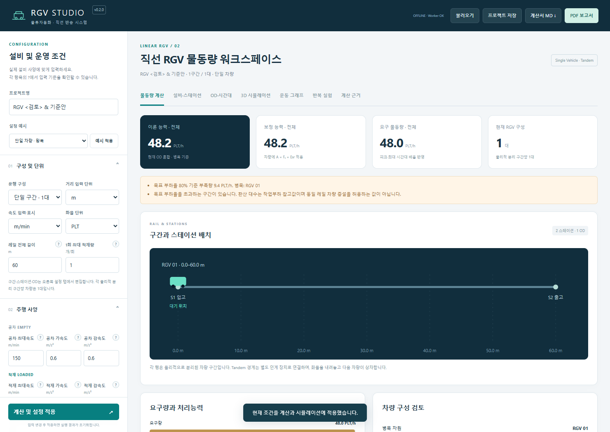
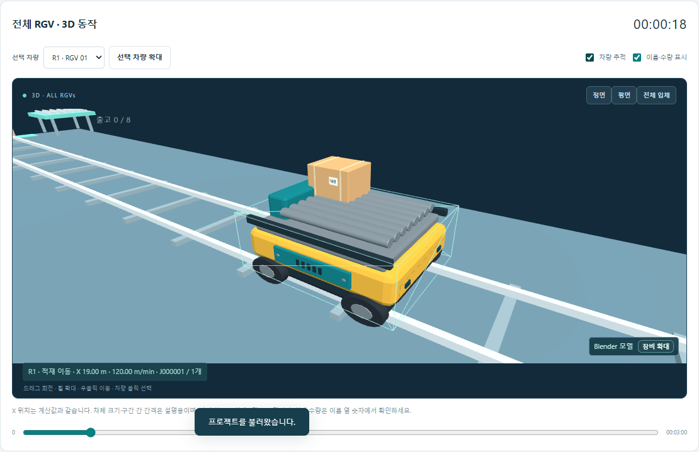
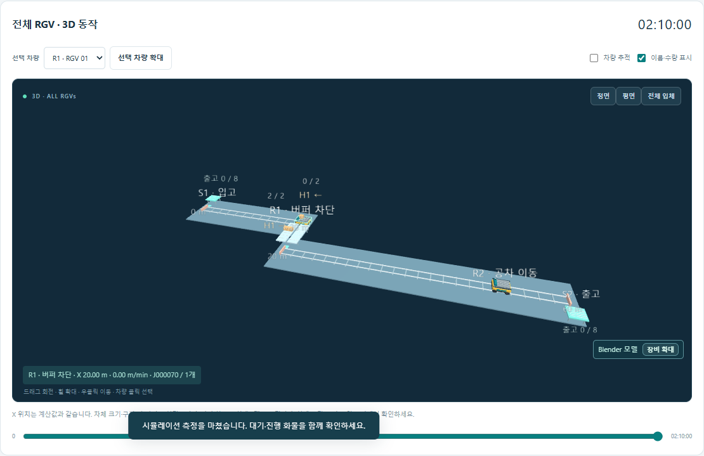

# 직선 RGV 계산 프로그램 사용 매뉴얼

RGV Studio v0.2.0 · 2026-09-11

[프로그램 열기](직선RGV_실행.html) · [개발 문서](02_rgv_linear/README.md) · [검증 기록](02_rgv_linear/qa/검증결과_v0.2.0.md)

## 1. 실행과 첫 계산

`직선RGV_실행.html`을 Edge 또는 Chrome으로 엽니다. 인터넷 연결과 서버 설치 없이 동작합니다. 다른 PC에 전달할 때도 이 HTML 파일 하나로 실행할 수 있습니다.

1. 왼쪽 `프로젝트명`을 입력합니다.
2. `설정 예시`에서 원하는 구성을 선택하고 `예시 적용`을 누릅니다.
3. 설비와 수요를 수정한 뒤 왼쪽 아래 `계산 및 설정 적용`을 누릅니다.
4. `물동량 계산`에서 능력과 병목을 확인합니다.
5. `3D 시뮬레이션 → 종료까지 계산`으로 대기·차단을 포함한 결과를 확인합니다.
6. 상단 `프로젝트 저장`으로 입력을 보관합니다.

입력 변경 후에는 결과 영역이 흐려지고 재적용 안내가 나타납니다. 계산을 적용해야 변경한 조건으로 재생·보고서 작성이 가능합니다. 각 숫자 입력 옆 `?`에서 포함 범위와 단위를 볼 수 있습니다.



## 2. 운행 구성과 설비 배치

| 구성 | 입력 및 해석 |
|---|---|
| 단일 구간 · 1대 | 한 담당 구간에 RGV 한 대를 배치합니다. 여러 스테이션과 양방향 반송이 가능합니다. |
| 독립 분리 구간 | 물리적으로 분리된 구간마다 한 대를 배치합니다. 한 OD의 출발·도착은 같은 구간 안에 있어야 합니다. |
| Tandem · 직렬 인계 | 각 구간의 차량이 경계에서 화물을 내려놓고 다음 차량이 받아 반송합니다. 구간은 0부터 전체 길이까지 빈틈없이 이어져야 합니다. |

`설비·스테이션` 탭에서 아래 항목을 설정합니다.

| 표 | 주요 입력 |
|---|---|
| 차량 담당 구간 | ID, 이름, 시작·끝 좌표, 대기점, 속도 비율. 구간은 좌표 오름차순이고 겹치지 않아야 합니다. |
| 스테이션 | ID, 이름, 위치, 상·하차 시간, 출고 버퍼 용량, 외부 반출 간격, 중간 정지 여부 |
| Tandem 인계 버퍼 | 경계별 **방향당** 버퍼 용량과 상차·하차 각각의 인계시간 |
| 구간 속도제한 | 시작·끝 좌표와 제한속도. 여러 제한이 겹치면 낮은 제한을 적용합니다. |

스테이션·OD·구간 ID는 중복 없는 영문, 숫자, `_`, `-`로 입력합니다. 한글 설명은 이름 칸에 씁니다. 최대 8구간, 30스테이션, 200개 OD를 지원합니다.

**Tandem 빠른 설정:** `Tandem · 2구간` 예시를 적용한 뒤 구간 경계, 스테이션 좌표, OD 수요를 수정합니다. 구간을 추가·삭제했다면 `구간 수에 맞춰 갱신`으로 인계 버퍼를 맞춥니다. 경계 수는 구간 수보다 하나 적습니다. 역방향 버퍼는 정방향과 별도 공간으로 가정합니다.

스테이션 버퍼는 최종 목적지에서 외부 반출을 기다리는 화물을 담습니다. 최초 작업의 출발 대기열은 용량 제한 없는 외부 대기열입니다. 출고·인계 버퍼 용량은 1회 최대 적재량 이상이어야 합니다.

## 3. 속도, 시간, 보정계수

| 항목 | 입력 기준 |
|---|---|
| 거리 | `m` 또는 `mm`. 단위를 바꾸면 현재 길이와 좌표가 환산됩니다. 거리행렬과 보고서 좌표 표는 m 기준입니다. |
| 속도 | `m/min` 또는 `m/s`. 예: 120 m/min = 2 m/s. 공차·적재를 따로 입력합니다. |
| 가속도·감속도 | 항상 m/s². 가속과 감속의 값이 달라도 됩니다. |
| 1회 최대 적재량 | 한 작업의 화물 수입니다. OD 수요 모드는 이 수량의 완전 배치로 작업을 생성합니다. |
| 간편 이재시간 | 정위치·인터록·신호를 포함한 상차/하차 **총 시간**입니다. |
| 상세 이재시간 | 스테이션의 순수 이재시간에 정위치·인터록·신호 지연을 더합니다. 모드를 바꾸기만 하면 총 시간은 유지됩니다. |
| 배차 제어 지연 | 한 차량의 구간 작업을 배차할 때 한 번 적용합니다. |
| 중간 정지 | 통과 정지가 선택된 스테이션에서 속도를 0으로 만든 뒤 지정 시간만큼 대기합니다. |
| 도착 저속구간 | 목적지 앞 지정 거리의 속도를 제한합니다. 길이 0이면 적용하지 않습니다. |
| jerk 근사 | 유효 가감속 저감 또는 이동별 보정시간 중 한 가지를 선택합니다. 정밀 S-curve 계산은 아닙니다. |

`분석 보정계수`의 A·Fₜ·E𝑤는 0~1 비율 중 입력 허용 범위에 맞춰 지정하고 근거를 선택합니다. `0.8`은 80%입니다. 실측이나 벤더 자료가 없다면 `설계 가정`을 선택하고 이유를 기록합니다. `이상 조건 1.0`은 손실 없는 비교 기준입니다.

보정계수 또는 근거가 비어 있으면 이론 능력만 표시하고 보정능력·환산 대수는 미산정합니다. 보정계수는 분석의 차량 능력에 한 번 적용하며 시뮬레이션 관측값에는 다시 적용하지 않습니다.

## 4. OD 수요와 작업이력

### OD·시간대 모드

`OD·시간대` 탭에서 출발 ID, 도착 ID, 물동량을 입력합니다. 물동량은 **화물 개수/h**이며 차량 대수로 나누지 않습니다. 역방향은 별도 OD 행으로 추가합니다.

```text
적용 수요 = OD 물동량 × 피크 계수 × 시간대 배율
작업 횟수/h = 적용 수요 ÷ 1회 최대 적재량
```

시간대 표가 비어 있으면 운전 전체에 1배를 적용합니다. 행이 있으면 지정한 시간대에만 작업이 도착하고 공백 시간대에는 도착이 없습니다. 시작·끝은 **준비운전을 포함한 운전 시작부터의 분**입니다. 분석은 최대 배율, 시뮬레이션은 각 시간대 배율을 사용합니다. 각 시간대의 첫 작업은 시작 시각에서 한 도착간격이 지난 뒤 생성됩니다.

도착 방식은 `일정 간격 + 변동` 또는 `Poisson 도착`입니다. 일정간격 변동폭 0은 일정한 도착간격이며, 난수 시드가 같으면 같은 버전·설정에서 도착 이력이 재현됩니다.

### 작업이력 CSV 모드

`양식 CSV ↓`로 양식을 받은 뒤 편집하여 `CSV 불러오기`를 누릅니다. 파일을 읽은 후 `계산 및 설정 적용`을 누릅니다.

```csv
time_s,from,to,quantity
0,S1,S2,1
60,S1,S2,1
120,S2,S1,1
```

| 열 | 의미 |
|---|---|
| `time_s` | 운전 시작부터의 작업 도착시각(초). 전체 운전시간 이내여야 합니다. |
| `from` / `to` | 설정된 스테이션 ID. 독립 구간의 구간 간 반송은 허용하지 않습니다. |
| `quantity` | 한 작업의 화물 수. 1 이상의 정수이며 최대 적재량 이하여야 합니다. |

CSV 모드에는 피크계수·시간대 배율·도착 난수를 추가 적용하지 않습니다. 분석 수요는 **측정구간에 도착한 이력의 평균**입니다. 예를 들어 0·60·120초 작업만 넣고 준비운전을 10분으로 두면 분석 수요는 0이 됩니다. 짧은 이력 예제를 확인할 때는 준비운전을 0분으로 설정하거나 `05_작업이력.json`을 불러옵니다.

## 5. 계산 결과 읽기

| 지표 | 의미 |
|---|---|
| 전체 이론 능력 | 현재 OD 혼합에서 차량·이재부·외부 반출 중 병목으로 정해지는 정적 처리능력 |
| 전체 보정 능력 | 차량 보정계수를 반영한 뒤 다시 병목을 비교한 능력 |
| 요구 물동량 | 피크·시간대를 적용한 수요 또는 CSV 측정구간 평균 수요 |
| 목표부하 고려 부족량 | 요구량 − 보정능력 × 목표 설계 부하율. 음수이면 0으로 표시 |
| 차량부하 환산 대수 | 목표 부하율을 만족시키기 위한 작업부하 환산값. 실제 같은 레일에 투입할 수 있는 차량 수를 뜻하지 않음 |

Tandem의 전체 완료 능력은 구간 능력의 합이 아닙니다. 중간 인계는 구간별 작업에는 포함되지만 전체 화물 완료는 최종 목적지에서 한 번만 집계합니다. 정적 분석에는 버퍼 대기로 인한 손실이 없으므로 시뮬레이션을 함께 확인합니다.

**기본 예제 검산:** 60 m, 공차 150 m/min·가감속 0.6 m/s², 적재 120 m/min·가감속 0.5 m/s², 상차 6초·하차 6초, 제어 0.5초이면 왕복 사이클은 약 **74.67초**, 이론 능력은 약 **48.2 PLT/h**입니다. OD 40 PLT/h × 피크 1.2 = 요구 48 PLT/h입니다. 계수를 모두 1.0으로 두어도 목표 부하율 80%의 여유 기준으로는 약 9.4 PLT/h가 부족합니다. 이때 환산 대수 2는 구간 분할·독립 설비 등 재설계를 검토하라는 참고값입니다.

## 6. 3D 시뮬레이션과 운동 그래프

스태커크레인과 같은 방식의 3D 화면에서 레일, RGV, 스테이션, 화물과 인계 버퍼를 확인합니다. 기존 파일을 열어 두었다면 변경된 HTML을 새로고침하고 `3D 시뮬레이션` 탭을 선택하세요.

| 화면 조작 | 동작 |
|---|---|
| 왼쪽 버튼 드래그 | 장면 회전 |
| 마우스 휠 | 확대·축소 |
| 오른쪽 버튼 드래그 | 장면 이동 |
| 정면 / 평면 / 전체 입체 | 전체 설비를 해당 시점으로 맞춤. 차량 추적은 해제됩니다. |
| 차량 클릭 / 선택 차량 목록 | 해당 차량을 선택하고 현재 X·속도·상태·작업을 아래 상태표시에 표시 |
| 선택 차량 확대 | 선택한 차량 주변을 확대 |
| 차량 추적 | 선택 차량을 확대하고 주행에 맞춰 카메라 이동 |
| 이름·수량 표시 | 장치 이름과 버퍼 수량의 표시 여부 변경 |



차량의 X 위치는 계산 엔진과 같습니다. 차체 크기, 상·하차 높이, 구간 사이 간격은 동작을 설명하는 표현입니다. 상·하차 동안 화물이 스테이션 또는 인계 버퍼와 차량 사이를 이동합니다. 인계 상차 중인 화물은 장면에서 중복으로 그리지 않지만, 계산상의 버퍼 점유는 상차가 끝날 때 해제됩니다.

버퍼 화물은 최대 8개를 그리고 실제 수량은 이름 옆 숫자로 표시합니다. `2 / 8 (예약 1)`은 현재 화물 2개, 전체 용량 8개, 진행 중 하차 예약 1개입니다. 화물이 많은 경우 숫자와 아래 버퍼 표를 기준으로 판단하세요.

| 조작 | 동작 |
|---|---|
| 시뮬레이션 재생 | 설정 배속으로 전체 차량의 현재 상태와 위치를 표시합니다. 다시 누르면 일시정지합니다. |
| 다음 이벤트 | 다음 이벤트 시각으로 이동합니다. |
| 종료까지 계산 | 준비운전 + 측정시간의 종료 시각까지 계산합니다. |
| 리셋 | 같은 적용 입력과 시드로 처음부터 시작합니다. |
| 시간 슬라이더 | 지정 시각으로 이동합니다. 과거 시각은 처음부터 같은 시드로 재계산합니다. |

`최종 목적지 완료`는 목적지 하차량, `외부 출하`는 출고 버퍼에서 실제 반출된 양입니다. 외부 반출이 느리면 두 값이 다르고 버퍼가 차면 RGV가 적재 상태로 기다립니다. 배치 반출은 `배치 수량 × 반출 간격` 후 한 번에 이루어집니다.

준비운전의 화물·위치는 측정구간으로 이어지며 준비운전 시간은 시간당 통계에서 제외됩니다. 측정 중 완료된 화물은 준비운전에 도착했어도 완료량에 포함합니다. 지정 종료 시각에 남은 화물을 모두 처리할 때까지 연장하는 방식은 아닙니다.

- `P95 대기`: 측정 중 **최초 배차된 작업**의 대기시간 95백분위입니다. 아직 배차되지 않은 화물은 이 값에 들어가지 않으므로 미배차 최장 경과도 함께 봅니다.
- `관측가동`: 측정시간 중 유휴가 아닌 상태 비율입니다. 적재·공차 주행뿐 아니라 이재·제어·차단시간도 포함합니다.
- `화물 보존`: 생성 = 외부 출하 + 대기 + 진행 + 출고 버퍼가 맞는지 표시합니다. 배차된 인계 화물은 진행으로 집계합니다.
- `교착 징후`: 현재 차단과 향후 해제 이벤트를 기준으로 한 경고입니다. 양방향 버퍼 운영과 배차 정책을 검토하는 데 사용합니다.



`운동 그래프` 탭에서는 OD와 차량 구간을 선택하고 `경로 적용`을 누릅니다. 속도·위치·가속도 그래프와 시간 슬라이더는 같은 운동 프로파일을 사용합니다. 대기점 복귀는 왕복을 표시하고, 위치 대기는 해당 상차점에서 시작하는 단일 작업을 표시합니다. 이 미리보기에는 앞선 배차나 버퍼 대기로 생기는 동적 지연이 포함되지 않습니다.

## 7. 반복 실험

`반복 실험` 탭에서 정책별 반복 수를 선택하고 시작합니다. FIFO/가까운 작업 × 대기점 복귀/위치 대기의 4개 조합을 비교합니다. 5회를 선택하면 총 20회를 실행합니다.

동일 반복 번호에는 같은 도착 시드를 사용합니다. 기본 시드에서 반복마다 1씩 증가하며 배차 정책이 도착 이력을 바꾸지 않습니다. 결과의 `±95% CI`는 처리량 평균의 Student t 신뢰구간입니다. P95 대기 열은 반복별 P95의 평균입니다. CSV 이력은 고정되어 있으므로 반복 결과가 동일할 수 있습니다.

`취소`는 진행 중인 실험을 중지합니다. 완료된 결과는 `실험 JSON ↓`으로 저장할 수 있습니다. 실험은 현재 적용 입력의 정책만 비교하며 설비 수나 구간 경계를 자동 최적화하지 않습니다.

## 8. 저장과 보고서

| 버튼 | 저장 내용 |
|---|---|
| 프로젝트 저장 | 설비·운영·수요 입력과 CSV 이력. 내부 값은 m, m/s, m/s², s 기준이며 표시 단위 선택도 보관합니다. |
| 불러오기 | 직선 RGV 프로젝트 JSON을 읽고 입력을 복원합니다. |
| 계산서 MD ↓ | 결과 요약, 시간 분해, 시뮬레이션 상태, 전체 입력 JSON |
| 완료 작업 CSV ↓ | 실제 완료 작업의 도착·배차·완료·대기시간, 화물 수, 측정구간 여부, 시드 |
| 실험 JSON ↓ | 정책별 반복 결과와 통계 |
| PDF 보고서 | 문서번호·제출처·작성자·검토자, 입력·결과, 선택한 운동 그래프·시뮬레이션 결과 |

PDF는 `PDF 보고서 → 보고서 미리보기 → PDF 저장 / 인쇄` 순서입니다. 브라우저에서 대상 `PDF로 저장`, 용지 `A4`를 선택하고 기본 머리글·바닥글을 끕니다. 미리보기 창이 차단되면 해당 로컬 파일의 팝업을 허용한 뒤 다시 누릅니다.

프로젝트 JSON에는 시뮬레이션 진행 상태가 저장되지 않습니다. 페이지를 닫거나 설정을 재적용하기 전에 필요한 작업 CSV와 보고서를 내보내세요. 브라우저 자동 저장 기능은 없습니다.

## 9. 자주 발생하는 상황

| 상황 | 확인할 내용 |
|---|---|
| 보정능력 또는 대수가 `—` | A·Fₜ·E𝑤와 계수 근거를 모두 선택했는지 확인합니다. |
| 길이를 바꾼 뒤 계산 오류 | 구간 끝, 대기점, 스테이션, 속도제한 좌표가 새 길이 안에 있는지 확인합니다. |
| 독립 구간 사이 OD 오류 | 같은 구간 내 OD로 바꾸거나 실제 인계가 있다면 Tandem으로 구성합니다. |
| 이재시간 합 오류 | 간편 총 시간이 정위치·인터록·신호 합보다 작은지 확인합니다. |
| 적재량을 늘린 뒤 오류 | 모든 출고·인계 버퍼 용량과 CSV 작업 수량을 확인합니다. |
| 분석은 높지만 실제 처리량은 낮음 | 요구량 부족, 준비운전, 도착 변동, 복귀 정책, 이재부 점유, 버퍼 차단, 외부 반출을 확인합니다. |
| 종료했는데 대기 화물이 남음 | 지정 시각 종료 방식입니다. 수요 초과 여부와 최장 미배차 대기를 확인합니다. |
| CSV 입력 후 수요 0 | 작업의 도착시각이 준비운전 이후 측정구간에 포함되는지 확인합니다. |
| 전체 보기에서 차량이 작음 | 차량을 선택하고 `선택 차량 확대` 또는 `차량 추적`을 사용합니다. |
| 3D 대신 2D 대체 표시 | 브라우저에서 WebGL을 사용할 수 없는 상태입니다. Edge/Chrome의 그래픽 가속 설정을 확인하고 설정 재적용으로 3D를 다시 시도합니다. 계산과 2D 재생은 계속 사용할 수 있습니다. |
| 저장 JSON을 불러올 수 없음 | 스태커크레인 등 다른 장비 파일이 아닌 직선 RGV JSON인지, 스키마·단위·버전이 맞는지 확인합니다. |

현재 버전은 설계 검토용 모델입니다. 같은 레일 다차량, 차량 간 안전거리, 실설비 PLC, 고장 이벤트, SKU별 적합성은 포함하지 않습니다. 지원 범위와 수식은 프로그램의 `계산 근거` 탭 및 개발 문서에 함께 기록되어 있습니다.
